# Report TCC Value

Calculating the TCC values of the classes in `/home/cody/Git/VV-ESIR-TP2/code/Exercise2/source/commons-math3-3.6.1-src/src`

# The class 'PrimesTest'
Package: `org.apache.commons.math3.primes.PrimesTest`
methods : [ `testPrimeFactors` `testIsPrime` `assertNextPrimeException` `testNextPrime` `product` `checkPrimeFactors` `sum` `assertPrimeFactorsException` ]
attributes : [ `PRIMES_SET` `BELOW_2` `NOT_PRIMES` `PRIMES` ]

The attributes used in each method are:
  - testPrimeFactors uses [BELOW_2, NOT_PRIMES, PRIMES]
  - testIsPrime uses [BELOW_2, NOT_PRIMES, PRIMES]
  - checkPrimeFactors uses [PRIMES_SET]

The methods called in each method are:
  - testPrimeFactors calls [product, assertPrimeFactorsException, checkPrimeFactors]
  - testNextPrime calls [assertNextPrimeException]

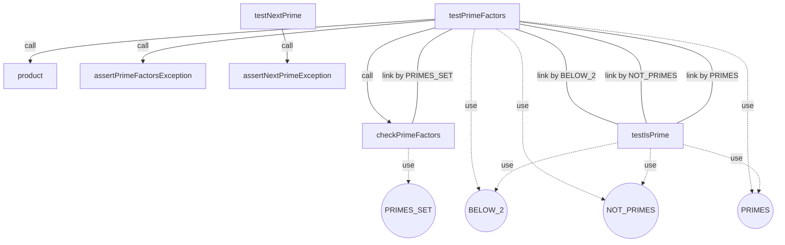

Number of max pairs: $28.0$
Number of direct connections (link by): $4.0$
**TCC value: $0.14285714285714285$**


# The class 'RetryRunnerTest'
Package: `org.apache.commons.math3.RetryRunnerTest`
methods : [ `testRetryFailAlways` `testRetryFailSometimes` ]
attributes : [ `rng` ]

The attributes used in each method are:
  - testRetryFailSometimes uses [rng]

The methods called in each method are:

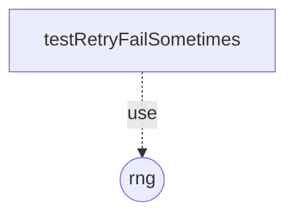

Number of max pairs: $1.0$
Number of direct connections (link by): $0.0$
**TCC value: $0.0$**


# The class 'NonMonotonicSequenceExceptionTest'
Package: `org.apache.commons.math3.exception.NonMonotonicSequenceExceptionTest`
methods : [ `testAccessors` ]
attributes : [ ]

The TCC value is 0 because the class has no methods or no attributes.


# The class 'NumberIsTooLargeExceptionTest'
Package: `org.apache.commons.math3.exception.NumberIsTooLargeExceptionTest`
methods : [ `testAccessors` ]
attributes : [ ]

The TCC value is 0 because the class has no methods or no attributes.


# The class 'MaxCountExceededExceptionTest'
Package: `org.apache.commons.math3.exception.MaxCountExceededExceptionTest`
methods : [ `testAccessors` ]
attributes : [ ]

The TCC value is 0 because the class has no methods or no attributes.


# The class 'LocalizedFormatsTest'
Package: `org.apache.commons.math3.exception.util.LocalizedFormatsTest`
methods : [ `testMessageNumber` `testNoOpEnglishTranslation` `testVariablePartsConsistency` `testAllKeysPresentInPropertiesFiles` `testNoMissingFrenchTranslation` `testAllPropertiesCorrespondToKeys` ]
attributes : [ ]

The TCC value is 0 because the class has no methods or no attributes.


# The class 'ExceptionContextTest'
Package: `org.apache.commons.math3.exception.util.ExceptionContextTest`
methods : [ `testSerialize` `testSerializeUnserializable` `testNoArgAddMessage` `testContext` `testMessageChain` ]
attributes : [ ]

The TCC value is 0 because the class has no methods or no attributes.


# The class 'ArgUtilsTest'
Package: `org.apache.commons.math3.exception.util.ArgUtilsTest`
methods : [ `create` `testFlatten` ]
attributes : [ ]

The TCC value is 0 because the class has no methods or no attributes.


# The class 'OutOfRangeExceptionTest'
Package: `org.apache.commons.math3.exception.OutOfRangeExceptionTest`
methods : [ `testAccessors` ]
attributes : [ ]

The TCC value is 0 because the class has no methods or no attributes.


# The class 'TooManyEvaluationsExceptionTest'
Package: `org.apache.commons.math3.exception.TooManyEvaluationsExceptionTest`
methods : [ `testMessage` ]
attributes : [ ]

The TCC value is 0 because the class has no methods or no attributes.


# The class 'NotStrictlyPositiveExceptionTest'
Package: `org.apache.commons.math3.exception.NotStrictlyPositiveExceptionTest`
methods : [ `testAccessors` ]
attributes : [ ]

The TCC value is 0 because the class has no methods or no attributes.


# The class 'NumberIsTooSmallExceptionTest'
Package: `org.apache.commons.math3.exception.NumberIsTooSmallExceptionTest`
methods : [ `testAccessors` ]
attributes : [ ]

The TCC value is 0 because the class has no methods or no attributes.


# The class 'DimensionMismatchExceptionTest'
Package: `org.apache.commons.math3.exception.DimensionMismatchExceptionTest`
methods : [ `testAccessors` ]
attributes : [ ]

The TCC value is 0 because the class has no methods or no attributes.


# The class 'NotPositiveExceptionTest'
Package: `org.apache.commons.math3.exception.NotPositiveExceptionTest`
methods : [ `testAccessors` ]
attributes : [ ]

The TCC value is 0 because the class has no methods or no attributes.


# The class 'KalmanFilterTest'
Package: `org.apache.commons.math3.filter.KalmanFilterTest`
methods : [ `testCannonball` `assertVectorEquals` `assertMatrixEquals` `testConstant` `testTransitionMeasurementMatrixMismatch` `testTransitionControlMatrixMismatch` `testConstantAcceleration` ]
attributes : [ ]

The TCC value is 0 because the class has no methods or no attributes.


# The class 'PowellOptimizerTest'
Package: `org.apache.commons.math3.optimization.direct.PowellOptimizerTest`
methods : [ `doTest` `testQuadratic` `testSumSinc` `testRelativeToleranceOnScaledValues` `testMaximizeQuadratic` `doTest` ]
attributes : [ ]

The TCC value is 0 because the class has no methods or no attributes.


# The class 'MultivariateFunctionPenaltyAdapterTest'
Package: `org.apache.commons.math3.optimization.direct.MultivariateFunctionPenaltyAdapterTest`
methods : [ `testStartSimplexOutsideRange` `testHalfBounded` `testUnbounded` `testOptimumOutsideRange` `testStartSimplexInsideRange` ]
attributes : [ ]

The TCC value is 0 because the class has no methods or no attributes.


# The class 'MultivariateFunctionMappingAdapterTest'
Package: `org.apache.commons.math3.optimization.direct.MultivariateFunctionMappingAdapterTest`
methods : [ `testStartSimplexInsideRange` `testUnbounded` `testHalfBounded` `testOptimumOutsideRange` ]
attributes : [ ]

The TCC value is 0 because the class has no methods or no attributes.


# The class 'BOBYQAOptimizerTest'
Package: `org.apache.commons.math3.optimization.direct.BOBYQAOptimizerTest`
methods : [ `testConstrainedRosen` `testRastrigin` `testEllipse` `testBoundariesDimensionMismatch` `doTest` `boundaries` `testSsDiffPow` `testTwoAxes` `testCigTab` `testConstrainedRosenWithMoreInterpolationPoints` `testSphere` `testElliRotated` `testAckley` `testCigar` `testInitOutOfBounds` `testDiffPow` `testMaximize` `testTablet` `point` `testProblemDimensionTooSmall` `doTest` `testRosen` `testMaxEvaluations` ]
attributes : [ `DIM` ]

The attributes used in each method are:
  - testConstrainedRosen uses [DIM]
  - testRastrigin uses [DIM]
  - testEllipse uses [DIM]
  - testBoundariesDimensionMismatch uses [DIM]
  - testSsDiffPow uses [DIM]
  - testCigTab uses [DIM]
  - testTwoAxes uses [DIM]
  - testConstrainedRosenWithMoreInterpolationPoints uses [DIM]
  - testSphere uses [DIM]
  - testAckley uses [DIM]
  - testElliRotated uses [DIM]
  - testCigar uses [DIM]
  - testInitOutOfBounds uses [DIM]
  - testDiffPow uses [DIM]
  - testMaximize uses [DIM]
  - testTablet uses [DIM]
  - testRosen uses [DIM]
  - testMaxEvaluations uses [DIM]

The methods called in each method are:
  - testConstrainedRosen calls [doTest, boundaries, point]
  - testRastrigin calls [doTest, point]
  - testEllipse calls [doTest, point]
  - testBoundariesDimensionMismatch calls [doTest, boundaries, point]
  - testSsDiffPow calls [doTest, point]
  - testCigTab calls [doTest, point]
  - testTwoAxes calls [doTest, point]
  - testConstrainedRosenWithMoreInterpolationPoints calls [doTest, boundaries, point]
  - testSphere calls [doTest, point]
  - testAckley calls [doTest, point]
  - testElliRotated calls [doTest, point]
  - testCigar calls [doTest, point]
  - testInitOutOfBounds calls [doTest, boundaries, point]
  - testDiffPow calls [doTest, point]
  - testMaximize calls [doTest, boundaries, point]
  - testTablet calls [doTest, point]
  - doTest calls [doTest]
  - testProblemDimensionTooSmall calls [doTest, point]
  - testRosen calls [doTest, point]
  - testMaxEvaluations calls [doTest, point]

```mermaid
graph TD
  testConstrainedRosen -->|call| doTest
  testConstrainedRosen -->|call| boundaries
  testConstrainedRosen -->|call| point
  testRastrigin -->|call| doTest
  testRastrigin -->|call| point
  testEllipse -->|call| doTest
  testEllipse -->|call| point
  testBoundariesDimensionMismatch -->|call| doTest
  testBoundariesDimensionMismatch -->|call| boundaries
  testBoundariesDimensionMismatch -->|call| point
  testSsDiffPow -->|call| doTest
  testSsDiffPow -->|call| point
  testCigTab -->|call| doTest
  testCigTab -->|call| point
  testTwoAxes -->|call| doTest
  testTwoAxes -->|call| point
  testConstrainedRosenWithMoreInterpolationPoints -->|call| doTest
  testConstrainedRosenWithMoreInterpolationPoints -->|call| boundaries
  testConstrainedRosenWithMoreInterpolationPoints -->|call| point
  testSphere -->|call| doTest
  testSphere -->|call| point
  testAckley -->|call| doTest
  testAckley -->|call| point
  testElliRotated -->|call| doTest
  testElliRotated -->|call| point
  testCigar -->|call| doTest
  testCigar -->|call| point
  testInitOutOfBounds -->|call| doTest
  testInitOutOfBounds -->|call| boundaries
  testInitOutOfBounds -->|call| point
  testDiffPow -->|call| doTest
  testDiffPow -->|call| point
  testMaximize -->|call| doTest
  testMaximize -->|call| boundaries
  testMaximize -->|call| point
  testTablet -->|call| doTest
  testTablet -->|call| point
  doTest -->|call| doTest
  testProblemDimensionTooSmall -->|call| doTest
  testProblemDimensionTooSmall -->|call| point
  testRosen -->|call| doTest
  testRosen -->|call| point
  testMaxEvaluations -->|call| doTest
  testMaxEvaluations -->|call| point
  testConstrainedRosen -. use .->DIM((DIM))
  testRastrigin -. use .->DIM((DIM))
  testEllipse -. use .->DIM((DIM))
  testBoundariesDimensionMismatch -. use .->DIM((DIM))
  testSsDiffPow -. use .->DIM((DIM))
  testCigTab -. use .->DIM((DIM))
  testTwoAxes -. use .->DIM((DIM))
  testConstrainedRosenWithMoreInterpolationPoints -. use .->DIM((DIM))
  testSphere -. use .->DIM((DIM))
  testAckley -. use .->DIM((DIM))
  testElliRotated -. use .->DIM((DIM))
  testCigar -. use .->DIM((DIM))
  testInitOutOfBounds -. use .->DIM((DIM))
  testDiffPow -. use .->DIM((DIM))
  testMaximize -. use .->DIM((DIM))
  testTablet -. use .->DIM((DIM))
  testRosen -. use .->DIM((DIM))
  testMaxEvaluations -. use .->DIM((DIM))
  testConstrainedRosen ----|link by DIM| testBoundariesDimensionMismatch
  testConstrainedRosen ----|link by DIM| testCigTab
  testConstrainedRosen ----|link by DIM| testAckley
  testConstrainedRosen ----|link by DIM| testCigar
  testRastrigin ----|link by DIM| testConstrainedRosen
  testRastrigin ----|link by DIM| testEllipse
  testRastrigin ----|link by DIM| testBoundariesDimensionMismatch
  testRastrigin ----|link by DIM| testCigTab
  testRastrigin ----|link by DIM| testConstrainedRosenWithMoreInterpolationPoints
  testRastrigin ----|link by DIM| testAckley
  testRastrigin ----|link by DIM| testElliRotated
  testRastrigin ----|link by DIM| testCigar
  testRastrigin ----|link by DIM| testInitOutOfBounds
  testRastrigin ----|link by DIM| testDiffPow
  testRastrigin ----|link by DIM| testMaximize
  testRastrigin ----|link by DIM| testMaxEvaluations
  testEllipse ----|link by DIM| testConstrainedRosen
  testEllipse ----|link by DIM| testBoundariesDimensionMismatch
  testEllipse ----|link by DIM| testCigTab
  testEllipse ----|link by DIM| testConstrainedRosenWithMoreInterpolationPoints
  testEllipse ----|link by DIM| testAckley
  testEllipse ----|link by DIM| testElliRotated
  testEllipse ----|link by DIM| testCigar
  testEllipse ----|link by DIM| testDiffPow
  testBoundariesDimensionMismatch ----|link by DIM| testAckley
  testSsDiffPow ----|link by DIM| testConstrainedRosen
  testSsDiffPow ----|link by DIM| testRastrigin
  testSsDiffPow ----|link by DIM| testEllipse
  testSsDiffPow ----|link by DIM| testBoundariesDimensionMismatch
  testSsDiffPow ----|link by DIM| testCigTab
  testSsDiffPow ----|link by DIM| testConstrainedRosenWithMoreInterpolationPoints
  testSsDiffPow ----|link by DIM| testSphere
  testSsDiffPow ----|link by DIM| testAckley
  testSsDiffPow ----|link by DIM| testElliRotated
  testSsDiffPow ----|link by DIM| testCigar
  testSsDiffPow ----|link by DIM| testInitOutOfBounds
  testSsDiffPow ----|link by DIM| testDiffPow
  testSsDiffPow ----|link by DIM| testMaximize
  testSsDiffPow ----|link by DIM| testRosen
  testSsDiffPow ----|link by DIM| testMaxEvaluations
  testCigTab ----|link by DIM| testBoundariesDimensionMismatch
  testCigTab ----|link by DIM| testAckley
  testTwoAxes ----|link by DIM| testConstrainedRosen
  testTwoAxes ----|link by DIM| testRastrigin
  testTwoAxes ----|link by DIM| testEllipse
  testTwoAxes ----|link by DIM| testBoundariesDimensionMismatch
  testTwoAxes ----|link by DIM| testSsDiffPow
  testTwoAxes ----|link by DIM| testCigTab
  testTwoAxes ----|link by DIM| testConstrainedRosenWithMoreInterpolationPoints
  testTwoAxes ----|link by DIM| testSphere
  testTwoAxes ----|link by DIM| testAckley
  testTwoAxes ----|link by DIM| testElliRotated
  testTwoAxes ----|link by DIM| testCigar
  testTwoAxes ----|link by DIM| testInitOutOfBounds
  testTwoAxes ----|link by DIM| testDiffPow
  testTwoAxes ----|link by DIM| testMaximize
  testTwoAxes ----|link by DIM| testTablet
  testTwoAxes ----|link by DIM| testRosen
  testTwoAxes ----|link by DIM| testMaxEvaluations
  testConstrainedRosenWithMoreInterpolationPoints ----|link by DIM| testConstrainedRosen
  testConstrainedRosenWithMoreInterpolationPoints ----|link by DIM| testBoundariesDimensionMismatch
  testConstrainedRosenWithMoreInterpolationPoints ----|link by DIM| testCigTab
  testConstrainedRosenWithMoreInterpolationPoints ----|link by DIM| testAckley
  testConstrainedRosenWithMoreInterpolationPoints ----|link by DIM| testCigar
  testSphere ----|link by DIM| testConstrainedRosen
  testSphere ----|link by DIM| testRastrigin
  testSphere ----|link by DIM| testEllipse
  testSphere ----|link by DIM| testBoundariesDimensionMismatch
  testSphere ----|link by DIM| testCigTab
  testSphere ----|link by DIM| testConstrainedRosenWithMoreInterpolationPoints
  testSphere ----|link by DIM| testAckley
  testSphere ----|link by DIM| testElliRotated
  testSphere ----|link by DIM| testCigar
  testSphere ----|link by DIM| testInitOutOfBounds
  testSphere ----|link by DIM| testDiffPow
  testSphere ----|link by DIM| testMaximize
  testSphere ----|link by DIM| testRosen
  testSphere ----|link by DIM| testMaxEvaluations
  testElliRotated ----|link by DIM| testConstrainedRosen
  testElliRotated ----|link by DIM| testBoundariesDimensionMismatch
  testElliRotated ----|link by DIM| testCigTab
  testElliRotated ----|link by DIM| testConstrainedRosenWithMoreInterpolationPoints
  testElliRotated ----|link by DIM| testAckley
  testElliRotated ----|link by DIM| testCigar
  testElliRotated ----|link by DIM| testDiffPow
  testCigar ----|link by DIM| testBoundariesDimensionMismatch
  testCigar ----|link by DIM| testCigTab
  testCigar ----|link by DIM| testAckley
  testInitOutOfBounds ----|link by DIM| testConstrainedRosen
  testInitOutOfBounds ----|link by DIM| testEllipse
  testInitOutOfBounds ----|link by DIM| testBoundariesDimensionMismatch
  testInitOutOfBounds ----|link by DIM| testCigTab
  testInitOutOfBounds ----|link by DIM| testConstrainedRosenWithMoreInterpolationPoints
  testInitOutOfBounds ----|link by DIM| testAckley
  testInitOutOfBounds ----|link by DIM| testElliRotated
  testInitOutOfBounds ----|link by DIM| testCigar
  testInitOutOfBounds ----|link by DIM| testDiffPow
  testDiffPow ----|link by DIM| testConstrainedRosen
  testDiffPow ----|link by DIM| testBoundariesDimensionMismatch
  testDiffPow ----|link by DIM| testCigTab
  testDiffPow ----|link by DIM| testConstrainedRosenWithMoreInterpolationPoints
  testDiffPow ----|link by DIM| testAckley
  testDiffPow ----|link by DIM| testCigar
  testMaximize ----|link by DIM| testConstrainedRosen
  testMaximize ----|link by DIM| testEllipse
  testMaximize ----|link by DIM| testBoundariesDimensionMismatch
  testMaximize ----|link by DIM| testCigTab
  testMaximize ----|link by DIM| testConstrainedRosenWithMoreInterpolationPoints
  testMaximize ----|link by DIM| testAckley
  testMaximize ----|link by DIM| testElliRotated
  testMaximize ----|link by DIM| testCigar
  testMaximize ----|link by DIM| testInitOutOfBounds
  testMaximize ----|link by DIM| testDiffPow
  testMaximize ----|link by DIM| testMaxEvaluations
  testTablet ----|link by DIM| testConstrainedRosen
  testTablet ----|link by DIM| testRastrigin
  testTablet ----|link by DIM| testEllipse
  testTablet ----|link by DIM| testBoundariesDimensionMismatch
  testTablet ----|link by DIM| testSsDiffPow
  testTablet ----|link by DIM| testCigTab
  testTablet ----|link by DIM| testConstrainedRosenWithMoreInterpolationPoints
  testTablet ----|link by DIM| testSphere
  testTablet ----|link by DIM| testAckley
  testTablet ----|link by DIM| testElliRotated
  testTablet ----|link by DIM| testCigar
  testTablet ----|link by DIM| testInitOutOfBounds
  testTablet ----|link by DIM| testDiffPow
  testTablet ----|link by DIM| testMaximize
  testTablet ----|link by DIM| testRosen
  testTablet ----|link by DIM| testMaxEvaluations
  testRosen ----|link by DIM| testConstrainedRosen
  testRosen ----|link by DIM| testRastrigin
  testRosen ----|link by DIM| testEllipse
  testRosen ----|link by DIM| testBoundariesDimensionMismatch
  testRosen ----|link by DIM| testCigTab
  testRosen ----|link by DIM| testConstrainedRosenWithMoreInterpolationPoints
  testRosen ----|link by DIM| testAckley
  testRosen ----|link by DIM| testElliRotated
  testRosen ----|link by DIM| testCigar
  testRosen ----|link by DIM| testInitOutOfBounds
  testRosen ----|link by DIM| testDiffPow
  testRosen ----|link by DIM| testMaximize
  testRosen ----|link by DIM| testMaxEvaluations
  testMaxEvaluations ----|link by DIM| testConstrainedRosen
  testMaxEvaluations ----|link by DIM| testEllipse
  testMaxEvaluations ----|link by DIM| testBoundariesDimensionMismatch
  testMaxEvaluations ----|link by DIM| testCigTab
  testMaxEvaluations ----|link by DIM| testConstrainedRosenWithMoreInterpolationPoints
  testMaxEvaluations ----|link by DIM| testAckley
  testMaxEvaluations ----|link by DIM| testElliRotated
  testMaxEvaluations ----|link by DIM| testCigar
  testMaxEvaluations ----|link by DIM| testInitOutOfBounds
  testMaxEvaluations ----|link by DIM| testDiffPow
```

Number of max pairs: $253.0$
Number of direct connections (link by): $153.0$
**TCC value: $0.6047430830039525$**


# The class 'SimplexOptimizerNelderMeadTest'
Package: `org.apache.commons.math3.optimization.direct.SimplexOptimizerNelderMeadTest`
methods : [ `testLeastSquares1` `testMinimize1` `testLeastSquares3` `testMaximize2` `testMinimize2` `testPowell` `testRosenbrock` `testMaxIterations` `testLeastSquares2` `testMaximize1` ]
attributes : [ ]

The TCC value is 0 because the class has no methods or no attributes.


# The class 'SimplexOptimizerMultiDirectionalTest'
Package: `org.apache.commons.math3.optimization.direct.SimplexOptimizerMultiDirectionalTest`
methods : [ `testPowell` `testMaximize2` `testMinimize1` `testMaximize1` `testMinimize2` `testRosenbrock` `testMath283` ]
attributes : [ `count` ]

The attributes used in each method are:
  - testPowell uses [count]
  - testRosenbrock uses [count]

The methods called in each method are:

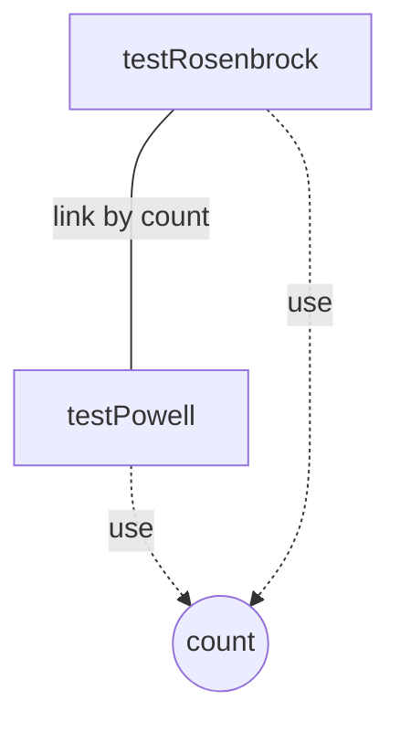

Number of max pairs: $21.0$
Number of direct connections (link by): $1.0$
**TCC value: $0.047619047619047616$**


# The class 'CMAESOptimizerTest'
Package: `org.apache.commons.math3.optimization.direct.CMAESOptimizerTest`
methods : [ `testTablet` `testInitOutofbounds1` `testEllipse` `testBoundariesDimensionMismatch` `testCigarWithBoundaries` `boundaries` `testSphere` `testFitAccuracyDependsOnBoundary` `testRosen` `testSsDiffPow` `testAckley` `testRastrigin` `testTwoAxes` `doTest` `testDiagonalRosen` `testInputSigmaDimensionMismatch` `testInputSigmaNegative` `testInputSigmaOutOfRange` `testCigar` `testConstrainedRosen` `testDiffPow` `testCigTab` `testMath864` `testMaximize` `testInitOutofbounds2` `testElliRotated` `point` ]
attributes : [ `DIM` `LAMBDA` ]

The attributes used in each method are:
  - testTablet uses [DIM, LAMBDA]
  - testDiagonalRosen uses [DIM, LAMBDA]
  - testInitOutofbounds1 uses [DIM, LAMBDA]
  - testInputSigmaDimensionMismatch uses [DIM, LAMBDA]
  - testEllipse uses [DIM, LAMBDA]
  - testInputSigmaNegative uses [DIM, LAMBDA]
  - testCigarWithBoundaries uses [DIM, LAMBDA]
  - testBoundariesDimensionMismatch uses [DIM, LAMBDA]
  - testInputSigmaOutOfRange uses [DIM, LAMBDA]
  - testCigar uses [DIM, LAMBDA]
  - testConstrainedRosen uses [DIM, LAMBDA]
  - testSphere uses [DIM, LAMBDA]
  - testDiffPow uses [DIM]
  - testRosen uses [DIM, LAMBDA]
  - testCigTab uses [DIM, LAMBDA]
  - testSsDiffPow uses [DIM]
  - testMaximize uses [DIM, LAMBDA]
  - testElliRotated uses [DIM, LAMBDA]
  - testInitOutofbounds2 uses [DIM, LAMBDA]
  - testRastrigin uses [DIM]
  - testAckley uses [DIM, LAMBDA]
  - testTwoAxes uses [DIM, LAMBDA]

The methods called in each method are:
  - testTablet calls [doTest, point]
  - testDiagonalRosen calls [doTest, point]
  - testInitOutofbounds1 calls [doTest, boundaries, point]
  - testInputSigmaDimensionMismatch calls [doTest, point]
  - testEllipse calls [doTest, point]
  - testInputSigmaNegative calls [doTest, point]
  - testCigarWithBoundaries calls [doTest, boundaries, point]
  - testBoundariesDimensionMismatch calls [doTest, boundaries, point]
  - testInputSigmaOutOfRange calls [doTest, boundaries, point]
  - testCigar calls [doTest, point]
  - testConstrainedRosen calls [doTest, boundaries, point]
  - testSphere calls [doTest, point]
  - testDiffPow calls [doTest, point]
  - testRosen calls [doTest, point]
  - testCigTab calls [doTest, point]
  - testSsDiffPow calls [doTest, point]
  - testMaximize calls [doTest, boundaries, point]
  - testElliRotated calls [doTest, point]
  - testInitOutofbounds2 calls [doTest, boundaries, point]
  - testRastrigin calls [doTest, point]
  - testAckley calls [doTest, point]
  - testTwoAxes calls [doTest, point]

```mermaid
graph TD
  testTablet -->|call| doTest
  testTablet -->|call| point
  testDiagonalRosen -->|call| doTest
  testDiagonalRosen -->|call| point
  testInitOutofbounds1 -->|call| doTest
  testInitOutofbounds1 -->|call| boundaries
  testInitOutofbounds1 -->|call| point
  testInputSigmaDimensionMismatch -->|call| doTest
  testInputSigmaDimensionMismatch -->|call| point
  testEllipse -->|call| doTest
  testEllipse -->|call| point
  testInputSigmaNegative -->|call| doTest
  testInputSigmaNegative -->|call| point
  testCigarWithBoundaries -->|call| doTest
  testCigarWithBoundaries -->|call| boundaries
  testCigarWithBoundaries -->|call| point
  testBoundariesDimensionMismatch -->|call| doTest
  testBoundariesDimensionMismatch -->|call| boundaries
  testBoundariesDimensionMismatch -->|call| point
  testInputSigmaOutOfRange -->|call| doTest
  testInputSigmaOutOfRange -->|call| boundaries
  testInputSigmaOutOfRange -->|call| point
  testCigar -->|call| doTest
  testCigar -->|call| point
  testConstrainedRosen -->|call| doTest
  testConstrainedRosen -->|call| boundaries
  testConstrainedRosen -->|call| point
  testSphere -->|call| doTest
  testSphere -->|call| point
  testDiffPow -->|call| doTest
  testDiffPow -->|call| point
  testRosen -->|call| doTest
  testRosen -->|call| point
  testCigTab -->|call| doTest
  testCigTab -->|call| point
  testSsDiffPow -->|call| doTest
  testSsDiffPow -->|call| point
  testMaximize -->|call| doTest
  testMaximize -->|call| boundaries
  testMaximize -->|call| point
  testElliRotated -->|call| doTest
  testElliRotated -->|call| point
  testInitOutofbounds2 -->|call| doTest
  testInitOutofbounds2 -->|call| boundaries
  testInitOutofbounds2 -->|call| point
  testRastrigin -->|call| doTest
  testRastrigin -->|call| point
  testAckley -->|call| doTest
  testAckley -->|call| point
  testTwoAxes -->|call| doTest
  testTwoAxes -->|call| point
  testTablet -. use .->DIM((DIM))
  testTablet -. use .->LAMBDA((LAMBDA))
  testDiagonalRosen -. use .->DIM((DIM))
  testDiagonalRosen -. use .->LAMBDA((LAMBDA))
  testInitOutofbounds1 -. use .->DIM((DIM))
  testInitOutofbounds1 -. use .->LAMBDA((LAMBDA))
  testInputSigmaDimensionMismatch -. use .->DIM((DIM))
  testInputSigmaDimensionMismatch -. use .->LAMBDA((LAMBDA))
  testEllipse -. use .->DIM((DIM))
  testEllipse -. use .->LAMBDA((LAMBDA))
  testInputSigmaNegative -. use .->DIM((DIM))
  testInputSigmaNegative -. use .->LAMBDA((LAMBDA))
  testCigarWithBoundaries -. use .->DIM((DIM))
  testCigarWithBoundaries -. use .->LAMBDA((LAMBDA))
  testBoundariesDimensionMismatch -. use .->DIM((DIM))
  testBoundariesDimensionMismatch -. use .->LAMBDA((LAMBDA))
  testInputSigmaOutOfRange -. use .->DIM((DIM))
  testInputSigmaOutOfRange -. use .->LAMBDA((LAMBDA))
  testCigar -. use .->DIM((DIM))
  testCigar -. use .->LAMBDA((LAMBDA))
  testConstrainedRosen -. use .->DIM((DIM))
  testConstrainedRosen -. use .->LAMBDA((LAMBDA))
  testSphere -. use .->DIM((DIM))
  testSphere -. use .->LAMBDA((LAMBDA))
  testDiffPow -. use .->DIM((DIM))
  testRosen -. use .->DIM((DIM))
  testRosen -. use .->LAMBDA((LAMBDA))
  testCigTab -. use .->DIM((DIM))
  testCigTab -. use .->LAMBDA((LAMBDA))
  testSsDiffPow -. use .->DIM((DIM))
  testMaximize -. use .->DIM((DIM))
  testMaximize -. use .->LAMBDA((LAMBDA))
  testElliRotated -. use .->DIM((DIM))
  testElliRotated -. use .->LAMBDA((LAMBDA))
  testInitOutofbounds2 -. use .->DIM((DIM))
  testInitOutofbounds2 -. use .->LAMBDA((LAMBDA))
  testRastrigin -. use .->DIM((DIM))
  testAckley -. use .->DIM((DIM))
  testAckley -. use .->LAMBDA((LAMBDA))
  testTwoAxes -. use .->DIM((DIM))
  testTwoAxes -. use .->LAMBDA((LAMBDA))
  testTablet ----|link by DIM| testDiagonalRosen
  testTablet ----|link by DIM| testInitOutofbounds1
  testTablet ----|link by DIM| testInputSigmaDimensionMismatch
  testTablet ----|link by DIM| testEllipse
  testTablet ----|link by DIM| testInputSigmaNegative
  testTablet ----|link by DIM| testCigarWithBoundaries
  testTablet ----|link by DIM| testBoundariesDimensionMismatch
  testTablet ----|link by DIM| testInputSigmaOutOfRange
  testTablet ----|link by DIM| testCigar
  testTablet ----|link by DIM| testConstrainedRosen
  testTablet ----|link by DIM| testSphere
  testTablet ----|link by DIM| testDiffPow
  testTablet ----|link by DIM| testRosen
  testTablet ----|link by DIM| testCigTab
  testTablet ----|link by DIM| testSsDiffPow
  testTablet ----|link by DIM| testMaximize
  testTablet ----|link by DIM| testElliRotated
  testTablet ----|link by DIM| testInitOutofbounds2
  testTablet ----|link by DIM| testRastrigin
  testTablet ----|link by DIM| testAckley
  testTablet ----|link by LAMBDA| testDiagonalRosen
  testTablet ----|link by LAMBDA| testInitOutofbounds1
  testTablet ----|link by LAMBDA| testInputSigmaDimensionMismatch
  testTablet ----|link by LAMBDA| testEllipse
  testTablet ----|link by LAMBDA| testInputSigmaNegative
  testTablet ----|link by LAMBDA| testCigarWithBoundaries
  testTablet ----|link by LAMBDA| testBoundariesDimensionMismatch
  testTablet ----|link by LAMBDA| testInputSigmaOutOfRange
  testTablet ----|link by LAMBDA| testCigar
  testTablet ----|link by LAMBDA| testConstrainedRosen
  testTablet ----|link by LAMBDA| testSphere
  testTablet ----|link by LAMBDA| testRosen
  testTablet ----|link by LAMBDA| testCigTab
  testTablet ----|link by LAMBDA| testMaximize
  testTablet ----|link by LAMBDA| testElliRotated
  testTablet ----|link by LAMBDA| testInitOutofbounds2
  testTablet ----|link by LAMBDA| testAckley
  testDiagonalRosen ----|link by DIM| testCigarWithBoundaries
  testDiagonalRosen ----|link by DIM| testBoundariesDimensionMismatch
  testDiagonalRosen ----|link by DIM| testCigar
  testDiagonalRosen ----|link by DIM| testConstrainedRosen
  testDiagonalRosen ----|link by DIM| testCigTab
  testDiagonalRosen ----|link by DIM| testAckley
  testDiagonalRosen ----|link by LAMBDA| testCigarWithBoundaries
  testDiagonalRosen ----|link by LAMBDA| testBoundariesDimensionMismatch
  testDiagonalRosen ----|link by LAMBDA| testCigar
  testDiagonalRosen ----|link by LAMBDA| testConstrainedRosen
  testDiagonalRosen ----|link by LAMBDA| testCigTab
  testDiagonalRosen ----|link by LAMBDA| testAckley
  testInitOutofbounds1 ----|link by DIM| testDiagonalRosen
  testInitOutofbounds1 ----|link by DIM| testEllipse
  testInitOutofbounds1 ----|link by DIM| testCigarWithBoundaries
  testInitOutofbounds1 ----|link by DIM| testBoundariesDimensionMismatch
  testInitOutofbounds1 ----|link by DIM| testCigar
  testInitOutofbounds1 ----|link by DIM| testConstrainedRosen
  testInitOutofbounds1 ----|link by DIM| testDiffPow
  testInitOutofbounds1 ----|link by DIM| testCigTab
  testInitOutofbounds1 ----|link by DIM| testElliRotated
  testInitOutofbounds1 ----|link by DIM| testAckley
  testInitOutofbounds1 ----|link by LAMBDA| testDiagonalRosen
  testInitOutofbounds1 ----|link by LAMBDA| testEllipse
  testInitOutofbounds1 ----|link by LAMBDA| testCigarWithBoundaries
  testInitOutofbounds1 ----|link by LAMBDA| testBoundariesDimensionMismatch
  testInitOutofbounds1 ----|link by LAMBDA| testCigar
  testInitOutofbounds1 ----|link by LAMBDA| testConstrainedRosen
  testInitOutofbounds1 ----|link by LAMBDA| testCigTab
  testInitOutofbounds1 ----|link by LAMBDA| testElliRotated
  testInitOutofbounds1 ----|link by LAMBDA| testAckley
  testInputSigmaDimensionMismatch ----|link by DIM| testDiagonalRosen
  testInputSigmaDimensionMismatch ----|link by DIM| testInitOutofbounds1
  testInputSigmaDimensionMismatch ----|link by DIM| testEllipse
  testInputSigmaDimensionMismatch ----|link by DIM| testCigarWithBoundaries
  testInputSigmaDimensionMismatch ----|link by DIM| testBoundariesDimensionMismatch
  testInputSigmaDimensionMismatch ----|link by DIM| testCigar
  testInputSigmaDimensionMismatch ----|link by DIM| testConstrainedRosen
  testInputSigmaDimensionMismatch ----|link by DIM| testDiffPow
  testInputSigmaDimensionMismatch ----|link by DIM| testCigTab
  testInputSigmaDimensionMismatch ----|link by DIM| testElliRotated
  testInputSigmaDimensionMismatch ----|link by DIM| testInitOutofbounds2
  testInputSigmaDimensionMismatch ----|link by DIM| testAckley
  testInputSigmaDimensionMismatch ----|link by LAMBDA| testDiagonalRosen
  testInputSigmaDimensionMismatch ----|link by LAMBDA| testInitOutofbounds1
  testInputSigmaDimensionMismatch ----|link by LAMBDA| testEllipse
  testInputSigmaDimensionMismatch ----|link by LAMBDA| testCigarWithBoundaries
  testInputSigmaDimensionMismatch ----|link by LAMBDA| testBoundariesDimensionMismatch
  testInputSigmaDimensionMismatch ----|link by LAMBDA| testCigar
  testInputSigmaDimensionMismatch ----|link by LAMBDA| testConstrainedRosen
  testInputSigmaDimensionMismatch ----|link by LAMBDA| testCigTab
  testInputSigmaDimensionMismatch ----|link by LAMBDA| testElliRotated
  testInputSigmaDimensionMismatch ----|link by LAMBDA| testInitOutofbounds2
  testInputSigmaDimensionMismatch ----|link by LAMBDA| testAckley
  testEllipse ----|link by DIM| testDiagonalRosen
  testEllipse ----|link by DIM| testCigarWithBoundaries
  testEllipse ----|link by DIM| testBoundariesDimensionMismatch
  testEllipse ----|link by DIM| testCigar
  testEllipse ----|link by DIM| testConstrainedRosen
  testEllipse ----|link by DIM| testDiffPow
  testEllipse ----|link by DIM| testCigTab
  testEllipse ----|link by DIM| testElliRotated
  testEllipse ----|link by DIM| testAckley
  testEllipse ----|link by LAMBDA| testDiagonalRosen
  testEllipse ----|link by LAMBDA| testCigarWithBoundaries
  testEllipse ----|link by LAMBDA| testBoundariesDimensionMismatch
  testEllipse ----|link by LAMBDA| testCigar
  testEllipse ----|link by LAMBDA| testConstrainedRosen
  testEllipse ----|link by LAMBDA| testCigTab
  testEllipse ----|link by LAMBDA| testElliRotated
  testEllipse ----|link by LAMBDA| testAckley
  testInputSigmaNegative ----|link by DIM| testDiagonalRosen
  testInputSigmaNegative ----|link by DIM| testInitOutofbounds1
  testInputSigmaNegative ----|link by DIM| testInputSigmaDimensionMismatch
  testInputSigmaNegative ----|link by DIM| testEllipse
  testInputSigmaNegative ----|link by DIM| testCigarWithBoundaries
  testInputSigmaNegative ----|link by DIM| testBoundariesDimensionMismatch
  testInputSigmaNegative ----|link by DIM| testCigar
  testInputSigmaNegative ----|link by DIM| testConstrainedRosen
  testInputSigmaNegative ----|link by DIM| testDiffPow
  testInputSigmaNegative ----|link by DIM| testCigTab
  testInputSigmaNegative ----|link by DIM| testElliRotated
  testInputSigmaNegative ----|link by DIM| testInitOutofbounds2
  testInputSigmaNegative ----|link by DIM| testAckley
  testInputSigmaNegative ----|link by LAMBDA| testDiagonalRosen
  testInputSigmaNegative ----|link by LAMBDA| testInitOutofbounds1
  testInputSigmaNegative ----|link by LAMBDA| testInputSigmaDimensionMismatch
  testInputSigmaNegative ----|link by LAMBDA| testEllipse
  testInputSigmaNegative ----|link by LAMBDA| testCigarWithBoundaries
  testInputSigmaNegative ----|link by LAMBDA| testBoundariesDimensionMismatch
  testInputSigmaNegative ----|link by LAMBDA| testCigar
  testInputSigmaNegative ----|link by LAMBDA| testConstrainedRosen
  testInputSigmaNegative ----|link by LAMBDA| testCigTab
  testInputSigmaNegative ----|link by LAMBDA| testElliRotated
  testInputSigmaNegative ----|link by LAMBDA| testInitOutofbounds2
  testInputSigmaNegative ----|link by LAMBDA| testAckley
  testCigarWithBoundaries ----|link by DIM| testBoundariesDimensionMismatch
  testCigarWithBoundaries ----|link by DIM| testCigar
  testCigarWithBoundaries ----|link by DIM| testCigTab
  testCigarWithBoundaries ----|link by DIM| testAckley
  testCigarWithBoundaries ----|link by LAMBDA| testBoundariesDimensionMismatch
  testCigarWithBoundaries ----|link by LAMBDA| testCigar
  testCigarWithBoundaries ----|link by LAMBDA| testCigTab
  testCigarWithBoundaries ----|link by LAMBDA| testAckley
  testBoundariesDimensionMismatch ----|link by DIM| testAckley
  testBoundariesDimensionMismatch ----|link by LAMBDA| testAckley
  testInputSigmaOutOfRange ----|link by DIM| testDiagonalRosen
  testInputSigmaOutOfRange ----|link by DIM| testInitOutofbounds1
  testInputSigmaOutOfRange ----|link by DIM| testInputSigmaDimensionMismatch
  testInputSigmaOutOfRange ----|link by DIM| testEllipse
  testInputSigmaOutOfRange ----|link by DIM| testInputSigmaNegative
  testInputSigmaOutOfRange ----|link by DIM| testCigarWithBoundaries
  testInputSigmaOutOfRange ----|link by DIM| testBoundariesDimensionMismatch
  testInputSigmaOutOfRange ----|link by DIM| testCigar
  testInputSigmaOutOfRange ----|link by DIM| testConstrainedRosen
  testInputSigmaOutOfRange ----|link by DIM| testDiffPow
  testInputSigmaOutOfRange ----|link by DIM| testCigTab
  testInputSigmaOutOfRange ----|link by DIM| testElliRotated
  testInputSigmaOutOfRange ----|link by DIM| testInitOutofbounds2
  testInputSigmaOutOfRange ----|link by DIM| testAckley
  testInputSigmaOutOfRange ----|link by LAMBDA| testDiagonalRosen
  testInputSigmaOutOfRange ----|link by LAMBDA| testInitOutofbounds1
  testInputSigmaOutOfRange ----|link by LAMBDA| testInputSigmaDimensionMismatch
  testInputSigmaOutOfRange ----|link by LAMBDA| testEllipse
  testInputSigmaOutOfRange ----|link by LAMBDA| testInputSigmaNegative
  testInputSigmaOutOfRange ----|link by LAMBDA| testCigarWithBoundaries
  testInputSigmaOutOfRange ----|link by LAMBDA| testBoundariesDimensionMismatch
  testInputSigmaOutOfRange ----|link by LAMBDA| testCigar
  testInputSigmaOutOfRange ----|link by LAMBDA| testConstrainedRosen
  testInputSigmaOutOfRange ----|link by LAMBDA| testCigTab
  testInputSigmaOutOfRange ----|link by LAMBDA| testElliRotated
  testInputSigmaOutOfRange ----|link by LAMBDA| testInitOutofbounds2
  testInputSigmaOutOfRange ----|link by LAMBDA| testAckley
  testCigar ----|link by DIM| testBoundariesDimensionMismatch
  testCigar ----|link by DIM| testCigTab
  testCigar ----|link by DIM| testAckley
  testCigar ----|link by LAMBDA| testBoundariesDimensionMismatch
  testCigar ----|link by LAMBDA| testCigTab
  testCigar ----|link by LAMBDA| testAckley
  testConstrainedRosen ----|link by DIM| testCigarWithBoundaries
  testConstrainedRosen ----|link by DIM| testBoundariesDimensionMismatch
  testConstrainedRosen ----|link by DIM| testCigar
  testConstrainedRosen ----|link by DIM| testCigTab
  testConstrainedRosen ----|link by DIM| testAckley
  testConstrainedRosen ----|link by LAMBDA| testCigarWithBoundaries
  testConstrainedRosen ----|link by LAMBDA| testBoundariesDimensionMismatch
  testConstrainedRosen ----|link by LAMBDA| testCigar
  testConstrainedRosen ----|link by LAMBDA| testCigTab
  testConstrainedRosen ----|link by LAMBDA| testAckley
  testSphere ----|link by DIM| testDiagonalRosen
  testSphere ----|link by DIM| testInitOutofbounds1
  testSphere ----|link by DIM| testInputSigmaDimensionMismatch
  testSphere ----|link by DIM| testEllipse
  testSphere ----|link by DIM| testInputSigmaNegative
  testSphere ----|link by DIM| testCigarWithBoundaries
  testSphere ----|link by DIM| testBoundariesDimensionMismatch
  testSphere ----|link by DIM| testInputSigmaOutOfRange
  testSphere ----|link by DIM| testCigar
  testSphere ----|link by DIM| testConstrainedRosen
  testSphere ----|link by DIM| testDiffPow
  testSphere ----|link by DIM| testRosen
  testSphere ----|link by DIM| testCigTab
  testSphere ----|link by DIM| testMaximize
  testSphere ----|link by DIM| testElliRotated
  testSphere ----|link by DIM| testInitOutofbounds2
  testSphere ----|link by DIM| testRastrigin
  testSphere ----|link by DIM| testAckley
  testSphere ----|link by LAMBDA| testDiagonalRosen
  testSphere ----|link by LAMBDA| testInitOutofbounds1
  testSphere ----|link by LAMBDA| testInputSigmaDimensionMismatch
  testSphere ----|link by LAMBDA| testEllipse
  testSphere ----|link by LAMBDA| testInputSigmaNegative
  testSphere ----|link by LAMBDA| testCigarWithBoundaries
  testSphere ----|link by LAMBDA| testBoundariesDimensionMismatch
  testSphere ----|link by LAMBDA| testInputSigmaOutOfRange
  testSphere ----|link by LAMBDA| testCigar
  testSphere ----|link by LAMBDA| testConstrainedRosen
  testSphere ----|link by LAMBDA| testRosen
  testSphere ----|link by LAMBDA| testCigTab
  testSphere ----|link by LAMBDA| testMaximize
  testSphere ----|link by LAMBDA| testElliRotated
  testSphere ----|link by LAMBDA| testInitOutofbounds2
  testSphere ----|link by LAMBDA| testAckley
  testDiffPow ----|link by DIM| testDiagonalRosen
  testDiffPow ----|link by DIM| testCigarWithBoundaries
  testDiffPow ----|link by DIM| testBoundariesDimensionMismatch
  testDiffPow ----|link by DIM| testCigar
  testDiffPow ----|link by DIM| testConstrainedRosen
  testDiffPow ----|link by DIM| testCigTab
  testDiffPow ----|link by DIM| testAckley
  testRosen ----|link by DIM| testDiagonalRosen
  testRosen ----|link by DIM| testInitOutofbounds1
  testRosen ----|link by DIM| testInputSigmaDimensionMismatch
  testRosen ----|link by DIM| testEllipse
  testRosen ----|link by DIM| testInputSigmaNegative
  testRosen ----|link by DIM| testCigarWithBoundaries
  testRosen ----|link by DIM| testBoundariesDimensionMismatch
  testRosen ----|link by DIM| testInputSigmaOutOfRange
  testRosen ----|link by DIM| testCigar
  testRosen ----|link by DIM| testConstrainedRosen
  testRosen ----|link by DIM| testDiffPow
  testRosen ----|link by DIM| testCigTab
  testRosen ----|link by DIM| testMaximize
  testRosen ----|link by DIM| testElliRotated
  testRosen ----|link by DIM| testInitOutofbounds2
  testRosen ----|link by DIM| testRastrigin
  testRosen ----|link by DIM| testAckley
  testRosen ----|link by LAMBDA| testDiagonalRosen
  testRosen ----|link by LAMBDA| testInitOutofbounds1
  testRosen ----|link by LAMBDA| testInputSigmaDimensionMismatch
  testRosen ----|link by LAMBDA| testEllipse
  testRosen ----|link by LAMBDA| testInputSigmaNegative
  testRosen ----|link by LAMBDA| testCigarWithBoundaries
  testRosen ----|link by LAMBDA| testBoundariesDimensionMismatch
  testRosen ----|link by LAMBDA| testInputSigmaOutOfRange
  testRosen ----|link by LAMBDA| testCigar
  testRosen ----|link by LAMBDA| testConstrainedRosen
  testRosen ----|link by LAMBDA| testCigTab
  testRosen ----|link by LAMBDA| testMaximize
  testRosen ----|link by LAMBDA| testElliRotated
  testRosen ----|link by LAMBDA| testInitOutofbounds2
  testRosen ----|link by LAMBDA| testAckley
  testCigTab ----|link by DIM| testBoundariesDimensionMismatch
  testCigTab ----|link by DIM| testAckley
  testCigTab ----|link by LAMBDA| testBoundariesDimensionMismatch
  testCigTab ----|link by LAMBDA| testAckley
  testSsDiffPow ----|link by DIM| testDiagonalRosen
  testSsDiffPow ----|link by DIM| testInitOutofbounds1
  testSsDiffPow ----|link by DIM| testInputSigmaDimensionMismatch
  testSsDiffPow ----|link by DIM| testEllipse
  testSsDiffPow ----|link by DIM| testInputSigmaNegative
  testSsDiffPow ----|link by DIM| testCigarWithBoundaries
  testSsDiffPow ----|link by DIM| testBoundariesDimensionMismatch
  testSsDiffPow ----|link by DIM| testInputSigmaOutOfRange
  testSsDiffPow ----|link by DIM| testCigar
  testSsDiffPow ----|link by DIM| testConstrainedRosen
  testSsDiffPow ----|link by DIM| testSphere
  testSsDiffPow ----|link by DIM| testDiffPow
  testSsDiffPow ----|link by DIM| testRosen
  testSsDiffPow ----|link by DIM| testCigTab
  testSsDiffPow ----|link by DIM| testMaximize
  testSsDiffPow ----|link by DIM| testElliRotated
  testSsDiffPow ----|link by DIM| testInitOutofbounds2
  testSsDiffPow ----|link by DIM| testRastrigin
  testSsDiffPow ----|link by DIM| testAckley
  testMaximize ----|link by DIM| testDiagonalRosen
  testMaximize ----|link by DIM| testInitOutofbounds1
  testMaximize ----|link by DIM| testInputSigmaDimensionMismatch
  testMaximize ----|link by DIM| testEllipse
  testMaximize ----|link by DIM| testInputSigmaNegative
  testMaximize ----|link by DIM| testCigarWithBoundaries
  testMaximize ----|link by DIM| testBoundariesDimensionMismatch
  testMaximize ----|link by DIM| testInputSigmaOutOfRange
  testMaximize ----|link by DIM| testCigar
  testMaximize ----|link by DIM| testConstrainedRosen
  testMaximize ----|link by DIM| testDiffPow
  testMaximize ----|link by DIM| testCigTab
  testMaximize ----|link by DIM| testElliRotated
  testMaximize ----|link by DIM| testInitOutofbounds2
  testMaximize ----|link by DIM| testAckley
  testMaximize ----|link by LAMBDA| testDiagonalRosen
  testMaximize ----|link by LAMBDA| testInitOutofbounds1
  testMaximize ----|link by LAMBDA| testInputSigmaDimensionMismatch
  testMaximize ----|link by LAMBDA| testEllipse
  testMaximize ----|link by LAMBDA| testInputSigmaNegative
  testMaximize ----|link by LAMBDA| testCigarWithBoundaries
  testMaximize ----|link by LAMBDA| testBoundariesDimensionMismatch
  testMaximize ----|link by LAMBDA| testInputSigmaOutOfRange
  testMaximize ----|link by LAMBDA| testCigar
  testMaximize ----|link by LAMBDA| testConstrainedRosen
  testMaximize ----|link by LAMBDA| testCigTab
  testMaximize ----|link by LAMBDA| testElliRotated
  testMaximize ----|link by LAMBDA| testInitOutofbounds2
  testMaximize ----|link by LAMBDA| testAckley
  testElliRotated ----|link by DIM| testDiagonalRosen
  testElliRotated ----|link by DIM| testCigarWithBoundaries
  testElliRotated ----|link by DIM| testBoundariesDimensionMismatch
  testElliRotated ----|link by DIM| testCigar
  testElliRotated ----|link by DIM| testConstrainedRosen
  testElliRotated ----|link by DIM| testDiffPow
  testElliRotated ----|link by DIM| testCigTab
  testElliRotated ----|link by DIM| testAckley
  testElliRotated ----|link by LAMBDA| testDiagonalRosen
  testElliRotated ----|link by LAMBDA| testCigarWithBoundaries
  testElliRotated ----|link by LAMBDA| testBoundariesDimensionMismatch
  testElliRotated ----|link by LAMBDA| testCigar
  testElliRotated ----|link by LAMBDA| testConstrainedRosen
  testElliRotated ----|link by LAMBDA| testCigTab
  testElliRotated ----|link by LAMBDA| testAckley
  testInitOutofbounds2 ----|link by DIM| testDiagonalRosen
  testInitOutofbounds2 ----|link by DIM| testInitOutofbounds1
  testInitOutofbounds2 ----|link by DIM| testEllipse
  testInitOutofbounds2 ----|link by DIM| testCigarWithBoundaries
  testInitOutofbounds2 ----|link by DIM| testBoundariesDimensionMismatch
  testInitOutofbounds2 ----|link by DIM| testCigar
  testInitOutofbounds2 ----|link by DIM| testConstrainedRosen
  testInitOutofbounds2 ----|link by DIM| testDiffPow
  testInitOutofbounds2 ----|link by DIM| testCigTab
  testInitOutofbounds2 ----|link by DIM| testElliRotated
  testInitOutofbounds2 ----|link by DIM| testAckley
  testInitOutofbounds2 ----|link by LAMBDA| testDiagonalRosen
  testInitOutofbounds2 ----|link by LAMBDA| testInitOutofbounds1
  testInitOutofbounds2 ----|link by LAMBDA| testEllipse
  testInitOutofbounds2 ----|link by LAMBDA| testCigarWithBoundaries
  testInitOutofbounds2 ----|link by LAMBDA| testBoundariesDimensionMismatch
  testInitOutofbounds2 ----|link by LAMBDA| testCigar
  testInitOutofbounds2 ----|link by LAMBDA| testConstrainedRosen
  testInitOutofbounds2 ----|link by LAMBDA| testCigTab
  testInitOutofbounds2 ----|link by LAMBDA| testElliRotated
  testInitOutofbounds2 ----|link by LAMBDA| testAckley
  testRastrigin ----|link by DIM| testDiagonalRosen
  testRastrigin ----|link by DIM| testInitOutofbounds1
  testRastrigin ----|link by DIM| testInputSigmaDimensionMismatch
  testRastrigin ----|link by DIM| testEllipse
  testRastrigin ----|link by DIM| testInputSigmaNegative
  testRastrigin ----|link by DIM| testCigarWithBoundaries
  testRastrigin ----|link by DIM| testBoundariesDimensionMismatch
  testRastrigin ----|link by DIM| testInputSigmaOutOfRange
  testRastrigin ----|link by DIM| testCigar
  testRastrigin ----|link by DIM| testConstrainedRosen
  testRastrigin ----|link by DIM| testDiffPow
  testRastrigin ----|link by DIM| testCigTab
  testRastrigin ----|link by DIM| testMaximize
  testRastrigin ----|link by DIM| testElliRotated
  testRastrigin ----|link by DIM| testInitOutofbounds2
  testRastrigin ----|link by DIM| testAckley
  testTwoAxes ----|link by DIM| testTablet
  testTwoAxes ----|link by DIM| testDiagonalRosen
  testTwoAxes ----|link by DIM| testInitOutofbounds1
  testTwoAxes ----|link by DIM| testInputSigmaDimensionMismatch
  testTwoAxes ----|link by DIM| testEllipse
  testTwoAxes ----|link by DIM| testInputSigmaNegative
  testTwoAxes ----|link by DIM| testCigarWithBoundaries
  testTwoAxes ----|link by DIM| testBoundariesDimensionMismatch
  testTwoAxes ----|link by DIM| testInputSigmaOutOfRange
  testTwoAxes ----|link by DIM| testCigar
  testTwoAxes ----|link by DIM| testConstrainedRosen
  testTwoAxes ----|link by DIM| testSphere
  testTwoAxes ----|link by DIM| testDiffPow
  testTwoAxes ----|link by DIM| testRosen
  testTwoAxes ----|link by DIM| testCigTab
  testTwoAxes ----|link by DIM| testSsDiffPow
  testTwoAxes ----|link by DIM| testMaximize
  testTwoAxes ----|link by DIM| testElliRotated
  testTwoAxes ----|link by DIM| testInitOutofbounds2
  testTwoAxes ----|link by DIM| testRastrigin
  testTwoAxes ----|link by DIM| testAckley
  testTwoAxes ----|link by LAMBDA| testTablet
  testTwoAxes ----|link by LAMBDA| testDiagonalRosen
  testTwoAxes ----|link by LAMBDA| testInitOutofbounds1
  testTwoAxes ----|link by LAMBDA| testInputSigmaDimensionMismatch
  testTwoAxes ----|link by LAMBDA| testEllipse
  testTwoAxes ----|link by LAMBDA| testInputSigmaNegative
  testTwoAxes ----|link by LAMBDA| testCigarWithBoundaries
  testTwoAxes ----|link by LAMBDA| testBoundariesDimensionMismatch
  testTwoAxes ----|link by LAMBDA| testInputSigmaOutOfRange
  testTwoAxes ----|link by LAMBDA| testCigar
  testTwoAxes ----|link by LAMBDA| testConstrainedRosen
  testTwoAxes ----|link by LAMBDA| testSphere
  testTwoAxes ----|link by LAMBDA| testRosen
  testTwoAxes ----|link by LAMBDA| testCigTab
  testTwoAxes ----|link by LAMBDA| testMaximize
  testTwoAxes ----|link by LAMBDA| testElliRotated
  testTwoAxes ----|link by LAMBDA| testInitOutofbounds2
  testTwoAxes ----|link by LAMBDA| testAckley
```

Number of max pairs: $351.0$
Number of direct connections (link by): $402.0$
**TCC value: $1.1452991452991452$**


# The class 'SimpleVectorValueCheckerTest'
Package: `org.apache.commons.math3.optimization.SimpleVectorValueCheckerTest`
methods : [ `testIterationCheckPrecondition` `testIterationCheckDisabled` `testIterationCheck` ]
attributes : [ ]

The TCC value is 0 because the class has no methods or no attributes.


# The class 'SimplePointCheckerTest'
Package: `org.apache.commons.math3.optimization.SimplePointCheckerTest`
methods : [ `testIterationCheckPrecondition` `testIterationCheckDisabled` `testIterationCheck` ]
attributes : [ ]

The TCC value is 0 because the class has no methods or no attributes.


# The class 'MultivariateDifferentiableVectorMultiStartOptimizerTest'
Package: `org.apache.commons.math3.optimization.MultivariateDifferentiableVectorMultiStartOptimizerTest`
methods : [ `testNoOptimum` `testTrivial` ]
attributes : [ ]

The TCC value is 0 because the class has no methods or no attributes.


# The class 'CurveFitterTest'
Package: `org.apache.commons.math3.optimization.fitting.CurveFitterTest`
methods : [ `testMath303` `testMath372` `testMath304` ]
attributes : [ ]

The TCC value is 0 because the class has no methods or no attributes.


# The class 'HarmonicFitterTest'
Package: `org.apache.commons.math3.optimization.fitting.HarmonicFitterTest`
methods : [ `testPreconditions1` `testTinyVariationsData` `test1PercentError` `testInitialGuess` `testUnsorted` `testMath844` `testNoError` ]
attributes : [ ]

The TCC value is 0 because the class has no methods or no attributes.


# The class 'GaussianFitterTest'
Package: `org.apache.commons.math3.optimization.fitting.GaussianFitterTest`
methods : [ `addDatasetToGaussianFitter` `testFit05` `testFit02` `testMath798` `testFit04` `testFit03` `testMath519` `testFit01` `testFit06` `testFit07` ]
attributes : [ `DATASET4` `DATASET5` `DATASET2` `DATASET3` `DATASET1` ]

The attributes used in each method are:
  - testFit05 uses [DATASET3]
  - testFit04 uses [DATASET2]
  - testFit06 uses [DATASET4]
  - testFit01 uses [DATASET1]
  - testFit07 uses [DATASET5]

The methods called in each method are:
  - testFit05 calls [addDatasetToGaussianFitter]
  - testFit04 calls [addDatasetToGaussianFitter]
  - testFit03 calls [addDatasetToGaussianFitter]
  - testFit06 calls [addDatasetToGaussianFitter]
  - testFit01 calls [addDatasetToGaussianFitter]
  - testFit07 calls [addDatasetToGaussianFitter]

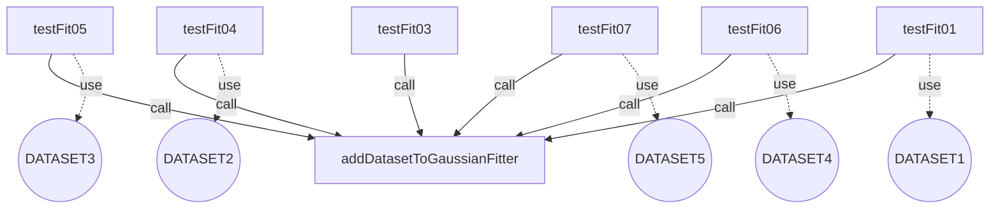

Number of max pairs: $45.0$
Number of direct connections (link by): $0.0$
**TCC value: $0.0$**


# The class 'PolynomialFitterTest'
Package: `org.apache.commons.math3.optimization.fitting.PolynomialFitterTest`
methods : [ `testLargeSample` `checkUnsolvableProblem` `testFit` `buildRandomPolynomial` `testMath798` `testMath798WithToleranceTooLow` `testMath798WithToleranceTooLowButNoException` `testNoError` `doMath798` `testSmallError` `testRedundantSolvable` `testRedundantUnsolvable` ]
attributes : [ ]

The TCC value is 0 because the class has no methods or no attributes.


# The class 'MultivariateDifferentiableMultiStartOptimizerTest'
Package: `org.apache.commons.math3.optimization.MultivariateDifferentiableMultiStartOptimizerTest`
methods : [ `testCircleFitting` ]
attributes : [ ]

The TCC value is 0 because the class has no methods or no attributes.


# The class 'SimpleValueCheckerTest'
Package: `org.apache.commons.math3.optimization.SimpleValueCheckerTest`
methods : [ `testIterationCheck` `testIterationCheckDisabled` `testIterationCheckPrecondition` ]
attributes : [ ]

The TCC value is 0 because the class has no methods or no attributes.


# The class 'PointValuePairTest'
Package: `org.apache.commons.math3.optimization.PointValuePairTest`
methods : [ `testSerial` ]
attributes : [ ]

The TCC value is 0 because the class has no methods or no attributes.


# The class 'UnivariateMultiStartOptimizerTest'
Package: `org.apache.commons.math3.optimization.univariate.UnivariateMultiStartOptimizerTest`
methods : [ `testQuinticMin` `testBadFunction` `testSinMin` ]
attributes : [ ]

The TCC value is 0 because the class has no methods or no attributes.


# The class 'SimpleUnivariateValueCheckerTest'
Package: `org.apache.commons.math3.optimization.univariate.SimpleUnivariateValueCheckerTest`
methods : [ `testIterationCheckPrecondition` `testIterationCheckDisabled` `testIterationCheck` ]
attributes : [ ]

The TCC value is 0 because the class has no methods or no attributes.


# The class 'BracketFinderTest'
Package: `org.apache.commons.math3.optimization.univariate.BracketFinderTest`
methods : [ `testCubicMin` `testIntervalBoundsOrdering` `testCubicMax` `testMinimumIsOnIntervalBoundary` ]
attributes : [ ]

The TCC value is 0 because the class has no methods or no attributes.


# The class 'BrentOptimizerTest'
Package: `org.apache.commons.math3.optimization.univariate.BrentOptimizerTest`
methods : [ `testQuinticMax` `testKeepInitIfBest` `testQuinticMin` `testMath855` `testSinMinWithValueChecker` `testMinEndpoints` `testBoundaries` `testSinMin` `testMath832` `testQuinticMinStatistics` ]
attributes : [ ]

The TCC value is 0 because the class has no methods or no attributes.


# The class 'SimplexTableauTest'
Package: `org.apache.commons.math3.optimization.linear.SimplexTableauTest`
methods : [ `testDropPhase1Objective` `testSerial` `assertMatrixEquals` `createFunction` `testTableauWithNoArtificialVars` `createConstraints` `testInitialization` ]
attributes : [ ]

The TCC value is 0 because the class has no methods or no attributes.


# The class 'SimplexSolverTest'
Package: `org.apache.commons.math3.optimization.linear.SimplexSolverTest`
methods : [ `testSolutionWithNegativeDecisionVariable` `testMath286` `testMath293` `testMath828Cycle` `testDegeneracy` `testRestrictVariablesToNonNegative` `testLargeModel` `testMath828` `testMath434PivotRowSelection` `testSimplexSolver` `testMath434PivotRowSelection2` `testMath781` `testMinimization` `testMath272` `testMath288` `testMath290LEQ` `testTrivialModel` `testMath434UnfeasibleSolution` `equationFromString` `testSingleVariableAndConstraint` `testInfeasibleSolution` `testEpsilon` `validSolution` `testModelWithNoArtificialVars` `testUnboundedSolution` `testMath713NegativeVariable` `testMath434NegativeVariable` `testMath290GEQ` ]
attributes : [ ]

The TCC value is 0 because the class has no methods or no attributes.


# The class 'MultivariateMultiStartOptimizerTest'
Package: `org.apache.commons.math3.optimization.MultivariateMultiStartOptimizerTest`
methods : [ `testRosenbrock` ]
attributes : [ ]

The TCC value is 0 because the class has no methods or no attributes.


# The class 'PointVectorValuePairTest'
Package: `org.apache.commons.math3.optimization.PointVectorValuePairTest`
methods : [ `testSerial` ]
attributes : [ ]

The TCC value is 0 because the class has no methods or no attributes.


# The class 'NonLinearConjugateGradientOptimizerTest'
Package: `org.apache.commons.math3.optimization.general.NonLinearConjugateGradientOptimizerTest`
methods : [ `testTwoSets` `testOneSet` `testInconsistentEquations` `testColumnsPermutation` `testMoreEstimatedParametersUnsorted` `testNonInversible` `testIllConditioned` `testNoDependency` `testMoreEstimatedParametersSimple` `testCircleFitting` `testTrivial` `testRedundantEquations` ]
attributes : [ ]

The TCC value is 0 because the class has no methods or no attributes.


# The class 'CircleVectorial'
Package: `org.apache.commons.math3.optimization.general.CircleVectorial`
methods : [ `getRadius` `value` `getN` `addPoint` `value` `distance` `getRadius` ]
attributes : [ `points` ]

The attributes used in each method are:
  - getRadius uses [points]
  - value uses [points]
  - getN uses [points]
  - value uses [points]
  - addPoint uses [points]
  - getRadius uses [points]

The methods called in each method are:
  - getRadius calls [distance]
  - value calls [distance, getRadius]
  - value calls [distance, getRadius]
  - getRadius calls [distance]

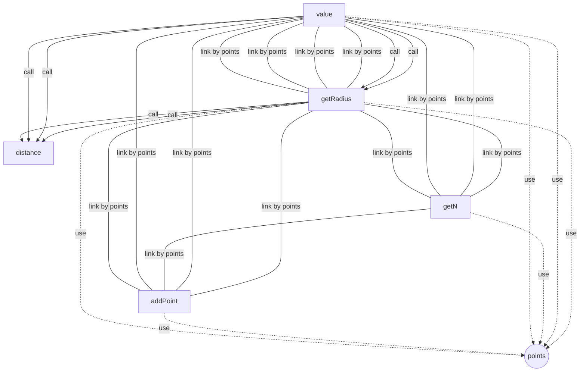

Number of max pairs: $21.0$
Number of direct connections (link by): $13.0$
**TCC value: $0.6190476190476191$**


# The class 'StraightLineProblem'
Package: `org.apache.commons.math3.optimization.general.StraightLineProblem`
methods : [ `x` `y` `target` `addPoint` `solve` `weight` `value` `value` ]
attributes : [ `sigma` `points` ]

The attributes used in each method are:
  - x uses [points]
  - y uses [points]
  - addPoint uses [points]
  - solve uses [points]
  - value uses [points]
  - weight uses [sigma, points]
  - value uses [points]

The methods called in each method are:
  - target calls [y]
  - value calls [value]
  - value calls [value]

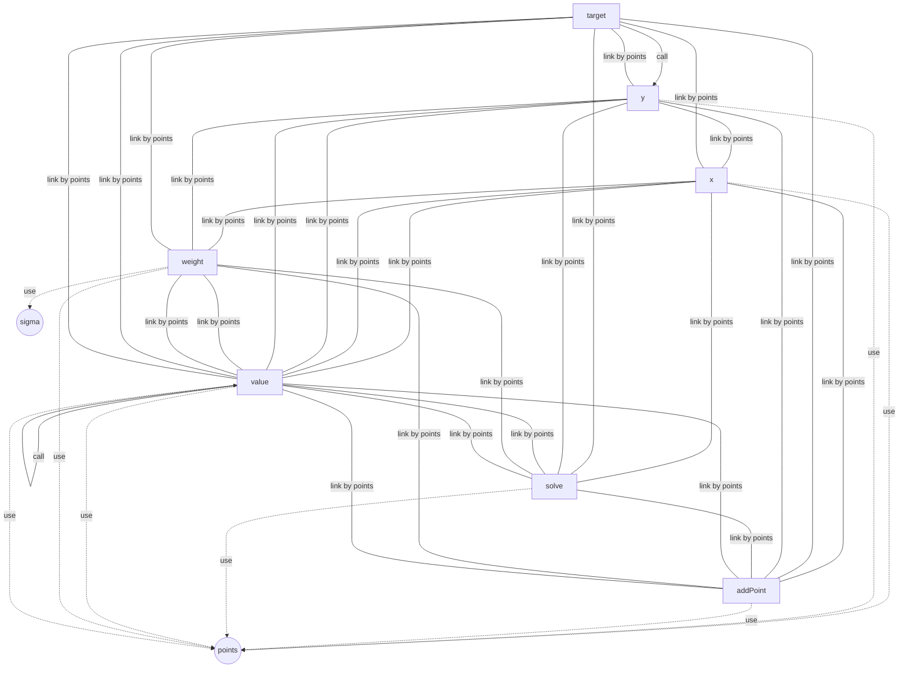

Number of max pairs: $28.0$
Number of direct connections (link by): $27.0$
**TCC value: $0.9642857142857143$**


# The class 'GaussNewtonOptimizerTest'
Package: `org.apache.commons.math3.optimization.general.GaussNewtonOptimizerTest`
methods : [ `testMoreEstimatedParametersSimple` `testMoreEstimatedParametersUnsorted` `createOptimizer` `testCircleFittingBadInit` `testMaxEvaluations` `testHahn1` ]
attributes : [ ]

The TCC value is 0 because the class has no methods or no attributes.


# The class 'AbstractLeastSquaresOptimizerTestValidation'
Package: `org.apache.commons.math3.optimization.general.AbstractLeastSquaresOptimizerTestValidation`
methods : [ `testParametersErrorMonteCarloParameters` `getChi2N` `testParametersErrorMonteCarloObservations` ]
attributes : [ `MONTE_CARLO_RUNS` ]

The attributes used in each method are:
  - testParametersErrorMonteCarloParameters uses [MONTE_CARLO_RUNS]
  - testParametersErrorMonteCarloObservations uses [MONTE_CARLO_RUNS]

The methods called in each method are:
  - testParametersErrorMonteCarloParameters calls [getChi2N]

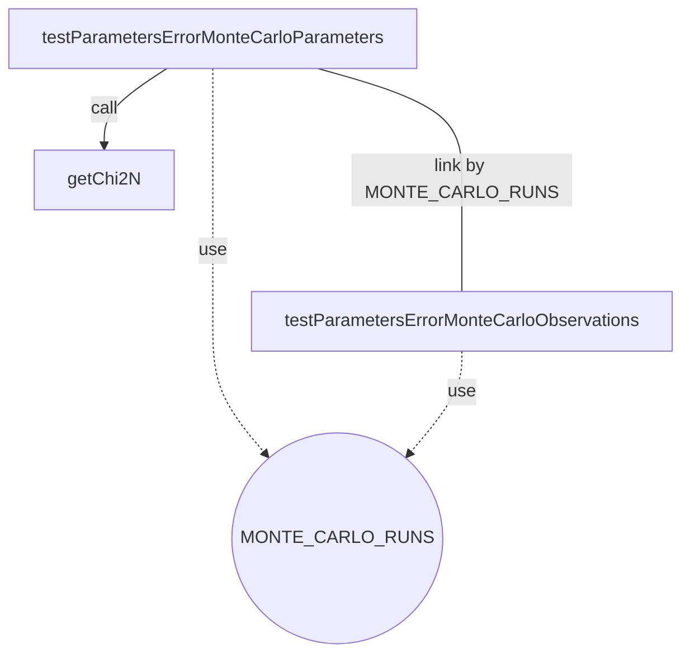

Number of max pairs: $3.0$
Number of direct connections (link by): $1.0$
**TCC value: $0.3333333333333333$**


# The class 'DummyOptimizer'
Package: `org.apache.commons.math3.optimization.general.DummyOptimizer`
methods : [ `doOptimize` ]
attributes : [ ]

The TCC value is 0 because the class has no methods or no attributes.


# The class 'CircleProblem'
Package: `org.apache.commons.math3.optimization.general.CircleProblem`
methods : [ `value` `value` `target` `addPoint` `weight` ]
attributes : [ `ySigma` `xSigma` `points` ]

The attributes used in each method are:
  - value uses [points]
  - value uses [points]
  - target uses [points]
  - addPoint uses [points]
  - weight uses [ySigma, xSigma, points]

The methods called in each method are:

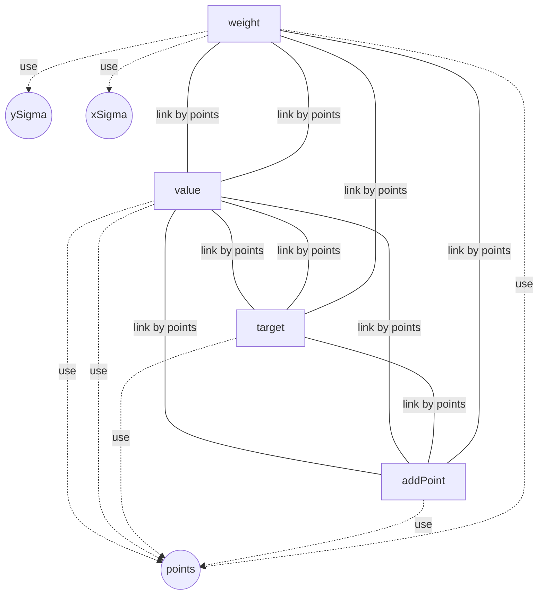

Number of max pairs: $10.0$
Number of direct connections (link by): $9.0$
**TCC value: $0.9$**


# The class 'RandomCirclePointGenerator'
Package: `org.apache.commons.math3.optimization.general.RandomCirclePointGenerator`
methods : [ `generate` `create` ]
attributes : [ `cX` `cY` `tP` `radius` ]

The attributes used in each method are:
  - create uses [cX, cY, tP, radius]

The methods called in each method are:
  - generate calls [create]

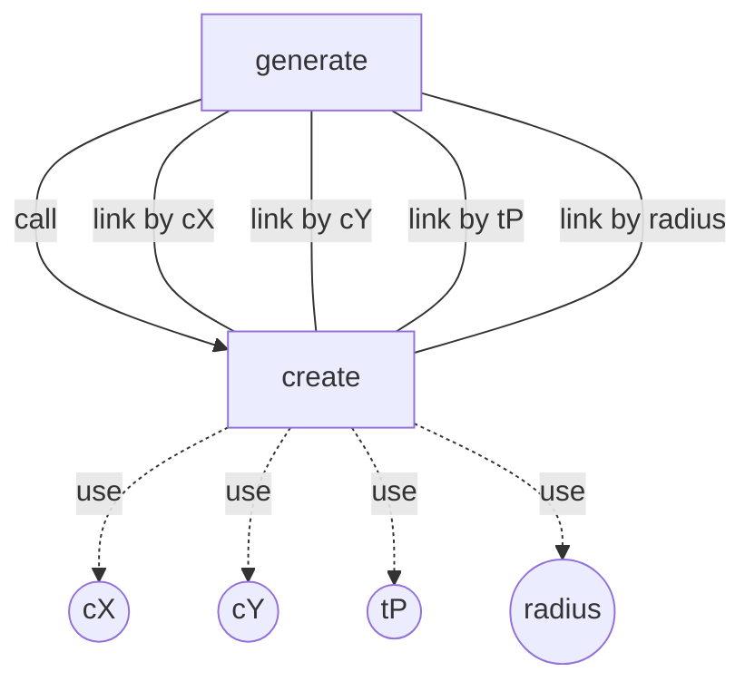

Number of max pairs: $1.0$
Number of direct connections (link by): $4.0$
**TCC value: $4.0$**


# The class 'CircleScalar'
Package: `org.apache.commons.math3.optimization.general.CircleScalar`
methods : [ `getRadius` `value` `addPoint` `distance` `getRadius` `value` ]
attributes : [ `points` ]

The attributes used in each method are:
  - getRadius uses [points]
  - value uses [points]
  - addPoint uses [points]
  - value uses [points]
  - getRadius uses [points]

The methods called in each method are:
  - getRadius calls [distance]
  - value calls [distance, getRadius]
  - value calls [distance, getRadius]
  - getRadius calls [distance]

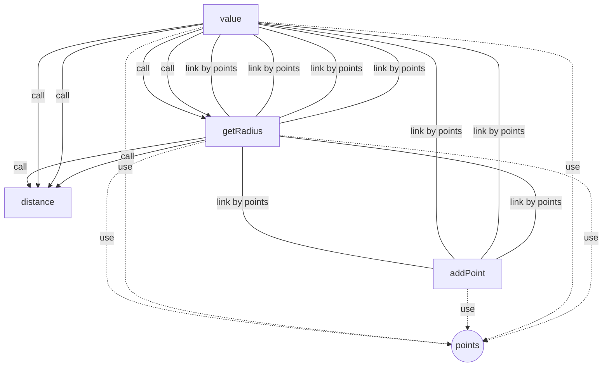

Number of max pairs: $15.0$
Number of direct connections (link by): $8.0$
**TCC value: $0.5333333333333333$**


# The class 'MinpackTest'
Package: `org.apache.commons.math3.optimization.general.MinpackTest`
methods : [ `testMinpackPowellSingular` `minpackTest` `testMinpackLinearRank1` `testMinpackFreudensteinRoth` `testMinpackMeyer` `testMinpackRosenbrok` `testMinpackWatson` `testMinpackChebyquad` `testMinpackBox3Dimensional` `testMinpackLinearRank1ZeroColsAndRows` `testMinpackOsborne1` `testMinpackLinearFullRank` `testMinpackKowalikOsborne` `testMinpackBard` `testMinpackBrownDennis` `testMinpackOsborne2` `testMinpackBrownAlmostLinear` `testMinpackJennrichSampson` `testMinpackHelicalValley` ]
attributes : [ ]

The TCC value is 0 because the class has no methods or no attributes.


# The class 'LevenbergMarquardtOptimizerTest'
Package: `org.apache.commons.math3.optimization.general.LevenbergMarquardtOptimizerTest`
methods : [ `testCircleFitting2` `createOptimizer` `testMath199` `testControlParameters` `checkEstimate` `testNonInvertible` `testBevington` ]
attributes : [ ]

The TCC value is 0 because the class has no methods or no attributes.


# The class 'StatisticalReferenceDataset'
Package: `org.apache.commons.math3.optimization.general.StatisticalReferenceDataset`
methods : [ `getLeastSquaresProblem` `getParameters` `findLineNumbers` `getName` `getParameterStandardDeviation` `getNumObservations` `getStartingPoint` `getX` `getParametersStandardDeviations` `getResidualSumOfSquares` `getData` `getNumStartingPoints` `getY` `getNumParameters` `getModelValue` `getParameter` ]
attributes : [ `a` `problem` `sigA` `numStartingPoints` `numObservations` `numParameters` `name` `x` `y` `residualSumOfSquares` `startingValues` ]

The attributes used in each method are:
  - getLeastSquaresProblem uses [problem]
  - getParameters uses [a]
  - getParameterStandardDeviation uses [sigA]
  - getName uses [name]
  - getStartingPoint uses [startingValues]
  - getNumObservations uses [numObservations]
  - getX uses [x]
  - getParametersStandardDeviations uses [sigA]
  - getResidualSumOfSquares uses [residualSumOfSquares]
  - getData uses [x, y]
  - getNumStartingPoints uses [numStartingPoints]
  - getY uses [y]
  - getNumParameters uses [numParameters]
  - getParameter uses [a]

The methods called in each method are:

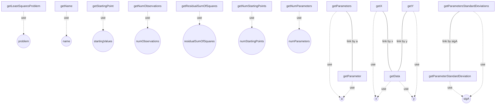

Number of max pairs: $120.0$
Number of direct connections (link by): $4.0$
**TCC value: $0.03333333333333333$**


# The class 'StatisticalReferenceDatasetFactory'
Package: `org.apache.commons.math3.optimization.general.StatisticalReferenceDatasetFactory`
methods : [ `createKirby2` `createAll` `createBufferedReaderFromResource` `createLanczos1` `createMGH17` `createHahn1` ]
attributes : [ ]

The TCC value is 0 because the class has no methods or no attributes.


# The class 'AbstractLeastSquaresOptimizerTest'
Package: `org.apache.commons.math3.optimization.general.AbstractLeastSquaresOptimizerTest`
methods : [ `testGetRMS` `testGetChiSquare` `createOptimizer` `testComputeSigma` ]
attributes : [ ]

The TCC value is 0 because the class has no methods or no attributes.


# The class 'RandomStraightLinePointGenerator'
Package: `org.apache.commons.math3.optimization.general.RandomStraightLinePointGenerator`
methods : [ `generate` `create` ]
attributes : [ `intercept` `x` `slope` `error` ]

The attributes used in each method are:
  - create uses [intercept, x, slope, error]

The methods called in each method are:
  - generate calls [create]

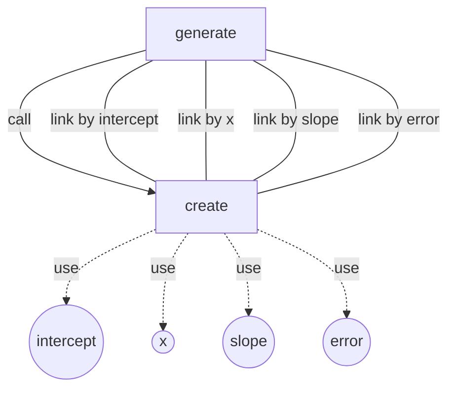

Number of max pairs: $1.0$
Number of direct connections (link by): $4.0$
**TCC value: $4.0$**


# The class 'AbstractLeastSquaresOptimizerAbstractTest'
Package: `org.apache.commons.math3.optimization.general.AbstractLeastSquaresOptimizerAbstractTest`
methods : [ `testOneSet` `doTestStRD` `testMoreEstimatedParametersUnsorted` `testInconsistentSizes2` `testQRColumnsPermutation` `testIllConditioned` `testKirby2` `testNoDependency` `testNonInvertible` `testCircleFittingGoodInit` `testInconsistentEquations` `testTwoSets` `createOptimizer` `testHahn1` `testRedundantEquations` `testMoreEstimatedParametersSimple` `testInconsistentSizes1` `testCircleFitting` `testTrivial` `testCircleFittingBadInit` ]
attributes : [ `circlePoints` ]

The attributes used in each method are:
  - testCircleFittingGoodInit uses [circlePoints]
  - testCircleFittingBadInit uses [circlePoints]

The methods called in each method are:
  - testOneSet calls [createOptimizer]
  - doTestStRD calls [createOptimizer]
  - testMoreEstimatedParametersUnsorted calls [createOptimizer]
  - testInconsistentSizes2 calls [createOptimizer]
  - testQRColumnsPermutation calls [createOptimizer]
  - testIllConditioned calls [createOptimizer]
  - testKirby2 calls [doTestStRD]
  - testNonInvertible calls [createOptimizer]
  - testNoDependency calls [createOptimizer]
  - testCircleFittingGoodInit calls [createOptimizer]
  - testInconsistentEquations calls [createOptimizer]
  - testTwoSets calls [createOptimizer]
  - testHahn1 calls [doTestStRD]
  - testRedundantEquations calls [createOptimizer]
  - testInconsistentSizes1 calls [createOptimizer]
  - testMoreEstimatedParametersSimple calls [createOptimizer]
  - testCircleFitting calls [createOptimizer]
  - testCircleFittingBadInit calls [createOptimizer]
  - testTrivial calls [createOptimizer]

```mermaid
graph TD
  testOneSet -->|call| createOptimizer
  doTestStRD -->|call| createOptimizer
  testMoreEstimatedParametersUnsorted -->|call| createOptimizer
  testInconsistentSizes2 -->|call| createOptimizer
  testQRColumnsPermutation -->|call| createOptimizer
  testIllConditioned -->|call| createOptimizer
  testKirby2 -->|call| doTestStRD
  testNonInvertible -->|call| createOptimizer
  testNoDependency -->|call| createOptimizer
  testCircleFittingGoodInit -->|call| createOptimizer
  testInconsistentEquations -->|call| createOptimizer
  testTwoSets -->|call| createOptimizer
  testHahn1 -->|call| doTestStRD
  testRedundantEquations -->|call| createOptimizer
  testInconsistentSizes1 -->|call| createOptimizer
  testMoreEstimatedParametersSimple -->|call| createOptimizer
  testCircleFitting -->|call| createOptimizer
  testCircleFittingBadInit -->|call| createOptimizer
  testTrivial -->|call| createOptimizer
  testCircleFittingGoodInit -. use .->circlePoints((circlePoints))
  testCircleFittingBadInit -. use .->circlePoints((circlePoints))
  testCircleFittingGoodInit ----|link by circlePoints| testCircleFittingBadInit
```

Number of max pairs: $190.0$
Number of direct connections (link by): $1.0$
**TCC value: $0.005263157894736842$**


# The class 'UniformIntegerDistributionTest'
Package: `org.apache.commons.math3.distribution.UniformIntegerDistributionTest`
methods : [ `makeCumulativeTestPoints` `testMoments` `makeDensityTestValues` `makeDensityTestPoints` `setUp` `makeInverseCumulativeTestPoints` `makeInverseCumulativeTestValues` `makeCumulativeTestValues` `makeDistribution` `testPreconditionUpperBoundInclusive` ]
attributes : [ ]

The TCC value is 0 because the class has no methods or no attributes.


# The class 'ChiSquaredDistributionTest'
Package: `org.apache.commons.math3.distribution.ChiSquaredDistributionTest`
methods : [ `makeDistribution` `makeDensityTestValues` `makeCumulativeTestPoints` `testSmallDf` `makeInverseCumulativeTestPoints` `makeCumulativeTestValues` `setUp` `testDfAccessors` `testDensity` `testMoments` `makeInverseCumulativeTestValues` `checkDensity` ]
attributes : [ ]

The TCC value is 0 because the class has no methods or no attributes.


# The class 'FDistributionTest'
Package: `org.apache.commons.math3.distribution.FDistributionTest`
methods : [ `testMath785` `testDfAccessors` `testSmallDegreesOfFreedom` `testMoments` `testPreconditions` `makeCumulativeTestValues` `setUp` `makeCumulativeTestPoints` `testLargeDegreesOfFreedom` `testInverseCumulativeProbabilityExtremes` `makeDensityTestValues` `testCumulativeProbabilityExtremes` `makeDistribution` ]
attributes : [ ]

The TCC value is 0 because the class has no methods or no attributes.


# The class 'IntegerDistributionAbstractTest'
Package: `org.apache.commons.math3.distribution.IntegerDistributionAbstractTest`
methods : [ `makeDensityTestValues` `getDistribution` `makeInverseCumulativeTestValues` `getInverseCumulativeTestValues` `getDensityTestValues` `getCumulativeTestPoints` `setDensityTestPoints` `verifyDensities` `getTolerance` `testLogDensities` `setCumulativeTestPoints` `testCumulativeProbabilities` `testIllegalArguments` `makeLogDensityTestValues` `makeDistribution` `getCumulativeTestValues` `setInverseCumulativeTestValues` `setDistribution` `setCumulativeTestValues` `tearDown` `verifyInverseCumulativeProbabilities` `setTolerance` `makeCumulativeTestValues` `verifyCumulativeProbabilities` `setUp` `verifyLogDensities` `getInverseCumulativeTestPoints` `testSampling` `setInverseCumulativeTestPoints` `makeCumulativeTestPoints` `testInverseCumulativeProbabilities` `testConsistencyAtSupportBounds` `makeInverseCumulativeTestPoints` `testDensities` `getDensityTestPoints` `makeDensityTestPoints` `setDensityTestValues` ]
attributes : [ `inverseCumulativeTestPoints` `densityTestPoints` `inverseCumulativeTestValues` `cumulativeTestPoints` `logDensityTestValues` `distribution` `tolerance` `densityTestValues` `cumulativeTestValues` ]

The attributes used in each method are:
  - getDistribution uses [distribution]
  - getInverseCumulativeTestValues uses [inverseCumulativeTestValues]
  - getDensityTestValues uses [densityTestValues]
  - getCumulativeTestPoints uses [cumulativeTestPoints]
  - setDensityTestPoints uses [densityTestPoints]
  - getTolerance uses [tolerance]
  - verifyDensities uses [densityTestPoints, distribution, densityTestValues]
  - setCumulativeTestPoints uses [cumulativeTestPoints]
  - testIllegalArguments uses [distribution]
  - makeLogDensityTestValues uses [logDensityTestValues, densityTestValues]
  - getCumulativeTestValues uses [cumulativeTestValues]
  - setInverseCumulativeTestValues uses [inverseCumulativeTestValues]
  - setDistribution uses [distribution]
  - setCumulativeTestValues uses [cumulativeTestValues]
  - tearDown uses [inverseCumulativeTestPoints, densityTestPoints, inverseCumulativeTestValues, cumulativeTestPoints, logDensityTestValues, distribution, densityTestValues, cumulativeTestValues]
  - setTolerance uses [tolerance]
  - verifyInverseCumulativeProbabilities uses [inverseCumulativeTestPoints, inverseCumulativeTestValues, distribution]
  - verifyCumulativeProbabilities uses [cumulativeTestPoints, distribution, cumulativeTestValues]
  - setUp uses [inverseCumulativeTestPoints, densityTestPoints, inverseCumulativeTestValues, cumulativeTestPoints, logDensityTestValues, distribution, densityTestValues, cumulativeTestValues]
  - getInverseCumulativeTestPoints uses [inverseCumulativeTestPoints]
  - verifyLogDensities uses [densityTestPoints, logDensityTestValues, distribution, tolerance]
  - testSampling uses [distribution]
  - setInverseCumulativeTestPoints uses [inverseCumulativeTestPoints]
  - testConsistencyAtSupportBounds uses [distribution]
  - getDensityTestPoints uses [densityTestPoints]
  - setDensityTestValues uses [densityTestValues]

The methods called in each method are:
  - testCumulativeProbabilities calls [verifyCumulativeProbabilities]
  - makeLogDensityTestValues calls [makeDensityTestValues]
  - testDensities calls [verifyDensities]
  - verifyCumulativeProbabilities calls [getTolerance]
  - setUp calls [makeDensityTestValues, makeCumulativeTestPoints, makeDistribution, makeCumulativeTestValues, makeInverseCumulativeTestPoints, makeDensityTestPoints, makeLogDensityTestValues, makeInverseCumulativeTestValues]
  - verifyDensities calls [getTolerance]
  - testSampling calls [makeDensityTestValues, makeDistribution, makeDensityTestPoints]
  - testLogDensities calls [verifyLogDensities]
  - testInverseCumulativeProbabilities calls [verifyInverseCumulativeProbabilities]
  - testConsistencyAtSupportBounds calls [getTolerance]

```mermaid
graph TD
  testCumulativeProbabilities -->|call| verifyCumulativeProbabilities
  makeLogDensityTestValues -->|call| makeDensityTestValues
  testDensities -->|call| verifyDensities
  verifyCumulativeProbabilities -->|call| getTolerance
  setUp -->|call| makeDensityTestValues
  setUp -->|call| makeCumulativeTestPoints
  setUp -->|call| makeDistribution
  setUp -->|call| makeCumulativeTestValues
  setUp -->|call| makeInverseCumulativeTestPoints
  setUp -->|call| makeDensityTestPoints
  setUp -->|call| makeLogDensityTestValues
  setUp -->|call| makeInverseCumulativeTestValues
  verifyDensities -->|call| getTolerance
  testSampling -->|call| makeDensityTestValues
  testSampling -->|call| makeDistribution
  testSampling -->|call| makeDensityTestPoints
  testLogDensities -->|call| verifyLogDensities
  testInverseCumulativeProbabilities -->|call| verifyInverseCumulativeProbabilities
  testConsistencyAtSupportBounds -->|call| getTolerance
  getDistribution -. use .->distribution((distribution))
  getInverseCumulativeTestValues -. use .->inverseCumulativeTestValues((inverseCumulativeTestValues))
  getDensityTestValues -. use .->densityTestValues((densityTestValues))
  getCumulativeTestPoints -. use .->cumulativeTestPoints((cumulativeTestPoints))
  setDensityTestPoints -. use .->densityTestPoints((densityTestPoints))
  getTolerance -. use .->tolerance((tolerance))
  verifyDensities -. use .->densityTestPoints((densityTestPoints))
  verifyDensities -. use .->distribution((distribution))
  verifyDensities -. use .->densityTestValues((densityTestValues))
  setCumulativeTestPoints -. use .->cumulativeTestPoints((cumulativeTestPoints))
  testIllegalArguments -. use .->distribution((distribution))
  makeLogDensityTestValues -. use .->logDensityTestValues((logDensityTestValues))
  makeLogDensityTestValues -. use .->densityTestValues((densityTestValues))
  getCumulativeTestValues -. use .->cumulativeTestValues((cumulativeTestValues))
  setInverseCumulativeTestValues -. use .->inverseCumulativeTestValues((inverseCumulativeTestValues))
  setDistribution -. use .->distribution((distribution))
  setCumulativeTestValues -. use .->cumulativeTestValues((cumulativeTestValues))
  tearDown -. use .->inverseCumulativeTestPoints((inverseCumulativeTestPoints))
  tearDown -. use .->densityTestPoints((densityTestPoints))
  tearDown -. use .->inverseCumulativeTestValues((inverseCumulativeTestValues))
  tearDown -. use .->cumulativeTestPoints((cumulativeTestPoints))
  tearDown -. use .->logDensityTestValues((logDensityTestValues))
  tearDown -. use .->distribution((distribution))
  tearDown -. use .->densityTestValues((densityTestValues))
  tearDown -. use .->cumulativeTestValues((cumulativeTestValues))
  setTolerance -. use .->tolerance((tolerance))
  verifyInverseCumulativeProbabilities -. use .->inverseCumulativeTestPoints((inverseCumulativeTestPoints))
  verifyInverseCumulativeProbabilities -. use .->inverseCumulativeTestValues((inverseCumulativeTestValues))
  verifyInverseCumulativeProbabilities -. use .->distribution((distribution))
  verifyCumulativeProbabilities -. use .->cumulativeTestPoints((cumulativeTestPoints))
  verifyCumulativeProbabilities -. use .->distribution((distribution))
  verifyCumulativeProbabilities -. use .->cumulativeTestValues((cumulativeTestValues))
  setUp -. use .->inverseCumulativeTestPoints((inverseCumulativeTestPoints))
  setUp -. use .->densityTestPoints((densityTestPoints))
  setUp -. use .->inverseCumulativeTestValues((inverseCumulativeTestValues))
  setUp -. use .->cumulativeTestPoints((cumulativeTestPoints))
  setUp -. use .->logDensityTestValues((logDensityTestValues))
  setUp -. use .->distribution((distribution))
  setUp -. use .->densityTestValues((densityTestValues))
  setUp -. use .->cumulativeTestValues((cumulativeTestValues))
  getInverseCumulativeTestPoints -. use .->inverseCumulativeTestPoints((inverseCumulativeTestPoints))
  verifyLogDensities -. use .->densityTestPoints((densityTestPoints))
  verifyLogDensities -. use .->logDensityTestValues((logDensityTestValues))
  verifyLogDensities -. use .->distribution((distribution))
  verifyLogDensities -. use .->tolerance((tolerance))
  testSampling -. use .->distribution((distribution))
  setInverseCumulativeTestPoints -. use .->inverseCumulativeTestPoints((inverseCumulativeTestPoints))
  testConsistencyAtSupportBounds -. use .->distribution((distribution))
  getDensityTestPoints -. use .->densityTestPoints((densityTestPoints))
  setDensityTestValues -. use .->densityTestValues((densityTestValues))
  setDensityTestPoints ----|link by densityTestPoints| getDensityTestPoints
  verifyDensities ----|link by densityTestPoints| setDensityTestPoints
  verifyDensities ----|link by densityTestPoints| testLogDensities
  verifyDensities ----|link by densityTestPoints| tearDown
  verifyDensities ----|link by densityTestPoints| setUp
  verifyDensities ----|link by densityTestPoints| testDensities
  verifyDensities ----|link by densityTestPoints| getDensityTestPoints
  verifyDensities ----|link by distribution| getDistribution
  verifyDensities ----|link by distribution| testLogDensities
  verifyDensities ----|link by distribution| testCumulativeProbabilities
  verifyDensities ----|link by distribution| testIllegalArguments
  verifyDensities ----|link by distribution| setDistribution
  verifyDensities ----|link by distribution| tearDown
  verifyDensities ----|link by distribution| verifyCumulativeProbabilities
  verifyDensities ----|link by distribution| setUp
  verifyDensities ----|link by distribution| testSampling
  verifyDensities ----|link by distribution| testInverseCumulativeProbabilities
  verifyDensities ----|link by distribution| testConsistencyAtSupportBounds
  verifyDensities ----|link by distribution| testDensities
  verifyDensities ----|link by tolerance| getTolerance
  verifyDensities ----|link by tolerance| testLogDensities
  verifyDensities ----|link by tolerance| testCumulativeProbabilities
  verifyDensities ----|link by tolerance| setTolerance
  verifyDensities ----|link by tolerance| verifyCumulativeProbabilities
  verifyDensities ----|link by tolerance| testConsistencyAtSupportBounds
  verifyDensities ----|link by tolerance| testDensities
  verifyDensities ----|link by densityTestValues| getDensityTestValues
  verifyDensities ----|link by densityTestValues| makeLogDensityTestValues
  verifyDensities ----|link by densityTestValues| tearDown
  verifyDensities ----|link by densityTestValues| setUp
  verifyDensities ----|link by densityTestValues| testDensities
  verifyDensities ----|link by densityTestValues| setDensityTestValues
  testLogDensities ----|link by densityTestPoints| setDensityTestPoints
  testLogDensities ----|link by densityTestPoints| tearDown
  testLogDensities ----|link by densityTestPoints| setUp
  testLogDensities ----|link by densityTestPoints| testDensities
  testLogDensities ----|link by densityTestPoints| getDensityTestPoints
  testLogDensities ----|link by logDensityTestValues| makeLogDensityTestValues
  testLogDensities ----|link by logDensityTestValues| tearDown
  testLogDensities ----|link by logDensityTestValues| setUp
  testLogDensities ----|link by distribution| getDistribution
  testLogDensities ----|link by distribution| testCumulativeProbabilities
  testLogDensities ----|link by distribution| testIllegalArguments
  testLogDensities ----|link by distribution| setDistribution
  testLogDensities ----|link by distribution| tearDown
  testLogDensities ----|link by distribution| setUp
  testLogDensities ----|link by distribution| testInverseCumulativeProbabilities
  testLogDensities ----|link by distribution| testConsistencyAtSupportBounds
  testLogDensities ----|link by distribution| testDensities
  testLogDensities ----|link by tolerance| getTolerance
  testLogDensities ----|link by tolerance| testCumulativeProbabilities
  testLogDensities ----|link by tolerance| setTolerance
  testLogDensities ----|link by tolerance| testConsistencyAtSupportBounds
  testLogDensities ----|link by tolerance| testDensities
  setCumulativeTestPoints ----|link by cumulativeTestPoints| getCumulativeTestPoints
  testCumulativeProbabilities ----|link by cumulativeTestPoints| getCumulativeTestPoints
  testCumulativeProbabilities ----|link by cumulativeTestPoints| setCumulativeTestPoints
  testCumulativeProbabilities ----|link by cumulativeTestPoints| tearDown
  testCumulativeProbabilities ----|link by cumulativeTestPoints| setUp
  testCumulativeProbabilities ----|link by distribution| getDistribution
  testCumulativeProbabilities ----|link by distribution| setDistribution
  testCumulativeProbabilities ----|link by distribution| tearDown
  testCumulativeProbabilities ----|link by distribution| setUp
  testCumulativeProbabilities ----|link by distribution| testConsistencyAtSupportBounds
  testCumulativeProbabilities ----|link by tolerance| getTolerance
  testCumulativeProbabilities ----|link by tolerance| setTolerance
  testCumulativeProbabilities ----|link by tolerance| testConsistencyAtSupportBounds
  testCumulativeProbabilities ----|link by cumulativeTestValues| getCumulativeTestValues
  testCumulativeProbabilities ----|link by cumulativeTestValues| setCumulativeTestValues
  testCumulativeProbabilities ----|link by cumulativeTestValues| tearDown
  testCumulativeProbabilities ----|link by cumulativeTestValues| setUp
  testIllegalArguments ----|link by distribution| getDistribution
  testIllegalArguments ----|link by distribution| testCumulativeProbabilities
  testIllegalArguments ----|link by distribution| setDistribution
  testIllegalArguments ----|link by distribution| tearDown
  testIllegalArguments ----|link by distribution| setUp
  testIllegalArguments ----|link by distribution| testConsistencyAtSupportBounds
  testIllegalArguments ----|link by distribution| testDensities
  makeLogDensityTestValues ----|link by densityTestValues| getDensityTestValues
  setInverseCumulativeTestValues ----|link by inverseCumulativeTestValues| getInverseCumulativeTestValues
  setDistribution ----|link by distribution| getDistribution
  setCumulativeTestValues ----|link by cumulativeTestValues| getCumulativeTestValues
  tearDown ----|link by inverseCumulativeTestPoints| setUp
  tearDown ----|link by inverseCumulativeTestPoints| getInverseCumulativeTestPoints
  tearDown ----|link by inverseCumulativeTestPoints| setInverseCumulativeTestPoints
  tearDown ----|link by densityTestPoints| setDensityTestPoints
  tearDown ----|link by densityTestPoints| setUp
  tearDown ----|link by densityTestPoints| getDensityTestPoints
  tearDown ----|link by inverseCumulativeTestValues| getInverseCumulativeTestValues
  tearDown ----|link by inverseCumulativeTestValues| setInverseCumulativeTestValues
  tearDown ----|link by inverseCumulativeTestValues| setUp
  tearDown ----|link by cumulativeTestPoints| getCumulativeTestPoints
  tearDown ----|link by cumulativeTestPoints| setCumulativeTestPoints
  tearDown ----|link by cumulativeTestPoints| setUp
  tearDown ----|link by logDensityTestValues| makeLogDensityTestValues
  tearDown ----|link by logDensityTestValues| setUp
  tearDown ----|link by distribution| getDistribution
  tearDown ----|link by distribution| setDistribution
  tearDown ----|link by distribution| setUp
  tearDown ----|link by densityTestValues| getDensityTestValues
  tearDown ----|link by densityTestValues| makeLogDensityTestValues
  tearDown ----|link by densityTestValues| setUp
  tearDown ----|link by densityTestValues| setDensityTestValues
  tearDown ----|link by cumulativeTestValues| getCumulativeTestValues
  tearDown ----|link by cumulativeTestValues| setCumulativeTestValues
  tearDown ----|link by cumulativeTestValues| setUp
  setTolerance ----|link by tolerance| getTolerance
  verifyInverseCumulativeProbabilities ----|link by inverseCumulativeTestPoints| tearDown
  verifyInverseCumulativeProbabilities ----|link by inverseCumulativeTestPoints| setUp
  verifyInverseCumulativeProbabilities ----|link by inverseCumulativeTestPoints| getInverseCumulativeTestPoints
  verifyInverseCumulativeProbabilities ----|link by inverseCumulativeTestPoints| setInverseCumulativeTestPoints
  verifyInverseCumulativeProbabilities ----|link by inverseCumulativeTestPoints| testInverseCumulativeProbabilities
  verifyInverseCumulativeProbabilities ----|link by inverseCumulativeTestValues| getInverseCumulativeTestValues
  verifyInverseCumulativeProbabilities ----|link by inverseCumulativeTestValues| setInverseCumulativeTestValues
  verifyInverseCumulativeProbabilities ----|link by inverseCumulativeTestValues| tearDown
  verifyInverseCumulativeProbabilities ----|link by inverseCumulativeTestValues| setUp
  verifyInverseCumulativeProbabilities ----|link by inverseCumulativeTestValues| testInverseCumulativeProbabilities
  verifyInverseCumulativeProbabilities ----|link by distribution| getDistribution
  verifyInverseCumulativeProbabilities ----|link by distribution| verifyDensities
  verifyInverseCumulativeProbabilities ----|link by distribution| testLogDensities
  verifyInverseCumulativeProbabilities ----|link by distribution| testCumulativeProbabilities
  verifyInverseCumulativeProbabilities ----|link by distribution| testIllegalArguments
  verifyInverseCumulativeProbabilities ----|link by distribution| setDistribution
  verifyInverseCumulativeProbabilities ----|link by distribution| tearDown
  verifyInverseCumulativeProbabilities ----|link by distribution| verifyCumulativeProbabilities
  verifyInverseCumulativeProbabilities ----|link by distribution| setUp
  verifyInverseCumulativeProbabilities ----|link by distribution| testSampling
  verifyInverseCumulativeProbabilities ----|link by distribution| testInverseCumulativeProbabilities
  verifyInverseCumulativeProbabilities ----|link by distribution| testConsistencyAtSupportBounds
  verifyInverseCumulativeProbabilities ----|link by distribution| testDensities
  verifyCumulativeProbabilities ----|link by cumulativeTestPoints| getCumulativeTestPoints
  verifyCumulativeProbabilities ----|link by cumulativeTestPoints| setCumulativeTestPoints
  verifyCumulativeProbabilities ----|link by cumulativeTestPoints| testCumulativeProbabilities
  verifyCumulativeProbabilities ----|link by cumulativeTestPoints| tearDown
  verifyCumulativeProbabilities ----|link by cumulativeTestPoints| setUp
  verifyCumulativeProbabilities ----|link by distribution| getDistribution
  verifyCumulativeProbabilities ----|link by distribution| testLogDensities
  verifyCumulativeProbabilities ----|link by distribution| testCumulativeProbabilities
  verifyCumulativeProbabilities ----|link by distribution| testIllegalArguments
  verifyCumulativeProbabilities ----|link by distribution| setDistribution
  verifyCumulativeProbabilities ----|link by distribution| tearDown
  verifyCumulativeProbabilities ----|link by distribution| setUp
  verifyCumulativeProbabilities ----|link by distribution| testSampling
  verifyCumulativeProbabilities ----|link by distribution| testInverseCumulativeProbabilities
  verifyCumulativeProbabilities ----|link by distribution| testConsistencyAtSupportBounds
  verifyCumulativeProbabilities ----|link by distribution| testDensities
  verifyCumulativeProbabilities ----|link by tolerance| getTolerance
  verifyCumulativeProbabilities ----|link by tolerance| testLogDensities
  verifyCumulativeProbabilities ----|link by tolerance| testCumulativeProbabilities
  verifyCumulativeProbabilities ----|link by tolerance| setTolerance
  verifyCumulativeProbabilities ----|link by tolerance| testConsistencyAtSupportBounds
  verifyCumulativeProbabilities ----|link by tolerance| testDensities
  verifyCumulativeProbabilities ----|link by cumulativeTestValues| testCumulativeProbabilities
  verifyCumulativeProbabilities ----|link by cumulativeTestValues| getCumulativeTestValues
  verifyCumulativeProbabilities ----|link by cumulativeTestValues| setCumulativeTestValues
  verifyCumulativeProbabilities ----|link by cumulativeTestValues| tearDown
  verifyCumulativeProbabilities ----|link by cumulativeTestValues| setUp
  setUp ----|link by inverseCumulativeTestPoints| getInverseCumulativeTestPoints
  setUp ----|link by inverseCumulativeTestPoints| setInverseCumulativeTestPoints
  setUp ----|link by densityTestPoints| setDensityTestPoints
  setUp ----|link by densityTestPoints| getDensityTestPoints
  setUp ----|link by inverseCumulativeTestValues| getInverseCumulativeTestValues
  setUp ----|link by inverseCumulativeTestValues| setInverseCumulativeTestValues
  setUp ----|link by cumulativeTestPoints| getCumulativeTestPoints
  setUp ----|link by cumulativeTestPoints| setCumulativeTestPoints
  setUp ----|link by logDensityTestValues| makeLogDensityTestValues
  setUp ----|link by distribution| getDistribution
  setUp ----|link by distribution| setDistribution
  setUp ----|link by densityTestValues| getDensityTestValues
  setUp ----|link by densityTestValues| makeLogDensityTestValues
  setUp ----|link by densityTestValues| setDensityTestValues
  setUp ----|link by cumulativeTestValues| getCumulativeTestValues
  setUp ----|link by cumulativeTestValues| setCumulativeTestValues
  verifyLogDensities ----|link by densityTestPoints| setDensityTestPoints
  verifyLogDensities ----|link by densityTestPoints| verifyDensities
  verifyLogDensities ----|link by densityTestPoints| testLogDensities
  verifyLogDensities ----|link by densityTestPoints| tearDown
  verifyLogDensities ----|link by densityTestPoints| setUp
  verifyLogDensities ----|link by densityTestPoints| testDensities
  verifyLogDensities ----|link by densityTestPoints| getDensityTestPoints
  verifyLogDensities ----|link by logDensityTestValues| testLogDensities
  verifyLogDensities ----|link by logDensityTestValues| makeLogDensityTestValues
  verifyLogDensities ----|link by logDensityTestValues| tearDown
  verifyLogDensities ----|link by logDensityTestValues| setUp
  verifyLogDensities ----|link by distribution| getDistribution
  verifyLogDensities ----|link by distribution| verifyDensities
  verifyLogDensities ----|link by distribution| testLogDensities
  verifyLogDensities ----|link by distribution| testCumulativeProbabilities
  verifyLogDensities ----|link by distribution| testIllegalArguments
  verifyLogDensities ----|link by distribution| setDistribution
  verifyLogDensities ----|link by distribution| tearDown
  verifyLogDensities ----|link by distribution| verifyInverseCumulativeProbabilities
  verifyLogDensities ----|link by distribution| verifyCumulativeProbabilities
  verifyLogDensities ----|link by distribution| setUp
  verifyLogDensities ----|link by distribution| testSampling
  verifyLogDensities ----|link by distribution| testInverseCumulativeProbabilities
  verifyLogDensities ----|link by distribution| testConsistencyAtSupportBounds
  verifyLogDensities ----|link by distribution| testDensities
  verifyLogDensities ----|link by tolerance| getTolerance
  verifyLogDensities ----|link by tolerance| verifyDensities
  verifyLogDensities ----|link by tolerance| testLogDensities
  verifyLogDensities ----|link by tolerance| testCumulativeProbabilities
  verifyLogDensities ----|link by tolerance| setTolerance
  verifyLogDensities ----|link by tolerance| verifyCumulativeProbabilities
  verifyLogDensities ----|link by tolerance| testConsistencyAtSupportBounds
  verifyLogDensities ----|link by tolerance| testDensities
  testSampling ----|link by distribution| getDistribution
  testSampling ----|link by distribution| testLogDensities
  testSampling ----|link by distribution| testCumulativeProbabilities
  testSampling ----|link by distribution| testIllegalArguments
  testSampling ----|link by distribution| setDistribution
  testSampling ----|link by distribution| tearDown
  testSampling ----|link by distribution| setUp
  testSampling ----|link by distribution| testInverseCumulativeProbabilities
  testSampling ----|link by distribution| testConsistencyAtSupportBounds
  testSampling ----|link by distribution| testDensities
  setInverseCumulativeTestPoints ----|link by inverseCumulativeTestPoints| getInverseCumulativeTestPoints
  testInverseCumulativeProbabilities ----|link by inverseCumulativeTestPoints| tearDown
  testInverseCumulativeProbabilities ----|link by inverseCumulativeTestPoints| setUp
  testInverseCumulativeProbabilities ----|link by inverseCumulativeTestPoints| getInverseCumulativeTestPoints
  testInverseCumulativeProbabilities ----|link by inverseCumulativeTestPoints| setInverseCumulativeTestPoints
  testInverseCumulativeProbabilities ----|link by inverseCumulativeTestValues| getInverseCumulativeTestValues
  testInverseCumulativeProbabilities ----|link by inverseCumulativeTestValues| setInverseCumulativeTestValues
  testInverseCumulativeProbabilities ----|link by inverseCumulativeTestValues| tearDown
  testInverseCumulativeProbabilities ----|link by inverseCumulativeTestValues| setUp
  testInverseCumulativeProbabilities ----|link by distribution| getDistribution
  testInverseCumulativeProbabilities ----|link by distribution| testCumulativeProbabilities
  testInverseCumulativeProbabilities ----|link by distribution| testIllegalArguments
  testInverseCumulativeProbabilities ----|link by distribution| setDistribution
  testInverseCumulativeProbabilities ----|link by distribution| tearDown
  testInverseCumulativeProbabilities ----|link by distribution| setUp
  testInverseCumulativeProbabilities ----|link by distribution| testConsistencyAtSupportBounds
  testInverseCumulativeProbabilities ----|link by distribution| testDensities
  testConsistencyAtSupportBounds ----|link by distribution| getDistribution
  testConsistencyAtSupportBounds ----|link by distribution| setDistribution
  testConsistencyAtSupportBounds ----|link by distribution| tearDown
  testConsistencyAtSupportBounds ----|link by distribution| setUp
  testConsistencyAtSupportBounds ----|link by tolerance| getTolerance
  testConsistencyAtSupportBounds ----|link by tolerance| setTolerance
  testDensities ----|link by densityTestPoints| setDensityTestPoints
  testDensities ----|link by densityTestPoints| tearDown
  testDensities ----|link by densityTestPoints| setUp
  testDensities ----|link by densityTestPoints| getDensityTestPoints
  testDensities ----|link by distribution| getDistribution
  testDensities ----|link by distribution| testCumulativeProbabilities
  testDensities ----|link by distribution| setDistribution
  testDensities ----|link by distribution| tearDown
  testDensities ----|link by distribution| setUp
  testDensities ----|link by distribution| testConsistencyAtSupportBounds
  testDensities ----|link by tolerance| getTolerance
  testDensities ----|link by tolerance| testCumulativeProbabilities
  testDensities ----|link by tolerance| setTolerance
  testDensities ----|link by tolerance| testConsistencyAtSupportBounds
  testDensities ----|link by densityTestValues| getDensityTestValues
  testDensities ----|link by densityTestValues| makeLogDensityTestValues
  testDensities ----|link by densityTestValues| tearDown
  testDensities ----|link by densityTestValues| setUp
  testDensities ----|link by densityTestValues| setDensityTestValues
  setDensityTestValues ----|link by densityTestValues| getDensityTestValues
  setDensityTestValues ----|link by densityTestValues| makeLogDensityTestValues
```

Number of max pairs: $666.0$
Number of direct connections (link by): $260.0$
**TCC value: $0.39039039039039036$**


# The class 'PoissonDistributionTest'
Package: `org.apache.commons.math3.distribution.PoissonDistributionTest`
methods : [ `makeDistribution` `testDegenerateInverseCumulativeProbability` `testMoments` `testLargeMeanInverseCumulativeProbability` `testLargeMeanCumulativeProbability` `makeDensityTestPoints` `checkProbability` `makeCumulativeTestValues` `testCumulativeProbabilitySpecial` `testMean` `makeInverseCumulativeTestValues` `makeCumulativeTestPoints` `testNegativeMean` `makeDensityTestValues` `testNormalApproximateProbability` `makeInverseCumulativeTestPoints` `makeLogDensityTestValues` ]
attributes : [ `DEFAULT_TEST_POISSON_PARAMETER` ]

The attributes used in each method are:
  - makeDistribution uses [DEFAULT_TEST_POISSON_PARAMETER]
  - testDegenerateInverseCumulativeProbability uses [DEFAULT_TEST_POISSON_PARAMETER]

The methods called in each method are:
  - testCumulativeProbabilitySpecial calls [checkProbability]

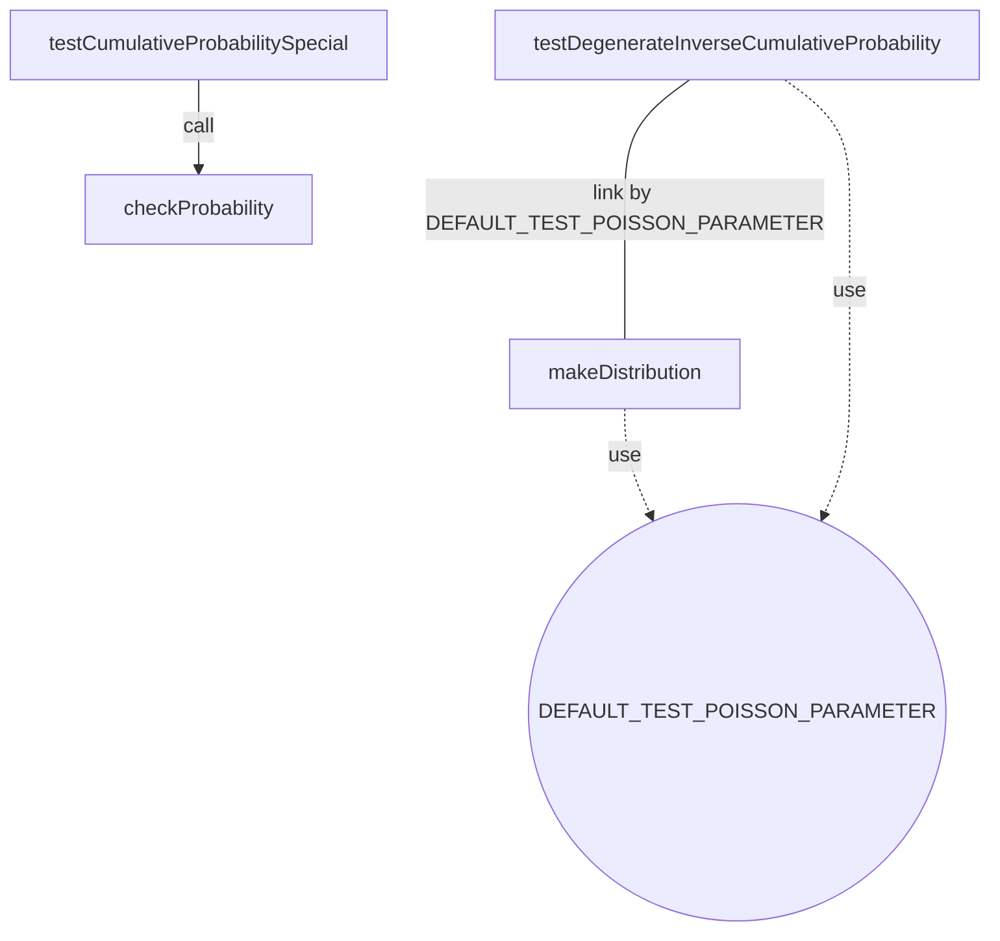

Number of max pairs: $136.0$
Number of direct connections (link by): $1.0$
**TCC value: $0.007352941176470588$**

> [...] + 174 568 more lines
> *This file has been lowered to ~2000 lines*