# Report TCC Value

Calculating the TCC values of the classes in `/home/cody/Git/VV-ESIR-TP2/code/Exercise2/source/commons-math3-3.6.1-src/src`

# The class 'PrimesTest'
Package: `org.apache.commons.math3.primes.PrimesTest`

methods : [ `assertNextPrimeException` `product` `sum` `assertPrimeFactorsException` `testPrimeFactors` `testNextPrime` `testIsPrime` `checkPrimeFactors` ]

attributes : [ `PRIMES_SET` `BELOW_2` `NOT_PRIMES` `PRIMES` ]


The attributes used in each method are:
  - testPrimeFactors uses [BELOW_2, NOT_PRIMES, PRIMES]
  - testIsPrime uses [BELOW_2, NOT_PRIMES, PRIMES]
  - checkPrimeFactors uses [PRIMES_SET]

The methods called in each method are:
  - testPrimeFactors calls [product, assertPrimeFactorsException, checkPrimeFactors]
  - testNextPrime calls [assertNextPrimeException]

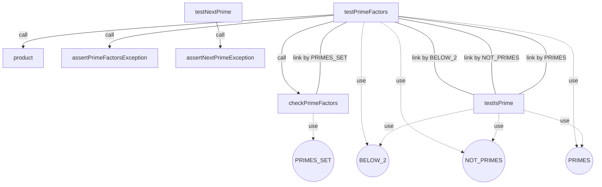

Number of max pairs: $28.0$

Number of direct connections (link by): $4.0$

**TCC value: $0.14285714285714285$**


# The class 'RetryRunnerTest'
Package: `org.apache.commons.math3.RetryRunnerTest`

methods : [ `testRetryFailSometimes` `testRetryFailAlways` ]

attributes : [ `rng` ]


The attributes used in each method are:
  - testRetryFailSometimes uses [rng]

The methods called in each method are:

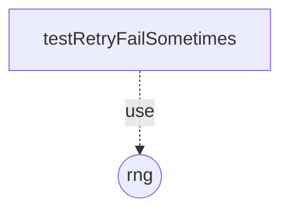

Number of max pairs: $1.0$

Number of direct connections (link by): $0.0$

**TCC value: $0.0$**


# The class 'NonMonotonicSequenceExceptionTest'
Package: `org.apache.commons.math3.exception.NonMonotonicSequenceExceptionTest`

methods : [ `testAccessors` ]

attributes : [ ]


The TCC value is 0 because the class has no methods or no attributes.


# The class 'NumberIsTooLargeExceptionTest'
Package: `org.apache.commons.math3.exception.NumberIsTooLargeExceptionTest`

methods : [ `testAccessors` ]

attributes : [ ]


The TCC value is 0 because the class has no methods or no attributes.


# The class 'MaxCountExceededExceptionTest'
Package: `org.apache.commons.math3.exception.MaxCountExceededExceptionTest`

methods : [ `testAccessors` ]

attributes : [ ]


The TCC value is 0 because the class has no methods or no attributes.


# The class 'LocalizedFormatsTest'
Package: `org.apache.commons.math3.exception.util.LocalizedFormatsTest`

methods : [ `testNoMissingFrenchTranslation` `testVariablePartsConsistency` `testAllKeysPresentInPropertiesFiles` `testAllPropertiesCorrespondToKeys` `testNoOpEnglishTranslation` `testMessageNumber` ]

attributes : [ ]


The TCC value is 0 because the class has no methods or no attributes.


# The class 'ExceptionContextTest'
Package: `org.apache.commons.math3.exception.util.ExceptionContextTest`

methods : [ `testMessageChain` `testNoArgAddMessage` `testSerialize` `testSerializeUnserializable` `testContext` ]

attributes : [ ]


The TCC value is 0 because the class has no methods or no attributes.


# The class 'ArgUtilsTest'
Package: `org.apache.commons.math3.exception.util.ArgUtilsTest`

methods : [ `testFlatten` `create` ]

attributes : [ ]


The TCC value is 0 because the class has no methods or no attributes.


# The class 'OutOfRangeExceptionTest'
Package: `org.apache.commons.math3.exception.OutOfRangeExceptionTest`

methods : [ `testAccessors` ]

attributes : [ ]


The TCC value is 0 because the class has no methods or no attributes.


# The class 'TooManyEvaluationsExceptionTest'
Package: `org.apache.commons.math3.exception.TooManyEvaluationsExceptionTest`

methods : [ `testMessage` ]

attributes : [ ]


The TCC value is 0 because the class has no methods or no attributes.


# The class 'NotStrictlyPositiveExceptionTest'
Package: `org.apache.commons.math3.exception.NotStrictlyPositiveExceptionTest`

methods : [ `testAccessors` ]

attributes : [ ]


The TCC value is 0 because the class has no methods or no attributes.


# The class 'NumberIsTooSmallExceptionTest'
Package: `org.apache.commons.math3.exception.NumberIsTooSmallExceptionTest`

methods : [ `testAccessors` ]

attributes : [ ]


The TCC value is 0 because the class has no methods or no attributes.


# The class 'DimensionMismatchExceptionTest'
Package: `org.apache.commons.math3.exception.DimensionMismatchExceptionTest`

methods : [ `testAccessors` ]

attributes : [ ]


The TCC value is 0 because the class has no methods or no attributes.


# The class 'NotPositiveExceptionTest'
Package: `org.apache.commons.math3.exception.NotPositiveExceptionTest`

methods : [ `testAccessors` ]

attributes : [ ]


The TCC value is 0 because the class has no methods or no attributes.


# The class 'KalmanFilterTest'
Package: `org.apache.commons.math3.filter.KalmanFilterTest`

methods : [ `testConstant` `testTransitionControlMatrixMismatch` `testConstantAcceleration` `testCannonball` `assertMatrixEquals` `assertVectorEquals` `testTransitionMeasurementMatrixMismatch` ]

attributes : [ ]


The TCC value is 0 because the class has no methods or no attributes.


# The class 'PowellOptimizerTest'
Package: `org.apache.commons.math3.optimization.direct.PowellOptimizerTest`

methods : [ `testQuadratic` `doTest` `doTest` `testMaximizeQuadratic` `testRelativeToleranceOnScaledValues` `testSumSinc` ]

attributes : [ ]


The TCC value is 0 because the class has no methods or no attributes.


# The class 'MultivariateFunctionPenaltyAdapterTest'
Package: `org.apache.commons.math3.optimization.direct.MultivariateFunctionPenaltyAdapterTest`

methods : [ `testStartSimplexInsideRange` `testUnbounded` `testStartSimplexOutsideRange` `testHalfBounded` `testOptimumOutsideRange` ]

attributes : [ ]


The TCC value is 0 because the class has no methods or no attributes.


# The class 'MultivariateFunctionMappingAdapterTest'
Package: `org.apache.commons.math3.optimization.direct.MultivariateFunctionMappingAdapterTest`

methods : [ `testStartSimplexInsideRange` `testOptimumOutsideRange` `testUnbounded` `testHalfBounded` ]

attributes : [ ]


The TCC value is 0 because the class has no methods or no attributes.


# The class 'BOBYQAOptimizerTest'
Package: `org.apache.commons.math3.optimization.direct.BOBYQAOptimizerTest`

methods : [ `testBoundariesDimensionMismatch` `doTest` `testCigTab` `testTablet` `testTwoAxes` `testAckley` `testRastrigin` `testMaxEvaluations` `testConstrainedRosen` `point` `testElliRotated` `testSphere` `boundaries` `testCigar` `testSsDiffPow` `testRosen` `testMaximize` `testProblemDimensionTooSmall` `testEllipse` `testDiffPow` `doTest` `testInitOutOfBounds` `testConstrainedRosenWithMoreInterpolationPoints` ]

attributes : [ `DIM` ]


The attributes used in each method are:
  - testBoundariesDimensionMismatch uses [DIM]
  - testTablet uses [DIM]
  - testCigTab uses [DIM]
  - testAckley uses [DIM]
  - testTwoAxes uses [DIM]
  - testRastrigin uses [DIM]
  - testConstrainedRosen uses [DIM]
  - testMaxEvaluations uses [DIM]
  - testElliRotated uses [DIM]
  - testSphere uses [DIM]
  - testCigar uses [DIM]
  - testSsDiffPow uses [DIM]
  - testRosen uses [DIM]
  - testMaximize uses [DIM]
  - testEllipse uses [DIM]
  - testDiffPow uses [DIM]
  - testInitOutOfBounds uses [DIM]
  - testConstrainedRosenWithMoreInterpolationPoints uses [DIM]

The methods called in each method are:
  - testBoundariesDimensionMismatch calls [doTest, boundaries, point]
  - testTablet calls [doTest, point]
  - testCigTab calls [doTest, point]
  - testAckley calls [doTest, point]
  - testTwoAxes calls [doTest, point]
  - testRastrigin calls [doTest, point]
  - testConstrainedRosen calls [doTest, boundaries, point]
  - testMaxEvaluations calls [doTest, point]
  - testElliRotated calls [doTest, point]
  - testSphere calls [doTest, point]
  - testCigar calls [doTest, point]
  - testSsDiffPow calls [doTest, point]
  - testRosen calls [doTest, point]
  - testMaximize calls [doTest, boundaries, point]
  - testEllipse calls [doTest, point]
  - testProblemDimensionTooSmall calls [doTest, point]
  - testDiffPow calls [doTest, point]
  - doTest calls [doTest]
  - testInitOutOfBounds calls [doTest, boundaries, point]
  - testConstrainedRosenWithMoreInterpolationPoints calls [doTest, boundaries, point]

```mermaid
graph TD
  testBoundariesDimensionMismatch -->|call| doTest
  testBoundariesDimensionMismatch -->|call| boundaries
  testBoundariesDimensionMismatch -->|call| point
  testTablet -->|call| doTest
  testTablet -->|call| point
  testCigTab -->|call| doTest
  testCigTab -->|call| point
  testAckley -->|call| doTest
  testAckley -->|call| point
  testTwoAxes -->|call| doTest
  testTwoAxes -->|call| point
  testRastrigin -->|call| doTest
  testRastrigin -->|call| point
  testConstrainedRosen -->|call| doTest
  testConstrainedRosen -->|call| boundaries
  testConstrainedRosen -->|call| point
  testMaxEvaluations -->|call| doTest
  testMaxEvaluations -->|call| point
  testElliRotated -->|call| doTest
  testElliRotated -->|call| point
  testSphere -->|call| doTest
  testSphere -->|call| point
  testCigar -->|call| doTest
  testCigar -->|call| point
  testSsDiffPow -->|call| doTest
  testSsDiffPow -->|call| point
  testRosen -->|call| doTest
  testRosen -->|call| point
  testMaximize -->|call| doTest
  testMaximize -->|call| boundaries
  testMaximize -->|call| point
  testEllipse -->|call| doTest
  testEllipse -->|call| point
  testProblemDimensionTooSmall -->|call| doTest
  testProblemDimensionTooSmall -->|call| point
  testDiffPow -->|call| doTest
  testDiffPow -->|call| point
  doTest -->|call| doTest
  testInitOutOfBounds -->|call| doTest
  testInitOutOfBounds -->|call| boundaries
  testInitOutOfBounds -->|call| point
  testConstrainedRosenWithMoreInterpolationPoints -->|call| doTest
  testConstrainedRosenWithMoreInterpolationPoints -->|call| boundaries
  testConstrainedRosenWithMoreInterpolationPoints -->|call| point
  testBoundariesDimensionMismatch -. use .->DIM((DIM))
  testTablet -. use .->DIM((DIM))
  testCigTab -. use .->DIM((DIM))
  testAckley -. use .->DIM((DIM))
  testTwoAxes -. use .->DIM((DIM))
  testRastrigin -. use .->DIM((DIM))
  testConstrainedRosen -. use .->DIM((DIM))
  testMaxEvaluations -. use .->DIM((DIM))
  testElliRotated -. use .->DIM((DIM))
  testSphere -. use .->DIM((DIM))
  testCigar -. use .->DIM((DIM))
  testSsDiffPow -. use .->DIM((DIM))
  testRosen -. use .->DIM((DIM))
  testMaximize -. use .->DIM((DIM))
  testEllipse -. use .->DIM((DIM))
  testDiffPow -. use .->DIM((DIM))
  testInitOutOfBounds -. use .->DIM((DIM))
  testConstrainedRosenWithMoreInterpolationPoints -. use .->DIM((DIM))
  testBoundariesDimensionMismatch ----|link by DIM| testAckley
  testTablet ----|link by DIM| testBoundariesDimensionMismatch
  testTablet ----|link by DIM| testCigTab
  testTablet ----|link by DIM| testAckley
  testTablet ----|link by DIM| testRastrigin
  testTablet ----|link by DIM| testConstrainedRosen
  testTablet ----|link by DIM| testMaxEvaluations
  testTablet ----|link by DIM| testElliRotated
  testTablet ----|link by DIM| testSphere
  testTablet ----|link by DIM| testCigar
  testTablet ----|link by DIM| testSsDiffPow
  testTablet ----|link by DIM| testRosen
  testTablet ----|link by DIM| testMaximize
  testTablet ----|link by DIM| testEllipse
  testTablet ----|link by DIM| testDiffPow
  testTablet ----|link by DIM| testInitOutOfBounds
  testTablet ----|link by DIM| testConstrainedRosenWithMoreInterpolationPoints
  testCigTab ----|link by DIM| testBoundariesDimensionMismatch
  testCigTab ----|link by DIM| testAckley
  testTwoAxes ----|link by DIM| testBoundariesDimensionMismatch
  testTwoAxes ----|link by DIM| testTablet
  testTwoAxes ----|link by DIM| testCigTab
  testTwoAxes ----|link by DIM| testAckley
  testTwoAxes ----|link by DIM| testRastrigin
  testTwoAxes ----|link by DIM| testConstrainedRosen
  testTwoAxes ----|link by DIM| testMaxEvaluations
  testTwoAxes ----|link by DIM| testElliRotated
  testTwoAxes ----|link by DIM| testSphere
  testTwoAxes ----|link by DIM| testCigar
  testTwoAxes ----|link by DIM| testSsDiffPow
  testTwoAxes ----|link by DIM| testRosen
  testTwoAxes ----|link by DIM| testMaximize
  testTwoAxes ----|link by DIM| testEllipse
  testTwoAxes ----|link by DIM| testDiffPow
  testTwoAxes ----|link by DIM| testInitOutOfBounds
  testTwoAxes ----|link by DIM| testConstrainedRosenWithMoreInterpolationPoints
  testRastrigin ----|link by DIM| testBoundariesDimensionMismatch
  testRastrigin ----|link by DIM| testCigTab
  testRastrigin ----|link by DIM| testAckley
  testRastrigin ----|link by DIM| testConstrainedRosen
  testRastrigin ----|link by DIM| testMaxEvaluations
  testRastrigin ----|link by DIM| testElliRotated
  testRastrigin ----|link by DIM| testCigar
  testRastrigin ----|link by DIM| testMaximize
  testRastrigin ----|link by DIM| testEllipse
  testRastrigin ----|link by DIM| testDiffPow
  testRastrigin ----|link by DIM| testInitOutOfBounds
  testRastrigin ----|link by DIM| testConstrainedRosenWithMoreInterpolationPoints
  testConstrainedRosen ----|link by DIM| testBoundariesDimensionMismatch
  testConstrainedRosen ----|link by DIM| testCigTab
  testConstrainedRosen ----|link by DIM| testAckley
  testConstrainedRosen ----|link by DIM| testCigar
  testMaxEvaluations ----|link by DIM| testBoundariesDimensionMismatch
  testMaxEvaluations ----|link by DIM| testCigTab
  testMaxEvaluations ----|link by DIM| testAckley
  testMaxEvaluations ----|link by DIM| testConstrainedRosen
  testMaxEvaluations ----|link by DIM| testElliRotated
  testMaxEvaluations ----|link by DIM| testCigar
  testMaxEvaluations ----|link by DIM| testEllipse
  testMaxEvaluations ----|link by DIM| testDiffPow
  testMaxEvaluations ----|link by DIM| testInitOutOfBounds
  testMaxEvaluations ----|link by DIM| testConstrainedRosenWithMoreInterpolationPoints
  testElliRotated ----|link by DIM| testBoundariesDimensionMismatch
  testElliRotated ----|link by DIM| testCigTab
  testElliRotated ----|link by DIM| testAckley
  testElliRotated ----|link by DIM| testConstrainedRosen
  testElliRotated ----|link by DIM| testCigar
  testElliRotated ----|link by DIM| testDiffPow
  testElliRotated ----|link by DIM| testConstrainedRosenWithMoreInterpolationPoints
  testSphere ----|link by DIM| testBoundariesDimensionMismatch
  testSphere ----|link by DIM| testCigTab
  testSphere ----|link by DIM| testAckley
  testSphere ----|link by DIM| testRastrigin
  testSphere ----|link by DIM| testConstrainedRosen
  testSphere ----|link by DIM| testMaxEvaluations
  testSphere ----|link by DIM| testElliRotated
  testSphere ----|link by DIM| testCigar
  testSphere ----|link by DIM| testRosen
  testSphere ----|link by DIM| testMaximize
  testSphere ----|link by DIM| testEllipse
  testSphere ----|link by DIM| testDiffPow
  testSphere ----|link by DIM| testInitOutOfBounds
  testSphere ----|link by DIM| testConstrainedRosenWithMoreInterpolationPoints
  testCigar ----|link by DIM| testBoundariesDimensionMismatch
  testCigar ----|link by DIM| testCigTab
  testCigar ----|link by DIM| testAckley
  testSsDiffPow ----|link by DIM| testBoundariesDimensionMismatch
  testSsDiffPow ----|link by DIM| testCigTab
  testSsDiffPow ----|link by DIM| testAckley
  testSsDiffPow ----|link by DIM| testRastrigin
  testSsDiffPow ----|link by DIM| testConstrainedRosen
  testSsDiffPow ----|link by DIM| testMaxEvaluations
  testSsDiffPow ----|link by DIM| testElliRotated
  testSsDiffPow ----|link by DIM| testSphere
  testSsDiffPow ----|link by DIM| testCigar
  testSsDiffPow ----|link by DIM| testRosen
  testSsDiffPow ----|link by DIM| testMaximize
  testSsDiffPow ----|link by DIM| testEllipse
  testSsDiffPow ----|link by DIM| testDiffPow
  testSsDiffPow ----|link by DIM| testInitOutOfBounds
  testSsDiffPow ----|link by DIM| testConstrainedRosenWithMoreInterpolationPoints
  testRosen ----|link by DIM| testBoundariesDimensionMismatch
  testRosen ----|link by DIM| testCigTab
  testRosen ----|link by DIM| testAckley
  testRosen ----|link by DIM| testRastrigin
  testRosen ----|link by DIM| testConstrainedRosen
  testRosen ----|link by DIM| testMaxEvaluations
  testRosen ----|link by DIM| testElliRotated
  testRosen ----|link by DIM| testCigar
  testRosen ----|link by DIM| testMaximize
  testRosen ----|link by DIM| testEllipse
  testRosen ----|link by DIM| testDiffPow
  testRosen ----|link by DIM| testInitOutOfBounds
  testRosen ----|link by DIM| testConstrainedRosenWithMoreInterpolationPoints
  testMaximize ----|link by DIM| testBoundariesDimensionMismatch
  testMaximize ----|link by DIM| testCigTab
  testMaximize ----|link by DIM| testAckley
  testMaximize ----|link by DIM| testConstrainedRosen
  testMaximize ----|link by DIM| testMaxEvaluations
  testMaximize ----|link by DIM| testElliRotated
  testMaximize ----|link by DIM| testCigar
  testMaximize ----|link by DIM| testEllipse
  testMaximize ----|link by DIM| testDiffPow
  testMaximize ----|link by DIM| testInitOutOfBounds
  testMaximize ----|link by DIM| testConstrainedRosenWithMoreInterpolationPoints
  testEllipse ----|link by DIM| testBoundariesDimensionMismatch
  testEllipse ----|link by DIM| testCigTab
  testEllipse ----|link by DIM| testAckley
  testEllipse ----|link by DIM| testConstrainedRosen
  testEllipse ----|link by DIM| testElliRotated
  testEllipse ----|link by DIM| testCigar
  testEllipse ----|link by DIM| testDiffPow
  testEllipse ----|link by DIM| testConstrainedRosenWithMoreInterpolationPoints
  testDiffPow ----|link by DIM| testBoundariesDimensionMismatch
  testDiffPow ----|link by DIM| testCigTab
  testDiffPow ----|link by DIM| testAckley
  testDiffPow ----|link by DIM| testConstrainedRosen
  testDiffPow ----|link by DIM| testCigar
  testDiffPow ----|link by DIM| testConstrainedRosenWithMoreInterpolationPoints
  testInitOutOfBounds ----|link by DIM| testBoundariesDimensionMismatch
  testInitOutOfBounds ----|link by DIM| testCigTab
  testInitOutOfBounds ----|link by DIM| testAckley
  testInitOutOfBounds ----|link by DIM| testConstrainedRosen
  testInitOutOfBounds ----|link by DIM| testElliRotated
  testInitOutOfBounds ----|link by DIM| testCigar
  testInitOutOfBounds ----|link by DIM| testEllipse
  testInitOutOfBounds ----|link by DIM| testDiffPow
  testInitOutOfBounds ----|link by DIM| testConstrainedRosenWithMoreInterpolationPoints
  testConstrainedRosenWithMoreInterpolationPoints ----|link by DIM| testBoundariesDimensionMismatch
  testConstrainedRosenWithMoreInterpolationPoints ----|link by DIM| testCigTab
  testConstrainedRosenWithMoreInterpolationPoints ----|link by DIM| testAckley
  testConstrainedRosenWithMoreInterpolationPoints ----|link by DIM| testConstrainedRosen
  testConstrainedRosenWithMoreInterpolationPoints ----|link by DIM| testCigar
```

Number of max pairs: $253.0$

Number of direct connections (link by): $153.0$

**TCC value: $0.6047430830039525$**


# The class 'SimplexOptimizerNelderMeadTest'
Package: `org.apache.commons.math3.optimization.direct.SimplexOptimizerNelderMeadTest`

methods : [ `testPowell` `testMaximize1` `testLeastSquares1` `testMinimize2` `testLeastSquares2` `testLeastSquares3` `testMinimize1` `testMaxIterations` `testMaximize2` `testRosenbrock` ]

attributes : [ ]


The TCC value is 0 because the class has no methods or no attributes.


# The class 'SimplexOptimizerMultiDirectionalTest'
Package: `org.apache.commons.math3.optimization.direct.SimplexOptimizerMultiDirectionalTest`

methods : [ `testMath283` `testMinimize1` `testRosenbrock` `testMinimize2` `testMaximize2` `testMaximize1` `testPowell` ]

attributes : [ `count` ]


The attributes used in each method are:
  - testRosenbrock uses [count]
  - testPowell uses [count]

The methods called in each method are:

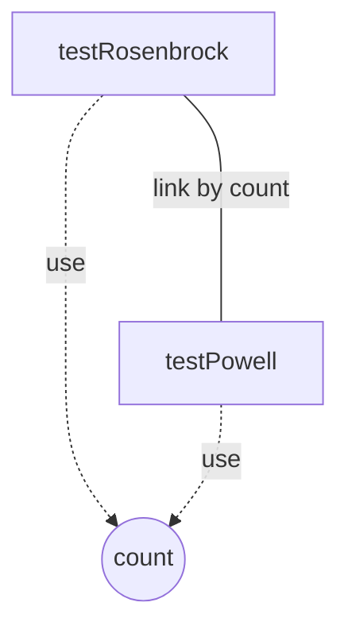

Number of max pairs: $21.0$

Number of direct connections (link by): $1.0$

**TCC value: $0.047619047619047616$**


# The class 'CMAESOptimizerTest'
Package: `org.apache.commons.math3.optimization.direct.CMAESOptimizerTest`

methods : [ `testTwoAxes` `testSsDiffPow` `testInitOutofbounds1` `testElliRotated` `testCigarWithBoundaries` `doTest` `point` `testDiffPow` `testMath864` `testCigTab` `testRastrigin` `testDiagonalRosen` `testAckley` `testInitOutofbounds2` `testInputSigmaOutOfRange` `testSphere` `testConstrainedRosen` `testInputSigmaNegative` `testEllipse` `boundaries` `testFitAccuracyDependsOnBoundary` `testInputSigmaDimensionMismatch` `testTablet` `testMaximize` `testRosen` `testCigar` `testBoundariesDimensionMismatch` ]

attributes : [ `DIM` `LAMBDA` ]


The attributes used in each method are:
  - testInitOutofbounds2 uses [DIM, LAMBDA]
  - testTwoAxes uses [DIM, LAMBDA]
  - testConstrainedRosen uses [DIM, LAMBDA]
  - testSphere uses [DIM, LAMBDA]
  - testInputSigmaOutOfRange uses [DIM, LAMBDA]
  - testSsDiffPow uses [DIM]
  - testInputSigmaNegative uses [DIM, LAMBDA]
  - testCigarWithBoundaries uses [DIM, LAMBDA]
  - testElliRotated uses [DIM, LAMBDA]
  - testInitOutofbounds1 uses [DIM, LAMBDA]
  - testEllipse uses [DIM, LAMBDA]
  - testDiffPow uses [DIM]
  - testRastrigin uses [DIM]
  - testCigTab uses [DIM, LAMBDA]
  - testInputSigmaDimensionMismatch uses [DIM, LAMBDA]
  - testTablet uses [DIM, LAMBDA]
  - testMaximize uses [DIM, LAMBDA]
  - testRosen uses [DIM, LAMBDA]
  - testCigar uses [DIM, LAMBDA]
  - testDiagonalRosen uses [DIM, LAMBDA]
  - testBoundariesDimensionMismatch uses [DIM, LAMBDA]
  - testAckley uses [DIM, LAMBDA]

The methods called in each method are:
  - testInitOutofbounds2 calls [doTest, boundaries, point]
  - testTwoAxes calls [doTest, point]
  - testConstrainedRosen calls [doTest, boundaries, point]
  - testSphere calls [doTest, point]
  - testInputSigmaOutOfRange calls [doTest, boundaries, point]
  - testSsDiffPow calls [doTest, point]
  - testInputSigmaNegative calls [doTest, point]
  - testCigarWithBoundaries calls [doTest, boundaries, point]
  - testElliRotated calls [doTest, point]
  - testInitOutofbounds1 calls [doTest, boundaries, point]
  - testEllipse calls [doTest, point]
  - testDiffPow calls [doTest, point]
  - testRastrigin calls [doTest, point]
  - testCigTab calls [doTest, point]
  - testInputSigmaDimensionMismatch calls [doTest, point]
  - testTablet calls [doTest, point]
  - testMaximize calls [doTest, boundaries, point]
  - testRosen calls [doTest, point]
  - testCigar calls [doTest, point]
  - testDiagonalRosen calls [doTest, point]
  - testBoundariesDimensionMismatch calls [doTest, boundaries, point]
  - testAckley calls [doTest, point]

```mermaid
graph TD
  testInitOutofbounds2 -->|call| doTest
  testInitOutofbounds2 -->|call| boundaries
  testInitOutofbounds2 -->|call| point
  testTwoAxes -->|call| doTest
  testTwoAxes -->|call| point
  testConstrainedRosen -->|call| doTest
  testConstrainedRosen -->|call| boundaries
  testConstrainedRosen -->|call| point
  testSphere -->|call| doTest
  testSphere -->|call| point
  testInputSigmaOutOfRange -->|call| doTest
  testInputSigmaOutOfRange -->|call| boundaries
  testInputSigmaOutOfRange -->|call| point
  testSsDiffPow -->|call| doTest
  testSsDiffPow -->|call| point
  testInputSigmaNegative -->|call| doTest
  testInputSigmaNegative -->|call| point
  testCigarWithBoundaries -->|call| doTest
  testCigarWithBoundaries -->|call| boundaries
  testCigarWithBoundaries -->|call| point
  testElliRotated -->|call| doTest
  testElliRotated -->|call| point
  testInitOutofbounds1 -->|call| doTest
  testInitOutofbounds1 -->|call| boundaries
  testInitOutofbounds1 -->|call| point
  testEllipse -->|call| doTest
  testEllipse -->|call| point
  testDiffPow -->|call| doTest
  testDiffPow -->|call| point
  testRastrigin -->|call| doTest
  testRastrigin -->|call| point
  testCigTab -->|call| doTest
  testCigTab -->|call| point
  testInputSigmaDimensionMismatch -->|call| doTest
  testInputSigmaDimensionMismatch -->|call| point
  testTablet -->|call| doTest
  testTablet -->|call| point
  testMaximize -->|call| doTest
  testMaximize -->|call| boundaries
  testMaximize -->|call| point
  testRosen -->|call| doTest
  testRosen -->|call| point
  testCigar -->|call| doTest
  testCigar -->|call| point
  testDiagonalRosen -->|call| doTest
  testDiagonalRosen -->|call| point
  testBoundariesDimensionMismatch -->|call| doTest
  testBoundariesDimensionMismatch -->|call| boundaries
  testBoundariesDimensionMismatch -->|call| point
  testAckley -->|call| doTest
  testAckley -->|call| point
  testInitOutofbounds2 -. use .->DIM((DIM))
  testInitOutofbounds2 -. use .->LAMBDA((LAMBDA))
  testTwoAxes -. use .->DIM((DIM))
  testTwoAxes -. use .->LAMBDA((LAMBDA))
  testConstrainedRosen -. use .->DIM((DIM))
  testConstrainedRosen -. use .->LAMBDA((LAMBDA))
  testSphere -. use .->DIM((DIM))
  testSphere -. use .->LAMBDA((LAMBDA))
  testInputSigmaOutOfRange -. use .->DIM((DIM))
  testInputSigmaOutOfRange -. use .->LAMBDA((LAMBDA))
  testSsDiffPow -. use .->DIM((DIM))
  testInputSigmaNegative -. use .->DIM((DIM))
  testInputSigmaNegative -. use .->LAMBDA((LAMBDA))
  testCigarWithBoundaries -. use .->DIM((DIM))
  testCigarWithBoundaries -. use .->LAMBDA((LAMBDA))
  testElliRotated -. use .->DIM((DIM))
  testElliRotated -. use .->LAMBDA((LAMBDA))
  testInitOutofbounds1 -. use .->DIM((DIM))
  testInitOutofbounds1 -. use .->LAMBDA((LAMBDA))
  testEllipse -. use .->DIM((DIM))
  testEllipse -. use .->LAMBDA((LAMBDA))
  testDiffPow -. use .->DIM((DIM))
  testRastrigin -. use .->DIM((DIM))
  testCigTab -. use .->DIM((DIM))
  testCigTab -. use .->LAMBDA((LAMBDA))
  testInputSigmaDimensionMismatch -. use .->DIM((DIM))
  testInputSigmaDimensionMismatch -. use .->LAMBDA((LAMBDA))
  testTablet -. use .->DIM((DIM))
  testTablet -. use .->LAMBDA((LAMBDA))
  testMaximize -. use .->DIM((DIM))
  testMaximize -. use .->LAMBDA((LAMBDA))
  testRosen -. use .->DIM((DIM))
  testRosen -. use .->LAMBDA((LAMBDA))
  testCigar -. use .->DIM((DIM))
  testCigar -. use .->LAMBDA((LAMBDA))
  testDiagonalRosen -. use .->DIM((DIM))
  testDiagonalRosen -. use .->LAMBDA((LAMBDA))
  testBoundariesDimensionMismatch -. use .->DIM((DIM))
  testBoundariesDimensionMismatch -. use .->LAMBDA((LAMBDA))
  testAckley -. use .->DIM((DIM))
  testAckley -. use .->LAMBDA((LAMBDA))
  testInitOutofbounds2 ----|link by DIM| testConstrainedRosen
  testInitOutofbounds2 ----|link by DIM| testCigarWithBoundaries
  testInitOutofbounds2 ----|link by DIM| testElliRotated
  testInitOutofbounds2 ----|link by DIM| testInitOutofbounds1
  testInitOutofbounds2 ----|link by DIM| testEllipse
  testInitOutofbounds2 ----|link by DIM| testDiffPow
  testInitOutofbounds2 ----|link by DIM| testCigTab
  testInitOutofbounds2 ----|link by DIM| testCigar
  testInitOutofbounds2 ----|link by DIM| testDiagonalRosen
  testInitOutofbounds2 ----|link by DIM| testBoundariesDimensionMismatch
  testInitOutofbounds2 ----|link by DIM| testAckley
  testInitOutofbounds2 ----|link by LAMBDA| testConstrainedRosen
  testInitOutofbounds2 ----|link by LAMBDA| testCigarWithBoundaries
  testInitOutofbounds2 ----|link by LAMBDA| testElliRotated
  testInitOutofbounds2 ----|link by LAMBDA| testInitOutofbounds1
  testInitOutofbounds2 ----|link by LAMBDA| testEllipse
  testInitOutofbounds2 ----|link by LAMBDA| testCigTab
  testInitOutofbounds2 ----|link by LAMBDA| testCigar
  testInitOutofbounds2 ----|link by LAMBDA| testDiagonalRosen
  testInitOutofbounds2 ----|link by LAMBDA| testBoundariesDimensionMismatch
  testInitOutofbounds2 ----|link by LAMBDA| testAckley
  testTwoAxes ----|link by DIM| testInitOutofbounds2
  testTwoAxes ----|link by DIM| testConstrainedRosen
  testTwoAxes ----|link by DIM| testSphere
  testTwoAxes ----|link by DIM| testInputSigmaOutOfRange
  testTwoAxes ----|link by DIM| testSsDiffPow
  testTwoAxes ----|link by DIM| testInputSigmaNegative
  testTwoAxes ----|link by DIM| testCigarWithBoundaries
  testTwoAxes ----|link by DIM| testElliRotated
  testTwoAxes ----|link by DIM| testInitOutofbounds1
  testTwoAxes ----|link by DIM| testEllipse
  testTwoAxes ----|link by DIM| testDiffPow
  testTwoAxes ----|link by DIM| testRastrigin
  testTwoAxes ----|link by DIM| testCigTab
  testTwoAxes ----|link by DIM| testInputSigmaDimensionMismatch
  testTwoAxes ----|link by DIM| testTablet
  testTwoAxes ----|link by DIM| testMaximize
  testTwoAxes ----|link by DIM| testRosen
  testTwoAxes ----|link by DIM| testCigar
  testTwoAxes ----|link by DIM| testDiagonalRosen
  testTwoAxes ----|link by DIM| testBoundariesDimensionMismatch
  testTwoAxes ----|link by DIM| testAckley
  testTwoAxes ----|link by LAMBDA| testInitOutofbounds2
  testTwoAxes ----|link by LAMBDA| testConstrainedRosen
  testTwoAxes ----|link by LAMBDA| testSphere
  testTwoAxes ----|link by LAMBDA| testInputSigmaOutOfRange
  testTwoAxes ----|link by LAMBDA| testInputSigmaNegative
  testTwoAxes ----|link by LAMBDA| testCigarWithBoundaries
  testTwoAxes ----|link by LAMBDA| testElliRotated
  testTwoAxes ----|link by LAMBDA| testInitOutofbounds1
  testTwoAxes ----|link by LAMBDA| testEllipse
  testTwoAxes ----|link by LAMBDA| testCigTab
  testTwoAxes ----|link by LAMBDA| testInputSigmaDimensionMismatch
  testTwoAxes ----|link by LAMBDA| testTablet
  testTwoAxes ----|link by LAMBDA| testMaximize
  testTwoAxes ----|link by LAMBDA| testRosen
  testTwoAxes ----|link by LAMBDA| testCigar
  testTwoAxes ----|link by LAMBDA| testDiagonalRosen
  testTwoAxes ----|link by LAMBDA| testBoundariesDimensionMismatch
  testTwoAxes ----|link by LAMBDA| testAckley
  testConstrainedRosen ----|link by DIM| testCigarWithBoundaries
  testConstrainedRosen ----|link by DIM| testCigTab
  testConstrainedRosen ----|link by DIM| testCigar
  testConstrainedRosen ----|link by DIM| testBoundariesDimensionMismatch
  testConstrainedRosen ----|link by DIM| testAckley
  testConstrainedRosen ----|link by LAMBDA| testCigarWithBoundaries
  testConstrainedRosen ----|link by LAMBDA| testCigTab
  testConstrainedRosen ----|link by LAMBDA| testCigar
  testConstrainedRosen ----|link by LAMBDA| testBoundariesDimensionMismatch
  testConstrainedRosen ----|link by LAMBDA| testAckley
  testSphere ----|link by DIM| testInitOutofbounds2
  testSphere ----|link by DIM| testConstrainedRosen
  testSphere ----|link by DIM| testInputSigmaOutOfRange
  testSphere ----|link by DIM| testInputSigmaNegative
  testSphere ----|link by DIM| testCigarWithBoundaries
  testSphere ----|link by DIM| testElliRotated
  testSphere ----|link by DIM| testInitOutofbounds1
  testSphere ----|link by DIM| testEllipse
  testSphere ----|link by DIM| testDiffPow
  testSphere ----|link by DIM| testRastrigin
  testSphere ----|link by DIM| testCigTab
  testSphere ----|link by DIM| testInputSigmaDimensionMismatch
  testSphere ----|link by DIM| testMaximize
  testSphere ----|link by DIM| testRosen
  testSphere ----|link by DIM| testCigar
  testSphere ----|link by DIM| testDiagonalRosen
  testSphere ----|link by DIM| testBoundariesDimensionMismatch
  testSphere ----|link by DIM| testAckley
  testSphere ----|link by LAMBDA| testInitOutofbounds2
  testSphere ----|link by LAMBDA| testConstrainedRosen
  testSphere ----|link by LAMBDA| testInputSigmaOutOfRange
  testSphere ----|link by LAMBDA| testInputSigmaNegative
  testSphere ----|link by LAMBDA| testCigarWithBoundaries
  testSphere ----|link by LAMBDA| testElliRotated
  testSphere ----|link by LAMBDA| testInitOutofbounds1
  testSphere ----|link by LAMBDA| testEllipse
  testSphere ----|link by LAMBDA| testCigTab
  testSphere ----|link by LAMBDA| testInputSigmaDimensionMismatch
  testSphere ----|link by LAMBDA| testMaximize
  testSphere ----|link by LAMBDA| testRosen
  testSphere ----|link by LAMBDA| testCigar
  testSphere ----|link by LAMBDA| testDiagonalRosen
  testSphere ----|link by LAMBDA| testBoundariesDimensionMismatch
  testSphere ----|link by LAMBDA| testAckley
  testInputSigmaOutOfRange ----|link by DIM| testInitOutofbounds2
  testInputSigmaOutOfRange ----|link by DIM| testConstrainedRosen
  testInputSigmaOutOfRange ----|link by DIM| testInputSigmaNegative
  testInputSigmaOutOfRange ----|link by DIM| testCigarWithBoundaries
  testInputSigmaOutOfRange ----|link by DIM| testElliRotated
  testInputSigmaOutOfRange ----|link by DIM| testInitOutofbounds1
  testInputSigmaOutOfRange ----|link by DIM| testEllipse
  testInputSigmaOutOfRange ----|link by DIM| testDiffPow
  testInputSigmaOutOfRange ----|link by DIM| testCigTab
  testInputSigmaOutOfRange ----|link by DIM| testInputSigmaDimensionMismatch
  testInputSigmaOutOfRange ----|link by DIM| testCigar
  testInputSigmaOutOfRange ----|link by DIM| testDiagonalRosen
  testInputSigmaOutOfRange ----|link by DIM| testBoundariesDimensionMismatch
  testInputSigmaOutOfRange ----|link by DIM| testAckley
  testInputSigmaOutOfRange ----|link by LAMBDA| testInitOutofbounds2
  testInputSigmaOutOfRange ----|link by LAMBDA| testConstrainedRosen
  testInputSigmaOutOfRange ----|link by LAMBDA| testInputSigmaNegative
  testInputSigmaOutOfRange ----|link by LAMBDA| testCigarWithBoundaries
  testInputSigmaOutOfRange ----|link by LAMBDA| testElliRotated
  testInputSigmaOutOfRange ----|link by LAMBDA| testInitOutofbounds1
  testInputSigmaOutOfRange ----|link by LAMBDA| testEllipse
  testInputSigmaOutOfRange ----|link by LAMBDA| testCigTab
  testInputSigmaOutOfRange ----|link by LAMBDA| testInputSigmaDimensionMismatch
  testInputSigmaOutOfRange ----|link by LAMBDA| testCigar
  testInputSigmaOutOfRange ----|link by LAMBDA| testDiagonalRosen
  testInputSigmaOutOfRange ----|link by LAMBDA| testBoundariesDimensionMismatch
  testInputSigmaOutOfRange ----|link by LAMBDA| testAckley
  testSsDiffPow ----|link by DIM| testInitOutofbounds2
  testSsDiffPow ----|link by DIM| testConstrainedRosen
  testSsDiffPow ----|link by DIM| testSphere
  testSsDiffPow ----|link by DIM| testInputSigmaOutOfRange
  testSsDiffPow ----|link by DIM| testInputSigmaNegative
  testSsDiffPow ----|link by DIM| testCigarWithBoundaries
  testSsDiffPow ----|link by DIM| testElliRotated
  testSsDiffPow ----|link by DIM| testInitOutofbounds1
  testSsDiffPow ----|link by DIM| testEllipse
  testSsDiffPow ----|link by DIM| testDiffPow
  testSsDiffPow ----|link by DIM| testRastrigin
  testSsDiffPow ----|link by DIM| testCigTab
  testSsDiffPow ----|link by DIM| testInputSigmaDimensionMismatch
  testSsDiffPow ----|link by DIM| testMaximize
  testSsDiffPow ----|link by DIM| testRosen
  testSsDiffPow ----|link by DIM| testCigar
  testSsDiffPow ----|link by DIM| testDiagonalRosen
  testSsDiffPow ----|link by DIM| testBoundariesDimensionMismatch
  testSsDiffPow ----|link by DIM| testAckley
  testInputSigmaNegative ----|link by DIM| testInitOutofbounds2
  testInputSigmaNegative ----|link by DIM| testConstrainedRosen
  testInputSigmaNegative ----|link by DIM| testCigarWithBoundaries
  testInputSigmaNegative ----|link by DIM| testElliRotated
  testInputSigmaNegative ----|link by DIM| testInitOutofbounds1
  testInputSigmaNegative ----|link by DIM| testEllipse
  testInputSigmaNegative ----|link by DIM| testDiffPow
  testInputSigmaNegative ----|link by DIM| testCigTab
  testInputSigmaNegative ----|link by DIM| testInputSigmaDimensionMismatch
  testInputSigmaNegative ----|link by DIM| testCigar
  testInputSigmaNegative ----|link by DIM| testDiagonalRosen
  testInputSigmaNegative ----|link by DIM| testBoundariesDimensionMismatch
  testInputSigmaNegative ----|link by DIM| testAckley
  testInputSigmaNegative ----|link by LAMBDA| testInitOutofbounds2
  testInputSigmaNegative ----|link by LAMBDA| testConstrainedRosen
  testInputSigmaNegative ----|link by LAMBDA| testCigarWithBoundaries
  testInputSigmaNegative ----|link by LAMBDA| testElliRotated
  testInputSigmaNegative ----|link by LAMBDA| testInitOutofbounds1
  testInputSigmaNegative ----|link by LAMBDA| testEllipse
  testInputSigmaNegative ----|link by LAMBDA| testCigTab
  testInputSigmaNegative ----|link by LAMBDA| testInputSigmaDimensionMismatch
  testInputSigmaNegative ----|link by LAMBDA| testCigar
  testInputSigmaNegative ----|link by LAMBDA| testDiagonalRosen
  testInputSigmaNegative ----|link by LAMBDA| testBoundariesDimensionMismatch
  testInputSigmaNegative ----|link by LAMBDA| testAckley
  testCigarWithBoundaries ----|link by DIM| testCigTab
  testCigarWithBoundaries ----|link by DIM| testCigar
  testCigarWithBoundaries ----|link by DIM| testBoundariesDimensionMismatch
  testCigarWithBoundaries ----|link by DIM| testAckley
  testCigarWithBoundaries ----|link by LAMBDA| testCigTab
  testCigarWithBoundaries ----|link by LAMBDA| testCigar
  testCigarWithBoundaries ----|link by LAMBDA| testBoundariesDimensionMismatch
  testCigarWithBoundaries ----|link by LAMBDA| testAckley
  testElliRotated ----|link by DIM| testConstrainedRosen
  testElliRotated ----|link by DIM| testCigarWithBoundaries
  testElliRotated ----|link by DIM| testDiffPow
  testElliRotated ----|link by DIM| testCigTab
  testElliRotated ----|link by DIM| testCigar
  testElliRotated ----|link by DIM| testDiagonalRosen
  testElliRotated ----|link by DIM| testBoundariesDimensionMismatch
  testElliRotated ----|link by DIM| testAckley
  testElliRotated ----|link by LAMBDA| testConstrainedRosen
  testElliRotated ----|link by LAMBDA| testCigarWithBoundaries
  testElliRotated ----|link by LAMBDA| testCigTab
  testElliRotated ----|link by LAMBDA| testCigar
  testElliRotated ----|link by LAMBDA| testDiagonalRosen
  testElliRotated ----|link by LAMBDA| testBoundariesDimensionMismatch
  testElliRotated ----|link by LAMBDA| testAckley
  testInitOutofbounds1 ----|link by DIM| testConstrainedRosen
  testInitOutofbounds1 ----|link by DIM| testCigarWithBoundaries
  testInitOutofbounds1 ----|link by DIM| testElliRotated
  testInitOutofbounds1 ----|link by DIM| testEllipse
  testInitOutofbounds1 ----|link by DIM| testDiffPow
  testInitOutofbounds1 ----|link by DIM| testCigTab
  testInitOutofbounds1 ----|link by DIM| testCigar
  testInitOutofbounds1 ----|link by DIM| testDiagonalRosen
  testInitOutofbounds1 ----|link by DIM| testBoundariesDimensionMismatch
  testInitOutofbounds1 ----|link by DIM| testAckley
  testInitOutofbounds1 ----|link by LAMBDA| testConstrainedRosen
  testInitOutofbounds1 ----|link by LAMBDA| testCigarWithBoundaries
  testInitOutofbounds1 ----|link by LAMBDA| testElliRotated
  testInitOutofbounds1 ----|link by LAMBDA| testEllipse
  testInitOutofbounds1 ----|link by LAMBDA| testCigTab
  testInitOutofbounds1 ----|link by LAMBDA| testCigar
  testInitOutofbounds1 ----|link by LAMBDA| testDiagonalRosen
  testInitOutofbounds1 ----|link by LAMBDA| testBoundariesDimensionMismatch
  testInitOutofbounds1 ----|link by LAMBDA| testAckley
  testEllipse ----|link by DIM| testConstrainedRosen
  testEllipse ----|link by DIM| testCigarWithBoundaries
  testEllipse ----|link by DIM| testElliRotated
  testEllipse ----|link by DIM| testDiffPow
  testEllipse ----|link by DIM| testCigTab
  testEllipse ----|link by DIM| testCigar
  testEllipse ----|link by DIM| testDiagonalRosen
  testEllipse ----|link by DIM| testBoundariesDimensionMismatch
  testEllipse ----|link by DIM| testAckley
  testEllipse ----|link by LAMBDA| testConstrainedRosen
  testEllipse ----|link by LAMBDA| testCigarWithBoundaries
  testEllipse ----|link by LAMBDA| testElliRotated
  testEllipse ----|link by LAMBDA| testCigTab
  testEllipse ----|link by LAMBDA| testCigar
  testEllipse ----|link by LAMBDA| testDiagonalRosen
  testEllipse ----|link by LAMBDA| testBoundariesDimensionMismatch
  testEllipse ----|link by LAMBDA| testAckley
  testDiffPow ----|link by DIM| testConstrainedRosen
  testDiffPow ----|link by DIM| testCigarWithBoundaries
  testDiffPow ----|link by DIM| testCigTab
  testDiffPow ----|link by DIM| testCigar
  testDiffPow ----|link by DIM| testDiagonalRosen
  testDiffPow ----|link by DIM| testBoundariesDimensionMismatch
  testDiffPow ----|link by DIM| testAckley
  testRastrigin ----|link by DIM| testInitOutofbounds2
  testRastrigin ----|link by DIM| testConstrainedRosen
  testRastrigin ----|link by DIM| testInputSigmaOutOfRange
  testRastrigin ----|link by DIM| testInputSigmaNegative
  testRastrigin ----|link by DIM| testCigarWithBoundaries
  testRastrigin ----|link by DIM| testElliRotated
  testRastrigin ----|link by DIM| testInitOutofbounds1
  testRastrigin ----|link by DIM| testEllipse
  testRastrigin ----|link by DIM| testDiffPow
  testRastrigin ----|link by DIM| testCigTab
  testRastrigin ----|link by DIM| testInputSigmaDimensionMismatch
  testRastrigin ----|link by DIM| testMaximize
  testRastrigin ----|link by DIM| testCigar
  testRastrigin ----|link by DIM| testDiagonalRosen
  testRastrigin ----|link by DIM| testBoundariesDimensionMismatch
  testRastrigin ----|link by DIM| testAckley
  testCigTab ----|link by DIM| testBoundariesDimensionMismatch
  testCigTab ----|link by DIM| testAckley
  testCigTab ----|link by LAMBDA| testBoundariesDimensionMismatch
  testCigTab ----|link by LAMBDA| testAckley
  testInputSigmaDimensionMismatch ----|link by DIM| testInitOutofbounds2
  testInputSigmaDimensionMismatch ----|link by DIM| testConstrainedRosen
  testInputSigmaDimensionMismatch ----|link by DIM| testCigarWithBoundaries
  testInputSigmaDimensionMismatch ----|link by DIM| testElliRotated
  testInputSigmaDimensionMismatch ----|link by DIM| testInitOutofbounds1
  testInputSigmaDimensionMismatch ----|link by DIM| testEllipse
  testInputSigmaDimensionMismatch ----|link by DIM| testDiffPow
  testInputSigmaDimensionMismatch ----|link by DIM| testCigTab
  testInputSigmaDimensionMismatch ----|link by DIM| testCigar
  testInputSigmaDimensionMismatch ----|link by DIM| testDiagonalRosen
  testInputSigmaDimensionMismatch ----|link by DIM| testBoundariesDimensionMismatch
  testInputSigmaDimensionMismatch ----|link by DIM| testAckley
  testInputSigmaDimensionMismatch ----|link by LAMBDA| testInitOutofbounds2
  testInputSigmaDimensionMismatch ----|link by LAMBDA| testConstrainedRosen
  testInputSigmaDimensionMismatch ----|link by LAMBDA| testCigarWithBoundaries
  testInputSigmaDimensionMismatch ----|link by LAMBDA| testElliRotated
  testInputSigmaDimensionMismatch ----|link by LAMBDA| testInitOutofbounds1
  testInputSigmaDimensionMismatch ----|link by LAMBDA| testEllipse
  testInputSigmaDimensionMismatch ----|link by LAMBDA| testCigTab
  testInputSigmaDimensionMismatch ----|link by LAMBDA| testCigar
  testInputSigmaDimensionMismatch ----|link by LAMBDA| testDiagonalRosen
  testInputSigmaDimensionMismatch ----|link by LAMBDA| testBoundariesDimensionMismatch
  testInputSigmaDimensionMismatch ----|link by LAMBDA| testAckley
  testTablet ----|link by DIM| testInitOutofbounds2
  testTablet ----|link by DIM| testConstrainedRosen
  testTablet ----|link by DIM| testSphere
  testTablet ----|link by DIM| testInputSigmaOutOfRange
  testTablet ----|link by DIM| testSsDiffPow
  testTablet ----|link by DIM| testInputSigmaNegative
  testTablet ----|link by DIM| testCigarWithBoundaries
  testTablet ----|link by DIM| testElliRotated
  testTablet ----|link by DIM| testInitOutofbounds1
  testTablet ----|link by DIM| testEllipse
  testTablet ----|link by DIM| testDiffPow
  testTablet ----|link by DIM| testRastrigin
  testTablet ----|link by DIM| testCigTab
  testTablet ----|link by DIM| testInputSigmaDimensionMismatch
  testTablet ----|link by DIM| testMaximize
  testTablet ----|link by DIM| testRosen
  testTablet ----|link by DIM| testCigar
  testTablet ----|link by DIM| testDiagonalRosen
  testTablet ----|link by DIM| testBoundariesDimensionMismatch
  testTablet ----|link by DIM| testAckley
  testTablet ----|link by LAMBDA| testInitOutofbounds2
  testTablet ----|link by LAMBDA| testConstrainedRosen
  testTablet ----|link by LAMBDA| testSphere
  testTablet ----|link by LAMBDA| testInputSigmaOutOfRange
  testTablet ----|link by LAMBDA| testInputSigmaNegative
  testTablet ----|link by LAMBDA| testCigarWithBoundaries
  testTablet ----|link by LAMBDA| testElliRotated
  testTablet ----|link by LAMBDA| testInitOutofbounds1
  testTablet ----|link by LAMBDA| testEllipse
  testTablet ----|link by LAMBDA| testCigTab
  testTablet ----|link by LAMBDA| testInputSigmaDimensionMismatch
  testTablet ----|link by LAMBDA| testMaximize
  testTablet ----|link by LAMBDA| testRosen
  testTablet ----|link by LAMBDA| testCigar
  testTablet ----|link by LAMBDA| testDiagonalRosen
  testTablet ----|link by LAMBDA| testBoundariesDimensionMismatch
  testTablet ----|link by LAMBDA| testAckley
  testMaximize ----|link by DIM| testInitOutofbounds2
  testMaximize ----|link by DIM| testConstrainedRosen
  testMaximize ----|link by DIM| testInputSigmaOutOfRange
  testMaximize ----|link by DIM| testInputSigmaNegative
  testMaximize ----|link by DIM| testCigarWithBoundaries
  testMaximize ----|link by DIM| testElliRotated
  testMaximize ----|link by DIM| testInitOutofbounds1
  testMaximize ----|link by DIM| testEllipse
  testMaximize ----|link by DIM| testDiffPow
  testMaximize ----|link by DIM| testCigTab
  testMaximize ----|link by DIM| testInputSigmaDimensionMismatch
  testMaximize ----|link by DIM| testCigar
  testMaximize ----|link by DIM| testDiagonalRosen
  testMaximize ----|link by DIM| testBoundariesDimensionMismatch
  testMaximize ----|link by DIM| testAckley
  testMaximize ----|link by LAMBDA| testInitOutofbounds2
  testMaximize ----|link by LAMBDA| testConstrainedRosen
  testMaximize ----|link by LAMBDA| testInputSigmaOutOfRange
  testMaximize ----|link by LAMBDA| testInputSigmaNegative
  testMaximize ----|link by LAMBDA| testCigarWithBoundaries
  testMaximize ----|link by LAMBDA| testElliRotated
  testMaximize ----|link by LAMBDA| testInitOutofbounds1
  testMaximize ----|link by LAMBDA| testEllipse
  testMaximize ----|link by LAMBDA| testCigTab
  testMaximize ----|link by LAMBDA| testInputSigmaDimensionMismatch
  testMaximize ----|link by LAMBDA| testCigar
  testMaximize ----|link by LAMBDA| testDiagonalRosen
  testMaximize ----|link by LAMBDA| testBoundariesDimensionMismatch
  testMaximize ----|link by LAMBDA| testAckley
  testRosen ----|link by DIM| testInitOutofbounds2
  testRosen ----|link by DIM| testConstrainedRosen
  testRosen ----|link by DIM| testInputSigmaOutOfRange
  testRosen ----|link by DIM| testInputSigmaNegative
  testRosen ----|link by DIM| testCigarWithBoundaries
  testRosen ----|link by DIM| testElliRotated
  testRosen ----|link by DIM| testInitOutofbounds1
  testRosen ----|link by DIM| testEllipse
  testRosen ----|link by DIM| testDiffPow
  testRosen ----|link by DIM| testRastrigin
  testRosen ----|link by DIM| testCigTab
  testRosen ----|link by DIM| testInputSigmaDimensionMismatch
  testRosen ----|link by DIM| testMaximize
  testRosen ----|link by DIM| testCigar
  testRosen ----|link by DIM| testDiagonalRosen
  testRosen ----|link by DIM| testBoundariesDimensionMismatch
  testRosen ----|link by DIM| testAckley
  testRosen ----|link by LAMBDA| testInitOutofbounds2
  testRosen ----|link by LAMBDA| testConstrainedRosen
  testRosen ----|link by LAMBDA| testInputSigmaOutOfRange
  testRosen ----|link by LAMBDA| testInputSigmaNegative
  testRosen ----|link by LAMBDA| testCigarWithBoundaries
  testRosen ----|link by LAMBDA| testElliRotated
  testRosen ----|link by LAMBDA| testInitOutofbounds1
  testRosen ----|link by LAMBDA| testEllipse
  testRosen ----|link by LAMBDA| testCigTab
  testRosen ----|link by LAMBDA| testInputSigmaDimensionMismatch
  testRosen ----|link by LAMBDA| testMaximize
  testRosen ----|link by LAMBDA| testCigar
  testRosen ----|link by LAMBDA| testDiagonalRosen
  testRosen ----|link by LAMBDA| testBoundariesDimensionMismatch
  testRosen ----|link by LAMBDA| testAckley
  testCigar ----|link by DIM| testCigTab
  testCigar ----|link by DIM| testBoundariesDimensionMismatch
  testCigar ----|link by DIM| testAckley
  testCigar ----|link by LAMBDA| testCigTab
  testCigar ----|link by LAMBDA| testBoundariesDimensionMismatch
  testCigar ----|link by LAMBDA| testAckley
  testDiagonalRosen ----|link by DIM| testConstrainedRosen
  testDiagonalRosen ----|link by DIM| testCigarWithBoundaries
  testDiagonalRosen ----|link by DIM| testCigTab
  testDiagonalRosen ----|link by DIM| testCigar
  testDiagonalRosen ----|link by DIM| testBoundariesDimensionMismatch
  testDiagonalRosen ----|link by DIM| testAckley
  testDiagonalRosen ----|link by LAMBDA| testConstrainedRosen
  testDiagonalRosen ----|link by LAMBDA| testCigarWithBoundaries
  testDiagonalRosen ----|link by LAMBDA| testCigTab
  testDiagonalRosen ----|link by LAMBDA| testCigar
  testDiagonalRosen ----|link by LAMBDA| testBoundariesDimensionMismatch
  testDiagonalRosen ----|link by LAMBDA| testAckley
  testBoundariesDimensionMismatch ----|link by DIM| testAckley
  testBoundariesDimensionMismatch ----|link by LAMBDA| testAckley
```

Number of max pairs: $351.0$

Number of direct connections (link by): $402.0$

**TCC value: $1.1452991452991452$**


# The class 'SimpleVectorValueCheckerTest'
Package: `org.apache.commons.math3.optimization.SimpleVectorValueCheckerTest`

methods : [ `testIterationCheckDisabled` `testIterationCheck` `testIterationCheckPrecondition` ]

attributes : [ ]


The TCC value is 0 because the class has no methods or no attributes.


# The class 'SimplePointCheckerTest'
Package: `org.apache.commons.math3.optimization.SimplePointCheckerTest`

methods : [ `testIterationCheckDisabled` `testIterationCheckPrecondition` `testIterationCheck` ]

attributes : [ ]


The TCC value is 0 because the class has no methods or no attributes.


# The class 'MultivariateDifferentiableVectorMultiStartOptimizerTest'
Package: `org.apache.commons.math3.optimization.MultivariateDifferentiableVectorMultiStartOptimizerTest`

methods : [ `testNoOptimum` `testTrivial` ]

attributes : [ ]


The TCC value is 0 because the class has no methods or no attributes.


# The class 'CurveFitterTest'
Package: `org.apache.commons.math3.optimization.fitting.CurveFitterTest`

methods : [ `testMath303` `testMath304` `testMath372` ]

attributes : [ ]


The TCC value is 0 because the class has no methods or no attributes.


# The class 'HarmonicFitterTest'
Package: `org.apache.commons.math3.optimization.fitting.HarmonicFitterTest`

methods : [ `test1PercentError` `testMath844` `testPreconditions1` `testUnsorted` `testNoError` `testTinyVariationsData` `testInitialGuess` ]

attributes : [ ]


The TCC value is 0 because the class has no methods or no attributes.


# The class 'GaussianFitterTest'
Package: `org.apache.commons.math3.optimization.fitting.GaussianFitterTest`

methods : [ `testFit01` `testFit06` `testFit07` `testMath798` `testFit05` `addDatasetToGaussianFitter` `testFit02` `testFit03` `testFit04` `testMath519` ]

attributes : [ `DATASET4` `DATASET5` `DATASET2` `DATASET3` `DATASET1` ]


The attributes used in each method are:
  - testFit07 uses [DATASET5]
  - testFit06 uses [DATASET4]
  - testFit01 uses [DATASET1]
  - testFit05 uses [DATASET3]
  - testFit04 uses [DATASET2]

The methods called in each method are:
  - testFit07 calls [addDatasetToGaussianFitter]
  - testFit06 calls [addDatasetToGaussianFitter]
  - testFit01 calls [addDatasetToGaussianFitter]
  - testFit05 calls [addDatasetToGaussianFitter]
  - testFit03 calls [addDatasetToGaussianFitter]
  - testFit04 calls [addDatasetToGaussianFitter]

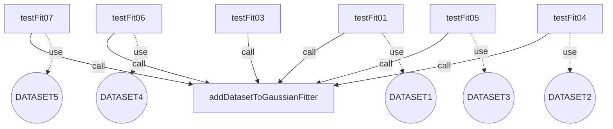

Number of max pairs: $45.0$

Number of direct connections (link by): $0.0$

**TCC value: $0.0$**


# The class 'PolynomialFitterTest'
Package: `org.apache.commons.math3.optimization.fitting.PolynomialFitterTest`

methods : [ `testSmallError` `testLargeSample` `doMath798` `checkUnsolvableProblem` `testRedundantSolvable` `buildRandomPolynomial` `testRedundantUnsolvable` `testMath798` `testMath798WithToleranceTooLowButNoException` `testNoError` `testFit` `testMath798WithToleranceTooLow` ]

attributes : [ ]


The TCC value is 0 because the class has no methods or no attributes.


# The class 'MultivariateDifferentiableMultiStartOptimizerTest'
Package: `org.apache.commons.math3.optimization.MultivariateDifferentiableMultiStartOptimizerTest`

methods : [ `testCircleFitting` ]

attributes : [ ]


The TCC value is 0 because the class has no methods or no attributes.


# The class 'SimpleValueCheckerTest'
Package: `org.apache.commons.math3.optimization.SimpleValueCheckerTest`

methods : [ `testIterationCheck` `testIterationCheckPrecondition` `testIterationCheckDisabled` ]

attributes : [ ]


The TCC value is 0 because the class has no methods or no attributes.


# The class 'PointValuePairTest'
Package: `org.apache.commons.math3.optimization.PointValuePairTest`

methods : [ `testSerial` ]

attributes : [ ]


The TCC value is 0 because the class has no methods or no attributes.


# The class 'UnivariateMultiStartOptimizerTest'
Package: `org.apache.commons.math3.optimization.univariate.UnivariateMultiStartOptimizerTest`

methods : [ `testQuinticMin` `testSinMin` `testBadFunction` ]

attributes : [ ]


The TCC value is 0 because the class has no methods or no attributes.


# The class 'SimpleUnivariateValueCheckerTest'
Package: `org.apache.commons.math3.optimization.univariate.SimpleUnivariateValueCheckerTest`

methods : [ `testIterationCheckDisabled` `testIterationCheck` `testIterationCheckPrecondition` ]

attributes : [ ]


The TCC value is 0 because the class has no methods or no attributes.


# The class 'BracketFinderTest'
Package: `org.apache.commons.math3.optimization.univariate.BracketFinderTest`

methods : [ `testCubicMax` `testMinimumIsOnIntervalBoundary` `testCubicMin` `testIntervalBoundsOrdering` ]

attributes : [ ]


The TCC value is 0 because the class has no methods or no attributes.


# The class 'BrentOptimizerTest'
Package: `org.apache.commons.math3.optimization.univariate.BrentOptimizerTest`

methods : [ `testQuinticMinStatistics` `testMath832` `testSinMinWithValueChecker` `testQuinticMin` `testKeepInitIfBest` `testMinEndpoints` `testMath855` `testQuinticMax` `testSinMin` `testBoundaries` ]

attributes : [ ]


The TCC value is 0 because the class has no methods or no attributes.


# The class 'SimplexTableauTest'
Package: `org.apache.commons.math3.optimization.linear.SimplexTableauTest`

methods : [ `createFunction` `assertMatrixEquals` `testTableauWithNoArtificialVars` `testInitialization` `testDropPhase1Objective` `createConstraints` `testSerial` ]

attributes : [ ]


The TCC value is 0 because the class has no methods or no attributes.


# The class 'SimplexSolverTest'
Package: `org.apache.commons.math3.optimization.linear.SimplexSolverTest`

methods : [ `testSimplexSolver` `testEpsilon` `testMath781` `testMath434PivotRowSelection` `testMath286` `testMinimization` `testMath713NegativeVariable` `equationFromString` `testMath290LEQ` `testUnboundedSolution` `testMath434PivotRowSelection2` `testTrivialModel` `testMath288` `testSingleVariableAndConstraint` `testLargeModel` `testMath272` `testSolutionWithNegativeDecisionVariable` `testMath434NegativeVariable` `validSolution` `testInfeasibleSolution` `testDegeneracy` `testMath293` `testMath828Cycle` `testModelWithNoArtificialVars` `testMath290GEQ` `testMath828` `testMath434UnfeasibleSolution` `testRestrictVariablesToNonNegative` ]

attributes : [ ]


The TCC value is 0 because the class has no methods or no attributes.


# The class 'MultivariateMultiStartOptimizerTest'
Package: `org.apache.commons.math3.optimization.MultivariateMultiStartOptimizerTest`

methods : [ `testRosenbrock` ]

attributes : [ ]


The TCC value is 0 because the class has no methods or no attributes.


# The class 'PointVectorValuePairTest'
Package: `org.apache.commons.math3.optimization.PointVectorValuePairTest`

methods : [ `testSerial` ]

attributes : [ ]


The TCC value is 0 because the class has no methods or no attributes.


# The class 'NonLinearConjugateGradientOptimizerTest'
Package: `org.apache.commons.math3.optimization.general.NonLinearConjugateGradientOptimizerTest`

methods : [ `testTrivial` `testInconsistentEquations` `testNonInversible` `testOneSet` `testMoreEstimatedParametersUnsorted` `testColumnsPermutation` `testTwoSets` `testIllConditioned` `testRedundantEquations` `testNoDependency` `testMoreEstimatedParametersSimple` `testCircleFitting` ]

attributes : [ ]


The TCC value is 0 because the class has no methods or no attributes.


# The class 'CircleVectorial'
Package: `org.apache.commons.math3.optimization.general.CircleVectorial`

methods : [ `value` `value` `getRadius` `getN` `addPoint` `getRadius` `distance` ]

attributes : [ `points` ]


The attributes used in each method are:
  - value uses [points]
  - value uses [points]
  - getRadius uses [points]
  - getN uses [points]
  - addPoint uses [points]
  - getRadius uses [points]

The methods called in each method are:
  - value calls [distance, getRadius]
  - value calls [distance, getRadius]
  - getRadius calls [distance]
  - getRadius calls [distance]

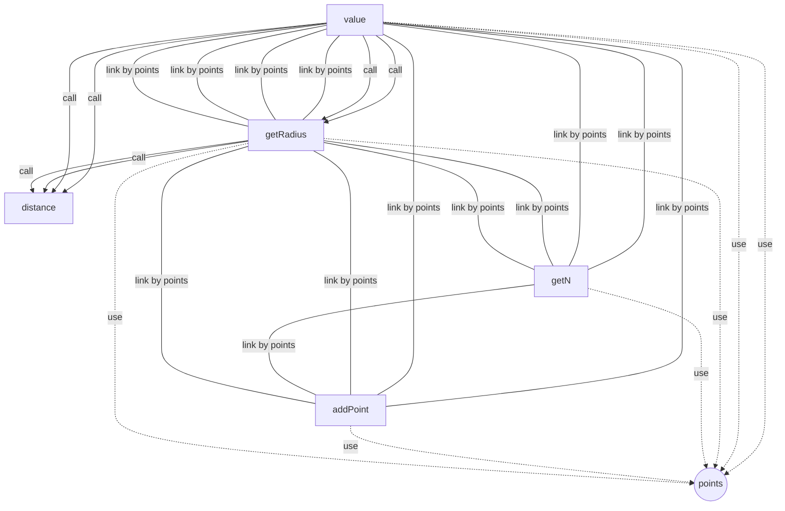

Number of max pairs: $21.0$

Number of direct connections (link by): $13.0$

**TCC value: $0.6190476190476191$**


# The class 'StraightLineProblem'
Package: `org.apache.commons.math3.optimization.general.StraightLineProblem`

methods : [ `value` `solve` `target` `weight` `x` `value` `addPoint` `y` ]

attributes : [ `sigma` `points` ]


The attributes used in each method are:
  - value uses [points]
  - solve uses [points]
  - weight uses [sigma, points]
  - value uses [points]
  - x uses [points]
  - y uses [points]
  - addPoint uses [points]

The methods called in each method are:
  - value calls [value]
  - target calls [y]
  - value calls [value]

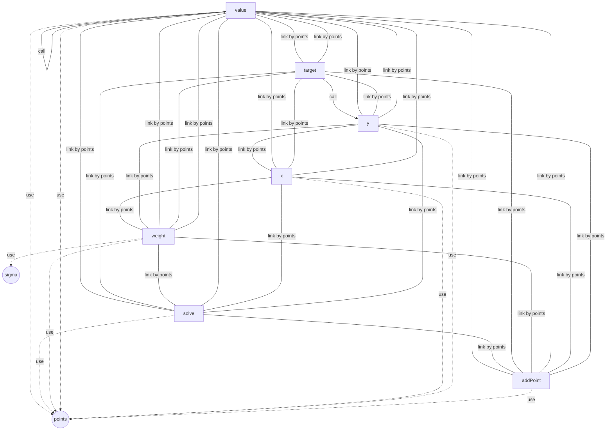

Number of max pairs: $28.0$

Number of direct connections (link by): $27.0$

**TCC value: $0.9642857142857143$**


# The class 'GaussNewtonOptimizerTest'
Package: `org.apache.commons.math3.optimization.general.GaussNewtonOptimizerTest`

methods : [ `testMaxEvaluations` `testMoreEstimatedParametersUnsorted` `createOptimizer` `testHahn1` `testMoreEstimatedParametersSimple` `testCircleFittingBadInit` ]

attributes : [ ]


The TCC value is 0 because the class has no methods or no attributes.


# The class 'AbstractLeastSquaresOptimizerTestValidation'
Package: `org.apache.commons.math3.optimization.general.AbstractLeastSquaresOptimizerTestValidation`

methods : [ `testParametersErrorMonteCarloObservations` `testParametersErrorMonteCarloParameters` `getChi2N` ]

attributes : [ `MONTE_CARLO_RUNS` ]


The attributes used in each method are:
  - testParametersErrorMonteCarloObservations uses [MONTE_CARLO_RUNS]
  - testParametersErrorMonteCarloParameters uses [MONTE_CARLO_RUNS]

The methods called in each method are:
  - testParametersErrorMonteCarloParameters calls [getChi2N]

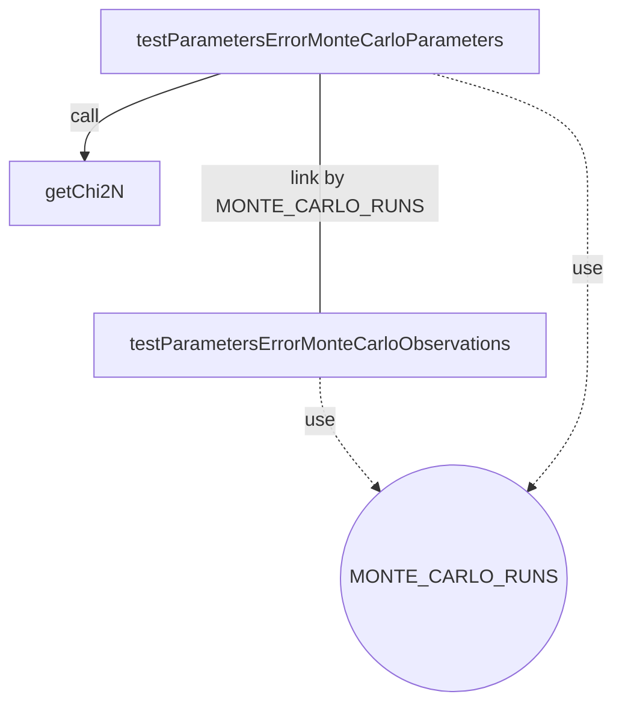

Number of max pairs: $3.0$

Number of direct connections (link by): $1.0$

**TCC value: $0.3333333333333333$**


# The class 'DummyOptimizer'
Package: `org.apache.commons.math3.optimization.general.DummyOptimizer`

methods : [ `doOptimize` ]

attributes : [ ]


The TCC value is 0 because the class has no methods or no attributes.


# The class 'CircleProblem'
Package: `org.apache.commons.math3.optimization.general.CircleProblem`

methods : [ `addPoint` `target` `value` `value` `weight` ]

attributes : [ `ySigma` `xSigma` `points` ]


The attributes used in each method are:
  - target uses [points]
  - addPoint uses [points]
  - value uses [points]
  - value uses [points]
  - weight uses [ySigma, xSigma, points]

The methods called in each method are:

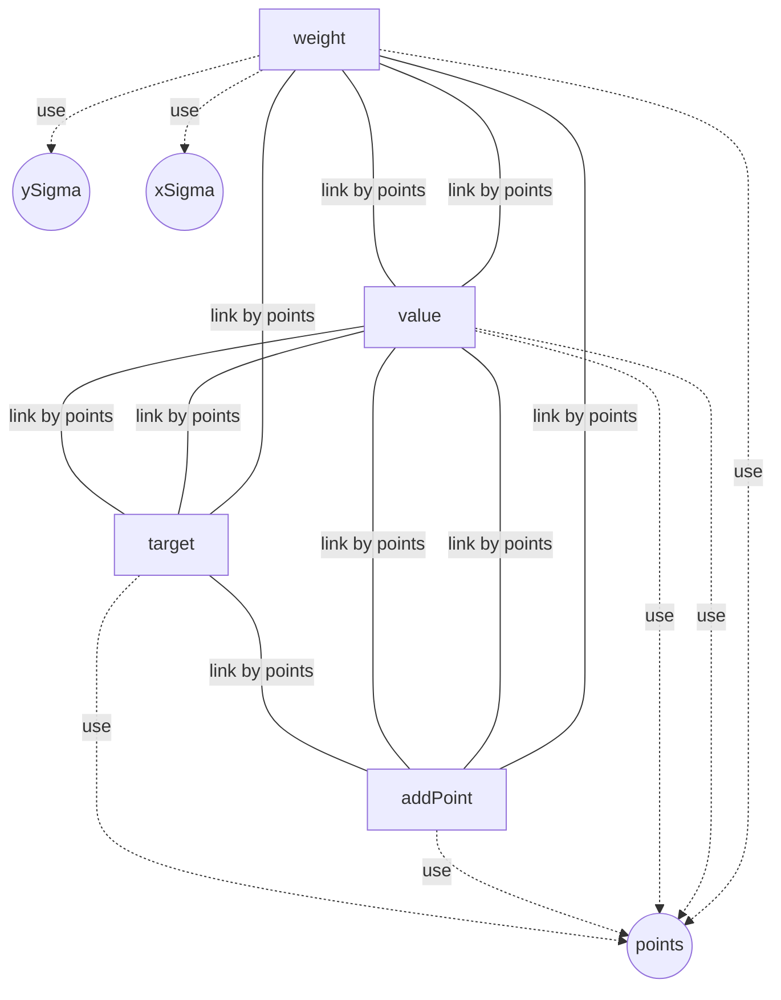

Number of max pairs: $10.0$

Number of direct connections (link by): $9.0$

**TCC value: $0.9$**


# The class 'RandomCirclePointGenerator'
Package: `org.apache.commons.math3.optimization.general.RandomCirclePointGenerator`

methods : [ `generate` `create` ]

attributes : [ `cX` `cY` `tP` `radius` ]


The attributes used in each method are:
  - create uses [cX, cY, tP, radius]

The methods called in each method are:
  - generate calls [create]

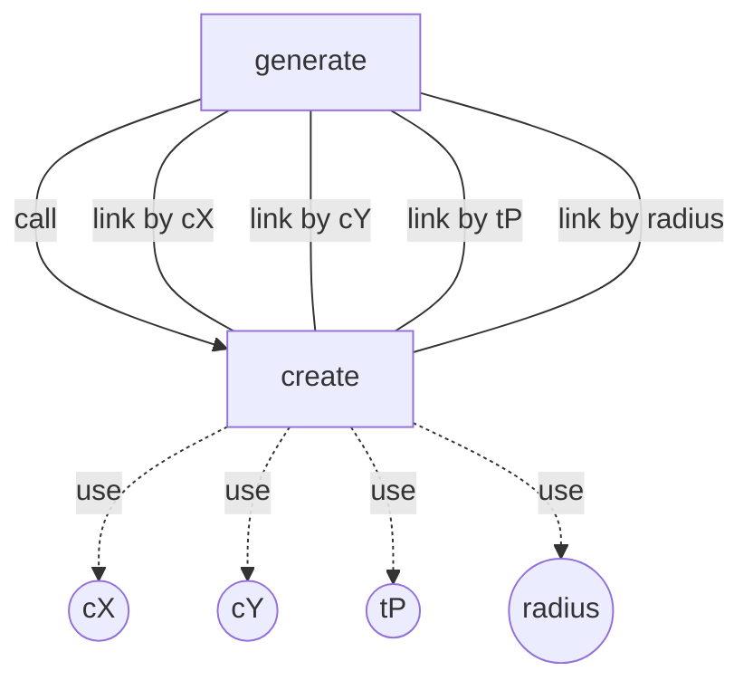

Number of max pairs: $1.0$

Number of direct connections (link by): $4.0$

**TCC value: $4.0$**


# The class 'CircleScalar'
Package: `org.apache.commons.math3.optimization.general.CircleScalar`

methods : [ `value` `getRadius` `value` `addPoint` `getRadius` `distance` ]

attributes : [ `points` ]


The attributes used in each method are:
  - value uses [points]
  - getRadius uses [points]
  - value uses [points]
  - addPoint uses [points]
  - getRadius uses [points]

The methods called in each method are:
  - value calls [distance, getRadius]
  - getRadius calls [distance]
  - value calls [distance, getRadius]
  - getRadius calls [distance]

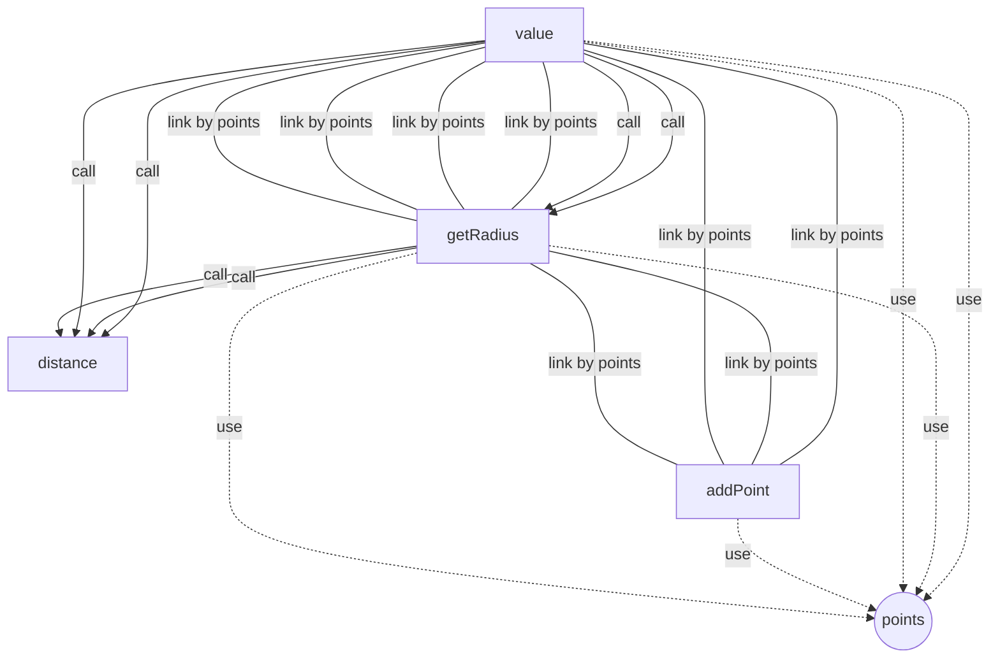

Number of max pairs: $15.0$

Number of direct connections (link by): $8.0$

**TCC value: $0.5333333333333333$**


# The class 'MinpackTest'
Package: `org.apache.commons.math3.optimization.general.MinpackTest`

methods : [ `testMinpackJennrichSampson` `testMinpackBrownAlmostLinear` `testMinpackOsborne2` `testMinpackOsborne1` `testMinpackBox3Dimensional` `testMinpackLinearFullRank` `testMinpackMeyer` `testMinpackFreudensteinRoth` `testMinpackBard` `testMinpackChebyquad` `minpackTest` `testMinpackKowalikOsborne` `testMinpackBrownDennis` `testMinpackRosenbrok` `testMinpackWatson` `testMinpackLinearRank1` `testMinpackLinearRank1ZeroColsAndRows` `testMinpackHelicalValley` `testMinpackPowellSingular` ]

attributes : [ ]


The TCC value is 0 because the class has no methods or no attributes.


# The class 'LevenbergMarquardtOptimizerTest'
Package: `org.apache.commons.math3.optimization.general.LevenbergMarquardtOptimizerTest`

methods : [ `createOptimizer` `testCircleFitting2` `testControlParameters` `testNonInvertible` `testBevington` `checkEstimate` `testMath199` ]

attributes : [ ]


The TCC value is 0 because the class has no methods or no attributes.


# The class 'StatisticalReferenceDataset'
Package: `org.apache.commons.math3.optimization.general.StatisticalReferenceDataset`

methods : [ `getParameterStandardDeviation` `getData` `getLeastSquaresProblem` `findLineNumbers` `getName` `getX` `getNumObservations` `getNumStartingPoints` `getParameters` `getParameter` `getNumParameters` `getModelValue` `getY` `getParametersStandardDeviations` `getStartingPoint` `getResidualSumOfSquares` ]

attributes : [ `a` `problem` `sigA` `numStartingPoints` `numObservations` `numParameters` `name` `x` `y` `residualSumOfSquares` `startingValues` ]


The attributes used in each method are:
  - getParameterStandardDeviation uses [sigA]
  - getData uses [x, y]
  - getLeastSquaresProblem uses [problem]
  - getX uses [x]
  - getName uses [name]
  - getNumObservations uses [numObservations]
  - getNumStartingPoints uses [numStartingPoints]
  - getParameter uses [a]
  - getParameters uses [a]
  - getNumParameters uses [numParameters]
  - getY uses [y]
  - getStartingPoint uses [startingValues]
  - getParametersStandardDeviations uses [sigA]
  - getResidualSumOfSquares uses [residualSumOfSquares]

The methods called in each method are:

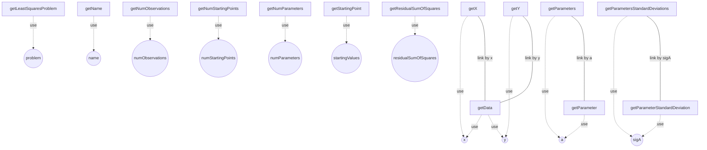

Number of max pairs: $120.0$

Number of direct connections (link by): $4.0$

**TCC value: $0.03333333333333333$**