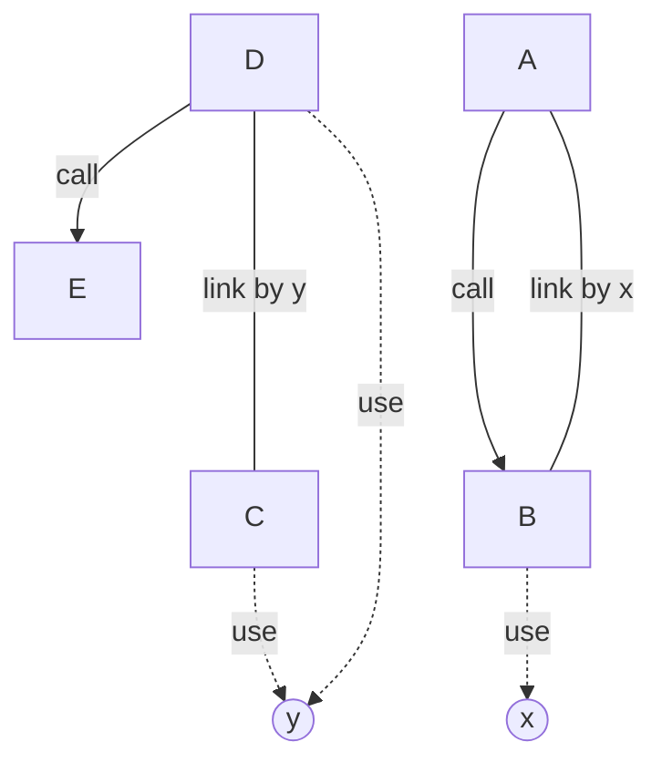
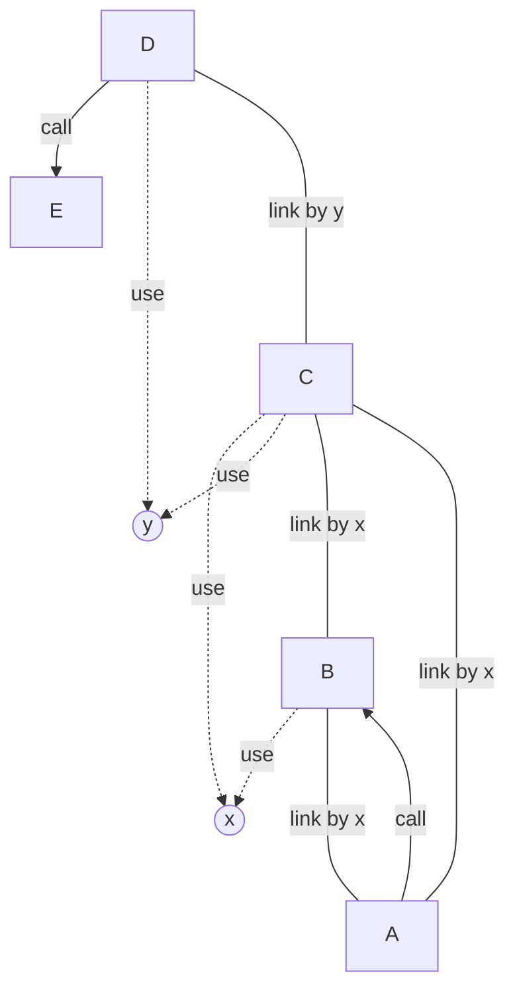

> This is the ouput of the following command : 
> `java -jar target/get-tcc-1.0-jar-with-dependencies.jar examples`
> It take the classes in the `examples` directory as input.

# Report TCC Value

Calculating the TCC values of the classes in `/home/cody/Git/VV-ESIR-TP2/code/Exercise5/get-tcc/examples`

# The class 'Example1'
Package: `Example1`
methods : [ `C` `D` `E` `B` `A` ]
attributes : [ `x` `y` ]

The attributes used in each method are:
  - C uses [y]
  - D uses [y]
  - B uses [x]

The methods called in each method are:
  - D calls [E()]
  - A calls [B()]

Number of max pairs: $10.0$
Number of direct connections (link by): $2.0$
**TCC value: $0.2$**

# The class 'Example2'
Package: `Example2`
methods : [ `C` `D` `E` `B` `A` ]
attributes : [ `x` `y` ]

The attributes used in each method are:
  - C uses [x, y]
  - D uses [y]
  - B uses [x]

The methods called in each method are:
  - D calls [E()]
  - A calls [B()]

Number of max pairs: $10.0$
Number of direct connections (link by): $4.0$
**TCC value: $0.4$**

*This output is printed as markdown format for readability, you can save to markdown using the `>` bash operator*